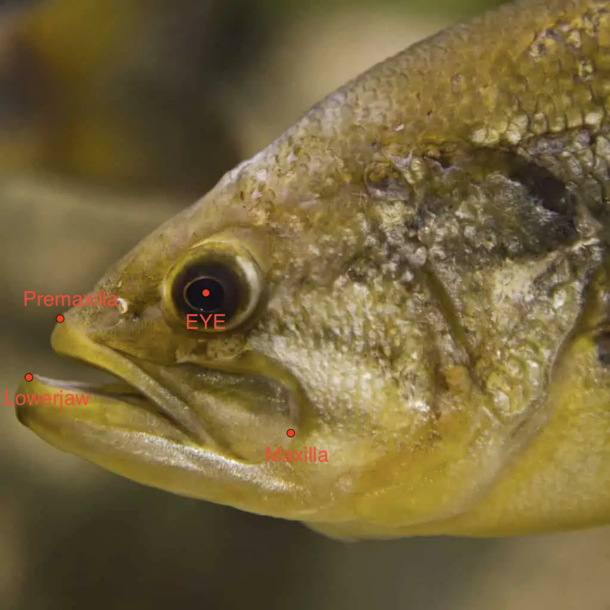

```{r setup, include=FALSE}
knitr::opts_chunk$set(echo = TRUE)
library(tidyverse)

if(F){
dat <- tibble(fish=c(rep("red",100),rep("blue",100),rep("green",100)),
              body_length=c(rnorm(100,mean=10,sd=2),
                            rnorm(100,mean=15,sd=2),
                            rnorm(100,mean=20,sd=2)),
              specimen=rep(1:100,3)
)

dat2 <- tibble(fish=c(rep("red",100),rep("blue",100),rep("green",100)),
              body_depth=c(rnorm(100,mean=5,sd=2),
                            rnorm(100,mean=7,sd=2),
                            rnorm(100,mean=4,sd=2)),
               specimen=rep(1:100,3)
)


dat %>% 
  ggplot(aes(fish,body_length))+geom_boxplot()

dat2 %>% 
  ggplot(aes(fish,body_depth))+geom_boxplot()

dat %>% 
  left_join(dat2) %>% 
  select(fish,specimen,body_length,body_depth) %>% 
  write_csv("body_data.csv")
}


```


Fist begin by creating an R script name `Last_Fist_WRC2.R` [-1 pt if not]. Then, please download these data: 

1. ["body_data.csv"](body_data.csv), a text file in .csv format that contains body length and body depth data for 100 specimens of three fish species: red, blue, and green.
2. ["head_xy.csv"](head_xy.csv), a text file in .csv format that contains X-Y position data for 4 landmarks on the heads of these red, blue, and green fish (see below). 

<center>
{width=50%}
</center>
## Question 1

Complete the following steps, writing lines of code as needed.

1. Read in both text files you downloaded as a tibble and name the variables `body_dat` and `head_dat`, logically so. [2 pt]

2. Compute the horizontal (X) distance between the maxilla and lower jaw for each specimen of each species. For this, you will have to use `pivot_wider()` and `mutate()` on the `head_dat` tibble. Name this column "jaw_length" and this new tibble "head_wide". [4 pts]

3. Compute the mean body length, body depth, and jaw length for each species all in one table (i.e., print this tibble to the console). [4 pts]

```{r,eval=FALSE,include=FALSE}

head_dat <- read_csv("head_xy.csv")

body_dat <- read_csv("body_data.csv")

head_wide <- head_dat %>% 
  pivot_wider(names_from = point,values_from = X:Y) %>% 
  mutate(jaw_length=X_maxilla-X_lowerjaw)

body_dat %>% 
  group_by(fish) %>% 
  summarise(m_length=mean(body_length),m_depth=mean(body_depth)) %>% 
  left_join(
    head_wide %>% 
      group_by(fish) %>% 
      summarise(m_jawlength=mean(jaw_length))
  )

```

## Submission

Submit your script via attachment by emailing it with the subject line "WRC2" to [kenaley@bc.edu](mailto:kenaley@bc.edu)

```{r eval=F,include=F}
library(rmarkdown)
library(fidelius)
pw <- "WCR2"
render("WCR_2.Rmd", html_password_protected(password=pw))

```
