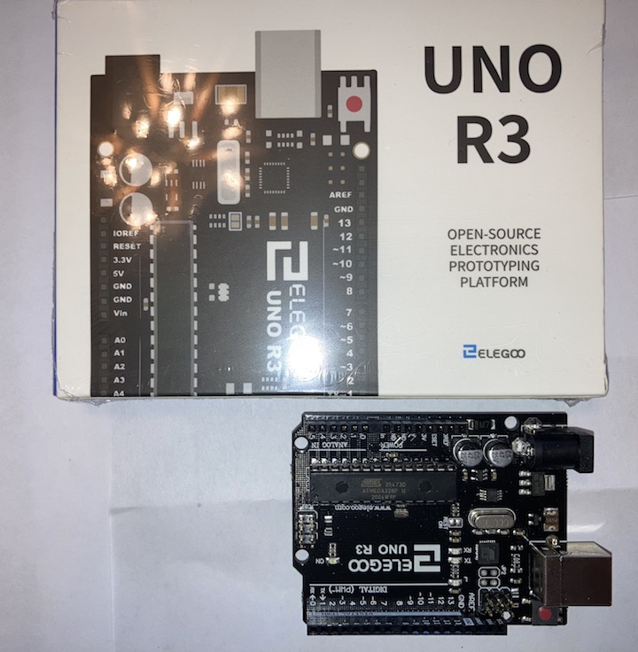
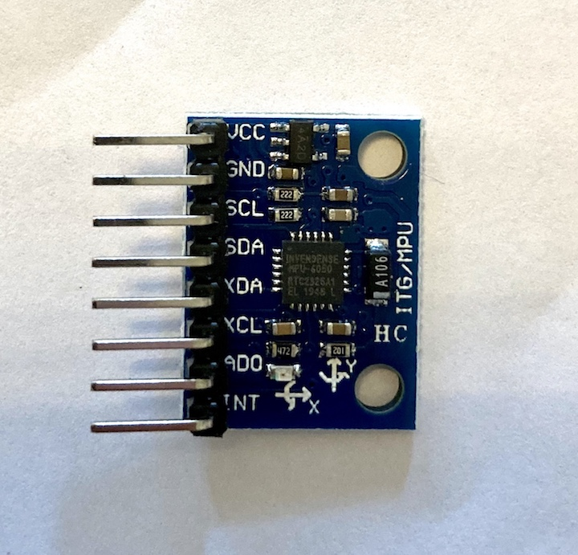
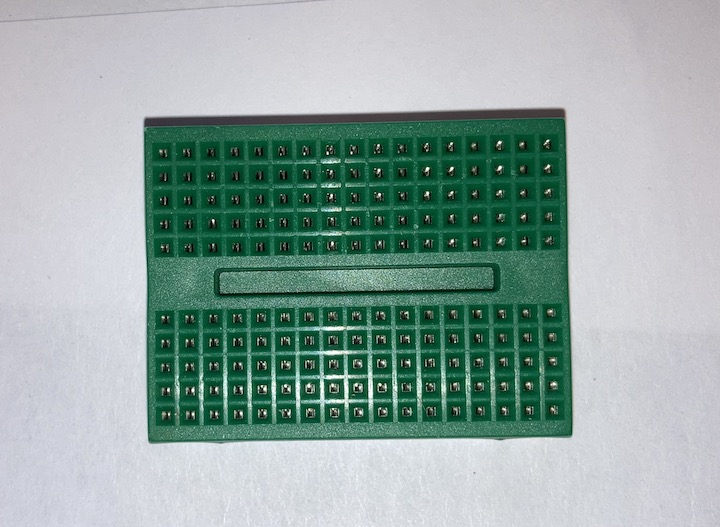
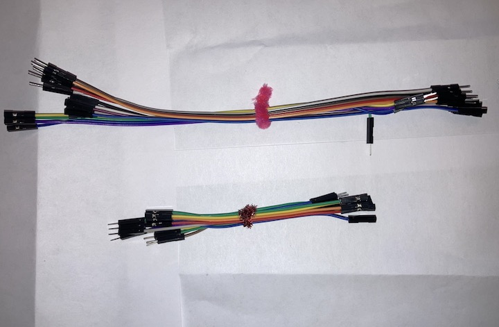
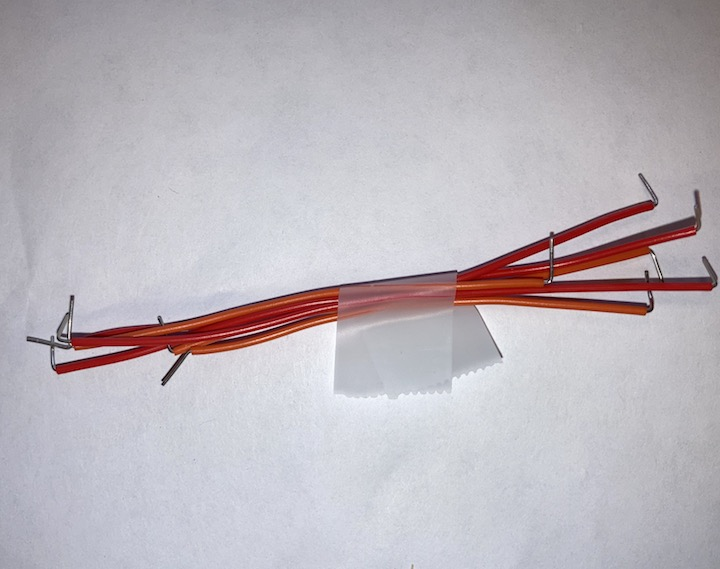
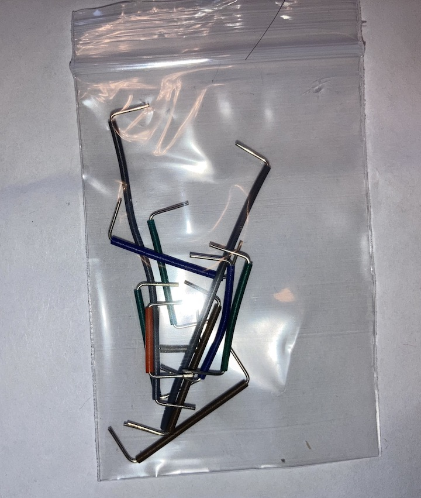
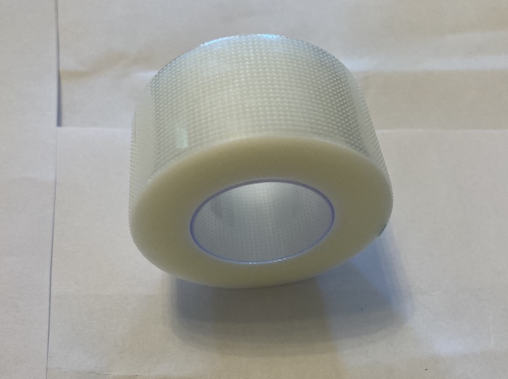

Thanks to a generous grant from [BC's Academic Technology Avisory Board](https://www.bc.edu/bc-web/academics/sites/academic-technology-advisory-board.html.html), we are able to provide "DaqPacks" of all the required hardware for the course to every student in BIOL 3140. Please take care of your DaqPacks, keeping them in a safe, dry place. There are lots of bits and pieces and what's below describes each.

Table: Caption of my table
<!-- Table: (\#tab:myTable-reference) Caption of my table -->

| Item | Description |
| :-------: | :----------- |
| {#id .class height=50%} | Elegoo Arduino Uno R3 clone  |
| {#id .class height=50%} | MPU-6050 6-axis accelerometer gyroscope sensor breakout board  |
| {#id .class height=50%} | MicroSD card module  |
| {#id .class height=50%} | 8GB MicroSD card |
| {#id .class height=50%} | 40-kg Load Cell with HX711 amplifier |
| {#id .class height=50%} | DS18B20 temperature sensor |
| {#id .class height=50%} | Mini solderless breadboard |
| {#id .class height=50%} | 4-in and 8-in breadboard jumper wires |
| {#id .class height=50%} | short solid-core protoyping wire |
| {#id .class height=50%} | long solid-core protoyping wire |
| {#id .class height=50%} | surgical tape |
| {#id .class height=50%} | 9V battery power cable |
|                  |             |

