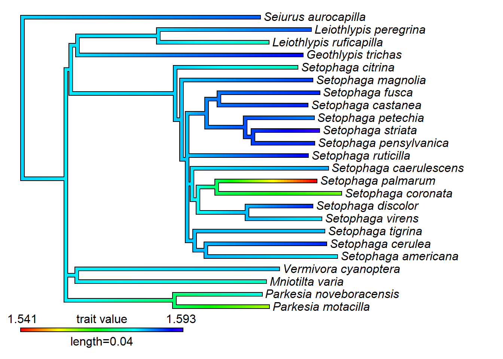

class: inverse, top
# Hello! 

```{r,echo=FALSE,message=FALSE}
library(tidyverse)
library(kableExtra)
```

<!-- Add icon library -->
<link rel="stylesheet" href="https://cdnjs.cloudflare.com/ajax/libs/font-awesome/5.14.0/css/all.min.css">


.pull-left[
Today we'll ....

- Learn what the course is about

- See how the course  is organized

]

.pull-right[

]
---
class: inverse, top
<!-- slide 1 -->
# Class details

.pull-left[


https://bcorgbio.github.io/class

Monday, Wednesday, Friday 10:00-10:50 for in-person **problem solving**


]

.pull-right[


kenaley@bc.edu

<!-- Add font awesome icons -->
<p style="text-align: left;">
    <a href="https://twitter.com/kenaley" class="fab fa-twitter">@kenaley</a>
</p>

kenaleylab.com

office hours by appointment in Higgins 415/535 (by appointment) or over Zoom
]


---
class: 

# Meet and potatoes


```{r,echo=FALSE}
   
g <- rbind(c("","","Points"),
  c("Discussion Q&A","",100),
c("Phase I Projects ","","5x15"), 
c("Phase II Projects ","","3x75"),
c("Phasee III/Final Project","", "1x150"),
c("","total","500")
)

kbl(g)%>%row_spec(row = 1:nrow(g),background = "white")%>%kable_styling()
```

---

# Course requirements

.pull-left[

Hard stuff:

- Personal computer (with USB2/3 ports, or see below)
- USB adapter (for Mac folks)
- Course DAQpack (see blow) [Provided]

Soft stuff: 
- [GitHub account](https://github.com/join) 
- [R](https://www.r-project.org/) installed 
- [R Studio IDE](https://www.rstudio.com/) installed 
- [Arduino IDE](https://www.arduino.cc/en/software) installed

]
.pull-right[


]

---
class:  top
# Class structure

.pull-left[

- Flipped (talk/discuss here, learn/conquer out there)
- Lectures are discussion based and project focused 
- You lead!
- No exams, no quizzes
- Team based projects
- Teams assigned randomly

]

.pull-right[

]


---
class:  top
# Teams and team responsibilities

- Take this survey: https://forms.gle/VdtMQWQ2G9FGViT4A

- Teams of 4 students assigned in the first few days of class. 

This team must establish two things:

  1. A *unique* team name. *Puns are welcome* and encouraged (e.g., "R-tful Coders") 
  
  2. A team discussion on GitHub that includes me (@ckenaley) on the team (see [Discussion Board](https://bcorgbio.github.io/class/index.html#Discussion_Board)). 
  
 Each week, teams use their team discussion board to generate a question

 This gets posted on the the class-wide discussion board. Include the team handle ("@bcorgbio/r-tful-coders"). 


---
class:  top
# Course Outline
.center[

]

.pull-left[

## Phase I

- Learning the basics
- Small projects

]

.pull-right[

## Phase II projects

- Project descriptions on course site
- 1-3 weeks to finish
- Reports due on Sundays
- Report written in R Markdown
- Commit to team repo on GitHub
]


---
class:  top
# Phase III/Final project

.pull-left[

## Overview

- Team-based
- Topic of your choice (build off of Phase II)
- Same report guidelines as Phase II (.Rmd, format, etc.)

]

.pull-right[

## Timeline
- ~2 weeks to develop, execute
- Start end of November
]


---
class:  top
# Phase II topics

.pull-left[
- Evolution of wing shape in butterflies and moths.

- Force-length relationship of fatigued muscles.

- Migration phenology of neotropical migrants in New England
]

.pull-right[

]


---
class:  top
# Phase II topics

.pull-left[
- Evolution of wing shape in butterflies and moths.

- Force-length relationship of fatigued muscles.

- Migration phenology of neotropical migrants in New England
]

.pull-right[

]


---
class:  top
# Phase II topics

.pull-left[
- Evolution of wing shape in butterflies and moths.

- Force-length relationship of fatigued muscles.

- Migration phenology of neotropical migrants in New England
]

.pull-right[

]

---
class:  top
# Phase III topics

.pull-left[

- Tongue Force-length relationship.

- *Phylogenetic signal* in migration phenology of neotropical migrants in New England
]

.pull-right[


]

---
class:  top
# Phase III topics

.pull-left[

- Tongue Force-length relationship.

- *Phylogenetic signal* in migration phenology of neotropical migrants in New England
]

.pull-right[



]


---

class: center, middle

# Thanks!

Slides created via the R package [**xaringan**](https://github.com/yihui/xaringan).

