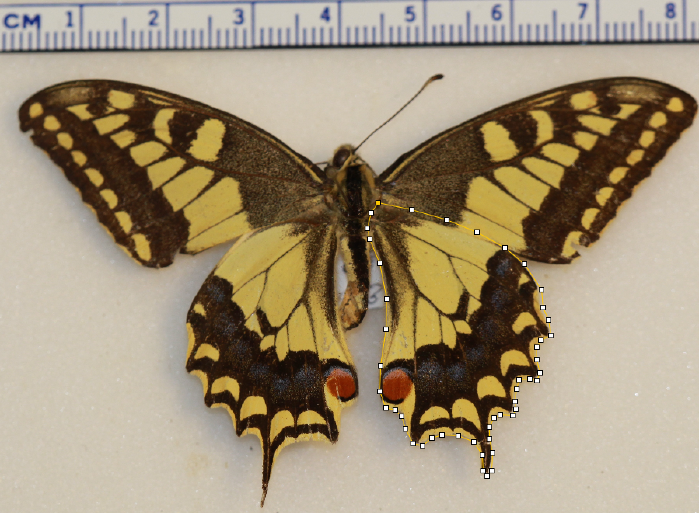
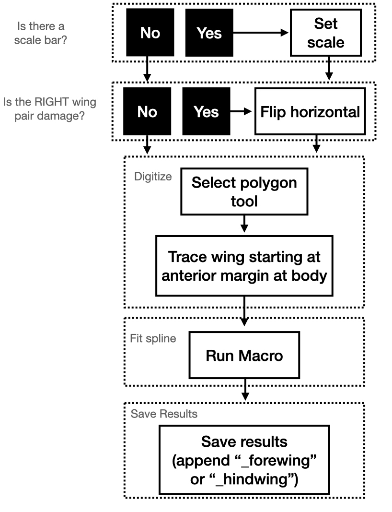

class: inverse, top
# In class today 

```{r,echo=FALSE,message=FALSE}
library(tidyverse)
library(kableExtra)
library(ape)
library(phytools)
library(broom)
library(Momocs)


```

<!-- Add icon library -->
<link rel="stylesheet" href="https://cdnjs.cloudflare.com/ajax/libs/font-awesome/5.14.0/css/all.min.css">


.pull-left[
Today we'll ....

- Kick off Module 6

- Introduce imageJ/FIJI

- Shape analysis

]

.pull-right[

]

---
class: inverse, top
<!-- slide 1 -->

## Module 6: Shape of Pretty Things

.pull-left[

- The Lepidoptera: a hyperdiverse radiation
- Two wings: one more important than the other?


]

.pull-right[

]


---
class: inverse, top
<!-- slide 1 -->

## Module 6: Shape of Pretty Things

.pull-left[

- The Lepidoptera: a hyperdiverse radiation
- Two wings: one more important than the other?

]

.pull-right[

]


---
class: inverse, top
<!-- slide 1 -->

## Module 6: Shape of Pretty Things

.pull-left[

- The Lepidoptera: a hyperdiverse radiation
- Two wings: one more important than the other?

]

.pull-right[

Jantzen and Eisner (2008)
]


---
class: inverse, top
<!-- slide 1 -->

## More software: FIJI


.pull-left[

- Outline shapes of each wing
- Worflow
- Fit spline using a macro

]

.pull-right[

]

---
class: inverse, top
<!-- slide 1 -->

## More software: FIJI


.pull-left[

- Outline shapes of each wing
- Worflow
- Fit spline using a macro

]

.pull-right[

]

---
class: inverse, top
<!-- slide 1 -->

## More software: FIJI


.pull-left[

- Outline shapes of each wing
- Worflow
- Fit spline using a macro

]

.pull-right[

]

---
class: inverse, top
<!-- slide 1 -->

## More software: FIJI


.pull-left[

- Outline shapes of each wing
- Worflow
- Fit spline using a macro

]

.pull-right[

]


---
class: inverse, top
<!-- slide 1 -->

## Shape Analysis


```{r,message=F,echo=F}

f <- list.files("out_data",full.names = T)
f <- f[sample(1:length(f),50)]

#make a large df with vroom
out.df <- vroom::vroom(f, id = "filename")

#add wing info
out.df <- out.df %>% 
  mutate(wing=gsub("XY_.+_(hindwing|forewing)\\..+","\\1",basename(filename))) %>% 
  na.omit()

#make a large df with vroom
out.df <- vroom::vroom(f, id = "filename")

#make list
outs.l <- sapply(f,function(x) out.df %>% filter(filename==x) %>% select(X,Y) %>% as.matrix)

outs.l %>% 
  Out() %>% 
  coo_flipx() %>% 
  stack()
```

---
class: inverse, top
<!-- slide 1 -->

## Shape Analysis


- Procrustes alignment

```{r,message=F,echo=F}

out <- outs.l %>% 
  Out()


```


.pull-left[
```{r,message=F,results='hide'}

min <- out %>% 
  coo_nb() %>% 
  min()

align_out <- out %>%
  coo_interpolate(min) %>% 
  fgProcrustes()
```
]

.pull-right[

]
---
class: inverse, top
<!-- slide 1 -->

## Shape Analysis


- Procrustes alignment


```{r}
align_out %>% 
  stack

```


<!-- https://link.springer.com/article/10.1007/s00414-017-1555-0/figures/3 -->


