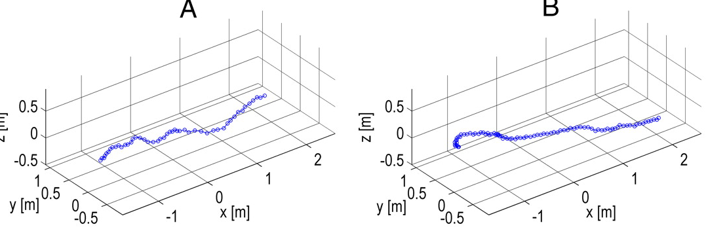

class: inverse, top
# In class today 

```{r,echo=FALSE,message=FALSE}
library(tidyverse)
library(kableExtra)
library(ape)
library(phytools)
library(geomorph)
library(abind)


```

<!-- Add icon library -->
<link rel="stylesheet" href="https://cdnjs.cloudflare.com/ajax/libs/font-awesome/5.14.0/css/all.min.css">


.pull-left[
Today we'll ....

- Kick off Module 5 (New Phase!!)

- Introduce imageJ/FIJI

- Shape analysis

]

.pull-right[

]

---
class: inverse, top
<!-- slide 1 -->

## Module 6: Shape of Pretty Things

.pull-left[

- The Lepidoptera: a hyperdiverse radiation
- Two wings: one more important than the other?


]

.pull-right[

]


---
class: inverse, top
<!-- slide 1 -->

## Module 6: Shape of Pretty Things

.pull-left[

- The Lepidoptera: a hyperdiverse radiation
- Two wings: one more important than the other?

]

.pull-right[

]


---
class: inverse, top
<!-- slide 1 -->

## Module 6: Shape of Pretty Things

.pull-left[

- The Lepidoptera: a hyperdiverse radiation
- Two wings: one more important than the other?

]

.pull-right[

Jantzen and Eisner (2008)
]


---
class: inverse, top
<!-- slide 1 -->

## More software: FIJI


.pull-left[

- Outline shapes of each wing
- Worflow
- Fit spline using a macro

]

.pull-right[

]

---
class: inverse, top
<!-- slide 1 -->

## More software: FIJI


.pull-left[

- Outline shapes of each wing
- Worflow
- Fit spline using a macro

]

.pull-right[

]

---
class: inverse, top
<!-- slide 1 -->

## More software: FIJI


.pull-left[

- Outline shapes of each wing
- Worflow
- Fit spline using a macro

]

.pull-right[

]

---
class: inverse, top
<!-- slide 1 -->

## More software: FIJI


.pull-left[

- Using multipoint tool, digitize 14 points
- Worflow
- Use macro to save file

]

.pull-right[
- Open am image.

- Select the multipoint tool.

- Digitize the 14 landmarks you see above.

- Measure the XY positions of these points (cmd/ctrl+m).

- Select the macro tab and run the macro (cmd/ctrl+r).

- Save the results to the appropriate directory.

- Close the results and image tab (don’t save the image).
]


---
class: inverse, top
<!-- slide 1 -->

## Shape Analysis


```{r,message=F,echo=F}
library(abind)
f <- list.files("shark_points",full.names = T,pattern=".csv")
ldk <- read_csv(f,id="file") %>% select(file,X,Y)


ldk %>% select(file) %>% table
ldk_l <- ldk %>% 
  mutate(file_name=gsub("*_.csv","",basename(file))) %>% 
  select(file,X,Y) %>% 
  mutate(Y=abs(Y-max(Y))) %>% 
  group_split(file,.keep = F) 

ldk_l <- lapply(ldk_l,as.data.frame)

ldk <-  abind(ldk_l, along=3)

names(ldk) <-gsub("*_.csv","",basename(f))


#ldk <- define.sliders(teeth_sl[,,1],nsliders = 1)

ldk_al <- gpagen(ldk,ProcD = F)
plot(ldk_al)
```

---
class: inverse, top
<!-- slide 1 -->

## Shape Analysis


- Procrustes alignment

```{r,message=F,echo=F}


```


.pull-left[
```{r,message=F,results='hide'}


```
]

.pull-right[

]
---
class: inverse, top
<!-- slide 1 -->

## Shape Analysis


- Procrustes alignment


```{r}


```


<!-- https://link.springer.com/article/10.1007/s00414-017-1555-0/figures/3 -->


