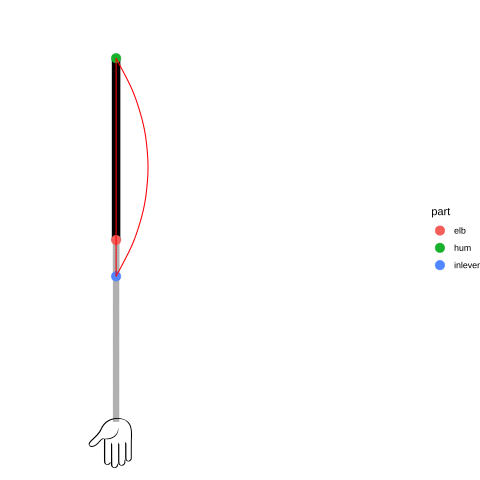

class: inverse, top
# In class today 

```{r,echo=FALSE,message=FALSE}
library(tidyverse)
library(kableExtra)
library(ape)
library(phytools)
library(broom)
library(Momocs)


```

<!-- Add icon library -->
<link rel="stylesheet" href="https://cdnjs.cloudflare.com/ajax/libs/font-awesome/5.14.0/css/all.min.css">


.pull-left[
Today we'll ....

- Kick off Module 7

- Introduce/Review basic muscle physiology

- Consider experimental procedures

- Modeling data

]

.pull-right[
   
]


---
class: inverse, top
<!-- slide 1 -->

## Module 7: Beach Muscles

.pull-left[

- Force-Length Relationship
- Cross-bridge theory predicts variable force over a range of lengths
- Often omit the effect of velecity, another important parameter


]

.pull-right[

]

---
class: inverse, top
<!-- slide 1 -->


## Module 7: Beach Muscles

.pull-left[

### Central questions 
  * What length results in peak force?
  * Is length at peak force always the same under different conditions?
]

.pull-right[

]


---
class: inverse, top
<!-- slide 1 -->


## Module 7: Beach Muscles

.center[


<br>
]


---
class: inverse, top
<!-- slide 1 -->

## Module 7: Beach Muscles

.pull-left[

- Biceps brachii
- Flexes lower arm

]

.pull-right[

]


---
class: inverse, top
<!-- slide 1 -->

## Module 7: Beach Muscles

.pull-left[

- Biceps brachii
- Flexes lower arm
- Forms 3rd order lever


]

.pull-right[


Fun R code can be found [here](https://gist.github.com/ckenaley/924171571a73874384a6aaaef93e372b).


]


---
class: inverse, top
<!-- slide 1 -->

## Module 7: Beach Muscles

.pull-left[

### Module 7 Question:

Does eccentric fatigue shift length at peak force?


]

.pull-right[


]


---
class: inverse, top
<!-- slide 1 -->

## Module 7: Beach Muscles

.pull-left[

- Use arm angle as proxy for length
- Force (torque, really) at palm during maximal voluntary contractions (MVCs)
- Fortunately TA=FL relationship in human arm system


]

.pull-right[


]

---
class: inverse, top
<!-- slide 1 -->


## Module 7: Beach Muscles

.pull-left[

### Module 7 Question:

Does eccentric fatigue shift length at peak force?

Protocol:
  - measure F of isometric MVCs at different angles
  - eccentrically fatigue biceps with book bag
  - measure F of isometric MVCs at different angles
]

.pull-right[

]


---
class: inverse, top
<!-- slide 1 -->


## Module 7: Beach Muscles

.pull-left[

### Module 7 Question:

Does eccentric fatigue shift length at peak force?

Protocol:
  - measure F of isometric MVCs at different angles
  - eccentrically fatigue biceps with book bag
  - measure F of isometric MVCs at different angles
]

.pull-right[

A gainiometer
]


---
class: inverse, top
<!-- slide 1 -->


## Module 7: Beach Muscles

.pull-left[

### Module 7 Question:

Does eccentric fatigue shift length at peak force?

Protocol:
  - measure F of isometric MVCs at different angles
  - eccentrically fatigue biceps with book bag
  - measure F of isometric MVCs at different angles
]

.pull-right[

]


---
class: inverse, top
<!-- slide 1 -->


## Module 7: Beach Muscles

.pull-left[

### Module 7 Question:

Does eccentric fatigue shift length at peak force?

Protocol:
  - measure F of isometric MVCs at different angles
  - eccentrically fatigue biceps with book bag
  - measure F of isometric MVCs at different angles
  
  

pick up today/tomorrow
]

.pull-right[

]


---
class: inverse, top
<!-- slide 1 -->


## Module 7: Beach Muscles

.pull-left[

Review: Load Cell Basics
  - metal shape strains
  - so do wires
  - voltage along circuit changes due to changes in resistance
  - Ohms law:
      $$V=I*R$$
      
      
]

.pull-right[

]


---
class: inverse, top
<!-- slide 1 -->
## Module 7: Beach Muscles


.pull-left[

Module 7 data

- Many TA curves
- One for each angle (x10) for each experiment (control + fatique)
- 20 curves for each student


]

.pull-right[

]

```{r, echo=F, include=F}
library(ggplot2)
ang <- seq(45,168.75,length.out = 12) #elbow angle

normF <- c(0.71, 0.77, 0.83, 0.91, 0.97, 1.00, 0.96, 0.94, 0.89, 0.84, 0.77, 0.74) #you'll get this by reading in data and calculating normalized values


p <- qplot(ang,normF)+geom_point(aes(x=ang[which.max(normF)],y=normF[which.max(normF)]),col="red",size=4)

#ang[which.max(normF)] #Find angle for Fmax, theta_max


```


---
class: inverse, top
<!-- slide 1 -->

## Module 7: Beach Muscles


.pull-left[

Module 7 data

- Many TA curves
- One for each angle (x10) for each experiment (control + fatique)
- 20 curves for each student


]

.pull-right[
```{r}
print(p)
```
]


---
class: inverse, top
<!-- slide 1 -->

## Module 7: Beach Muscles
Fitting polynomials, e.g., 2nd order
$$Y=aX^2+bX+c$$
where

$$a<0$$
Use of `R`'s` poly()` .... 
```{r}
library(MuMIn)

poly.m2 <- lm(normF~poly(ang,2)) #second order
poly.m3 <- lm(normF~poly(ang,3)) #third order
poly.m4 <- lm(normF~poly(ang,4)) #fourth order

AICc(poly.m2,poly.m3,poly.m4) #the 3rd order model fits best


```

---
class: inverse, top
<!-- slide 1 -->

## Module 7: Beach Muscles

```{r,fig.height=3}
#define 1000 angles from our range
x.pred <- seq(45,157.5,length.out = 1000) 

#predict the force using 1000 angles
normF.pred <- predict(poly.m3,newdata = data.frame(ang=x.pred)) 

qplot(ang,normF)+
  geom_point(aes(x=x.pred,y=normF.pred),col="red")+
  geom_point(aes(x=x.pred[which.max(normF.pred)],
                 y=normF.pred[which.max(normF.pred)]),
             size=5,col="blue")

```


