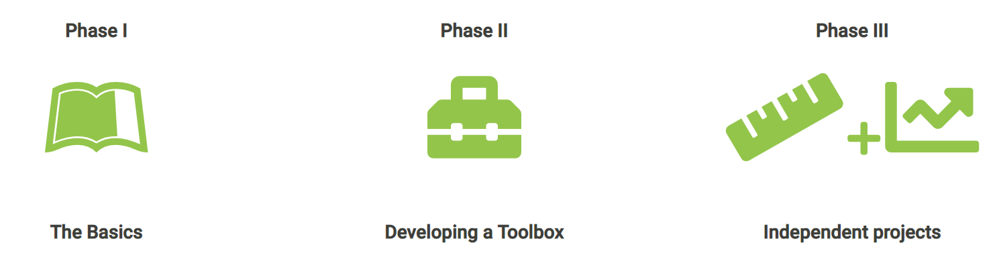

class: inverse, top
# Hello! 

```{r,echo=FALSE,message=FALSE,warning=FALSE}
library(tidyverse)
library(kableExtra)
```

<!-- Add icon library -->
<link rel="stylesheet" href="https://cdnjs.cloudflare.com/ajax/libs/font-awesome/5.14.0/css/all.min.css">


.pull-left[
Today we'll ....

- Learn what the course is about

- See how the course  is organized

]

.pull-right[

]
---
class: inverse, top
<!-- slide 1 -->
# Class details

.pull-left[


https://bcorgbio.github.io/class

Monday, Wednesday, Friday 10:00-10:50 for **some** lecturing and lots of in-person **problem solving**


]

.pull-right[


kenaley@bc.edu

<!-- Add font awesome icons -->
<p style="text-align: left;">
    <a href="https://twitter.com/kenaley" class="fab fa-twitter">@kenaley</a>
</p>

kenaleylab.org

office hours by appointment in Higgins 425B (by appointment) 
]


---
class: 

# Meet and potatoes


```{r,echo=FALSE}
   
g <- rbind(c("","","Points"),
  c("Discussion Q&A","",50),
  c("Wednesday Code Reviews ","","12x10"),
c("Phase I Projects ","","4x25"), 
c("Phase II Projects ","","3x50"),
c("Phasee III/Final Project","", "1x150"),
c("","total","500")
)

kbl(g)%>%row_spec(row = 1:nrow(g),background = "white")%>%kable_styling()
```

---

# Course requirements

.pull-left[

Hard stuff:

- Personal computer 


Soft stuff: 
- [GitHub account](https://github.com/join) 
- [R](https://www.r-project.org/) installed 
- [R Studio IDE](https://www.rstudio.com/) installed 


]
.pull-right[


]

---
class:  top
# Class structure

.pull-left[

- Semi-flipped (a little lecturing: talk/discuss here, learn/conquer out there)
- Lectures are discussion based and project focused 
- In class code reviews (graded)
- You lead!
- Team-based projects
- Teams assigned randomly

]

.pull-right[

]


---
class:  top
# Teams and team responsibilities

- Teams of 3 students assigned in the first few days of class. 

This team must establish two things:

  1. Pick a team nickname. Puns are welcome and encouraged (e.g., "R-tful Coders") 
  2. Have a single team member create a github repository titled ProjectNumber_TeamNumber, e.g., "Project2_Team2" (directions [here](https://docs.github.com/en/repositories/creating-and-managing-repositories/creating-a-new-repository)). Note: only one person in the team should create a project repo.
  4. Add Professor Kenaley (@ckenaley) and other team members as collaborator to this repository (directions [here](https://docs.github.com/en/account-and-profile/setting-up-and-managing-your-personal-account-on-github/managing-access-to-your-personal-repositories/inviting-collaborators-to-a-personal-repository))
  5. A team representative must submit a question to our [discussion board](https://github.com/orgs/bcorgbio/discussions) and include the team handle in the question title.
  6. A team representative must answer a question on the discussion board and include the team handle in the response.
  


---
class:  top
# Course Outline
.center[

]

.pull-left[

## Phase I

- Learning the basics
- Small projects

]

.pull-right[

## Phase II projects

- Project descriptions on [course site](https://bcorgbio.github.io/class/index.html)
- 2-3 weeks to finish
- Reports due on Sundays
- Report written in R Markdown
- Commit to team repo on GitHub
]


---
class:  top
# Phase III/Final project

.pull-left[

## Overview

- Team-based
- Topic of your choice (build off of Phase II)
- Same report guidelines as Phase II (.Rmd, format, etc.)

]

.pull-right[

## Timeline
- ~2 weeks to develop, execute
- Start end of November
]


---
class:  top
# Phase II topics

.pull-left[
- Evolution of head shape in ray-finned fishes.

- Spatial analysis of species occurences.

- Migration phenology of neotropical migrants in New England
]

.pull-right[

]


---
class:  top
# Phase II topics

.pull-left[
- Evolution of head shape in ray-finned fishes.

- Spatial analysis of species occurances.

- Migration phenology of neotropical migrants in New England
]

.pull-right[

]


---
class:  top
# Phase II topics

.pull-left[
- Evolution of head shape in ray-finned fishes.

- Spatial analysis of species occurances.

- Migration phenology of neotropical migrants in New England
]

.pull-right[

]


---
class:  top
# Phase III topics

.pull-left[

- New Englang shark occurences and SST.

- *Phylogenetic signal* in migration phenology of neotropical migrants in New England
]

.pull-right[


]


---

class: center, middle

# Thanks!

Slides created via the R package [**xaringan**](https://github.com/yihui/xaringan).

