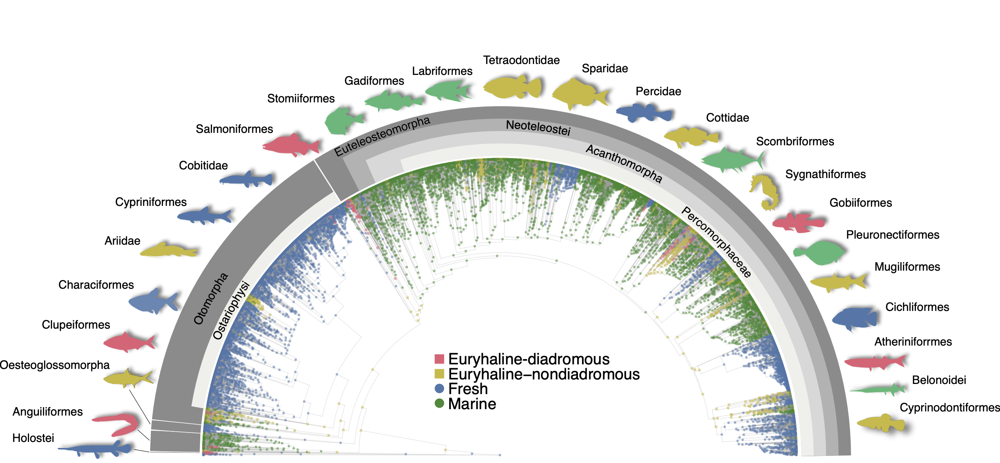
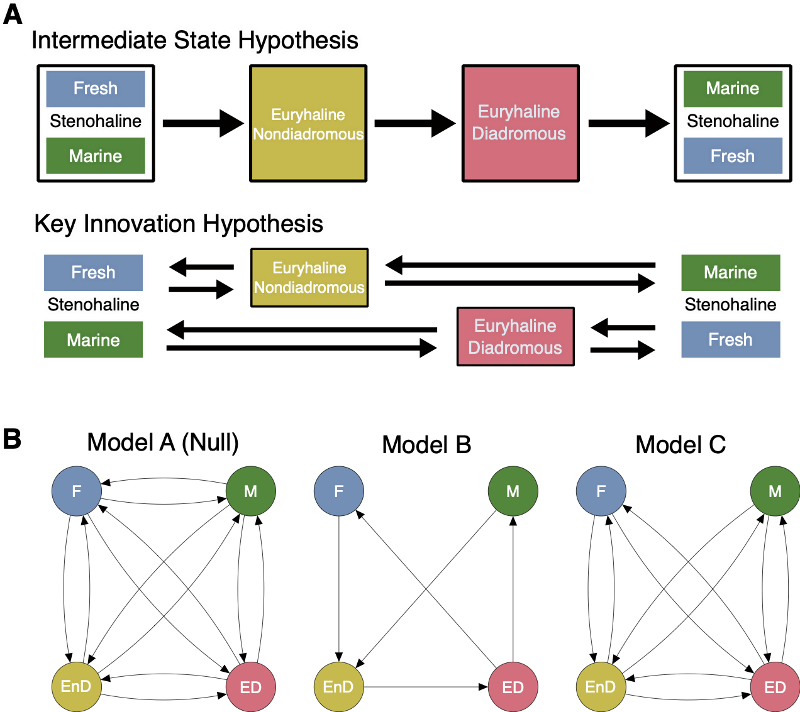

class: inverse, top
# Today we'll .....
```{r,echo=FALSE,message=FALSE,warning=F}
library(tidyverse)
library(kableExtra)
```

.pull-left[

- Review/Learn about Gitting

- Subsetting data

- `for` loops

- Peak under the hood of Module Project 1

- Research opportunity
]

---
class: inverse, top
# gitting


## Two important steps

.pull-left[


1. Create repo on github

2. Create an R project
  - Clone of repo
]

.pull-right[


]


---
class: inverse, top
# Research opportunity


.pull-left[


- Evolution of Anadromy

]

.pull-right[


]


---
class: inverse, top
<!-- slide 1 -->
# Research opportunity



---
class: inverse, top
<!-- slide 1 -->
# Research opportunity




