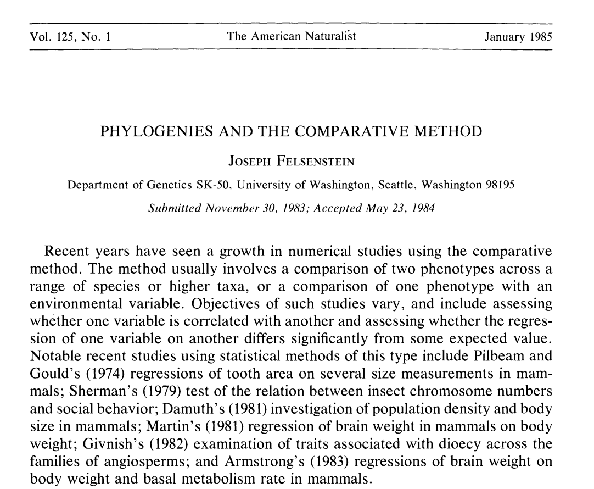
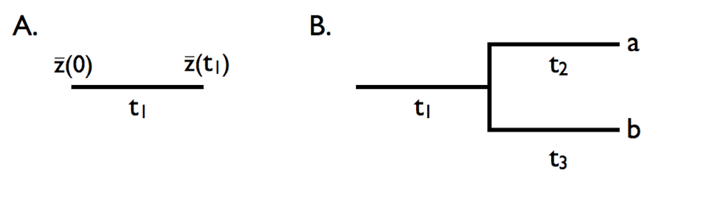
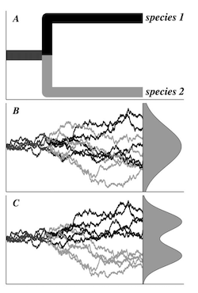

class: inverse, top
# In class today 

```{r,echo=FALSE,message=FALSE,warning=F}
library(tidyverse)
library(kableExtra)
library(ape)
library(phytools)
library(broom)
library(formatR)

```

<!-- qAdd icon library -->
<link rel="stylesheet" href="https://cdnjs.cloudflare.com/ajax/libs/font-awesome/5.14.0/css/all.min.css">


.pull-left[
Today we'll ....

- Consider a little history

- Consider the effect of phylogeny

]

.pull-right[

]

---
class: inverse, top
# First, some history


.pull-left[
The comparative method:

- Documenting diversity of traits 

- Quantifying their intercorrelations 

- Speculating on their evolution

Before Felsenstein (1985), no theoretical method to account for phylogeny and this effect was largely ignored of explained away.
]

.pull-right[
Cited >10000 times!!!

]


---
class: inverse, top
## Before Felsenstein (1985)

.pull-left[
- Sample a breadth of species

- Document the phenotype (e.g., Met. rate vs. size)

- Quantifying the contrast or trend between them (ANOVA, T-test, etc.)


```{r, echo=FALSE,fig.height=5,message=F,warning=F}
spec <- letters[1:20]
set.seed(123) 
phy <- rcoal(n=20)
phy$tip.label <- spec
plot(phy)

met <- c(runif(1,))
theta <- rep(1, Nedge(phy))
theta[c(1:8)] <- 2
## sensitive to 'alpha' and 'sigma':
met <- rTraitCont(phy, "OU", theta = theta, alpha=.02, sigma=.01)*1000
mass <- c(rnorm(7,n=8,sd=1),rnorm(5,n = 12,sd=1))
```
]

.pull-right[
```{r,fig.height=3,echo=FALSE,results='hide',warning=F}
d <- tibble(spec,mass,met)
d%>%
  ggplot(aes(x=mass,y=met))+geom_point()+geom_smooth(method="lm")+theme_classic(20)
```


```{r,echo=FALSE,message=F,warning=F}
d.lm <- lm(log(met)~log(mass),d)
tidy(anova(d.lm))[,c(1,5,6)]
```
]


---
class: inverse, top
## After Felsenstein (1985)

.pull-left[
```{r,fig.height=4,message=F,warning=F}
mass.pic <- pic(log(mass),phy)
met.pic <- pic(log(met),phy)

qplot(mass.pic,met.pic)+geom_smooth(method = "lm")+theme_classic(20)
```
]

.pull-right[
```{r}
d.lm.pic <- lm(met.pic~mass.pic)
tidy(anova(d.lm.pic))[,c(1,5,6)]
```
]


---
class: inverse, top
## After Felsenstein (1985)


.pull-left[

Metabolic Rate

```{r,echo=FALSE,message=F}
plotBranchbyTrait(phy,met)
```
]


.pull-right[

Mass

```{r,echo=FALSE,message=F}
plotBranchbyTrait(phy,mass)
```
]


---
class: inverse, top
<!-- slide 1 -->

## Humble beginnings

> This paper addresses a complex and important issue, and provides a solution to part of the problem—a very unsatisfactory solution, as the author is well aware, given the degree to which our data will usually fall short of the quality required by the method he proposes. … Nevertheless, as far as I can tell the method does what is claimed, and it is probably worth publishing.
              
              -Anonymous reviewer of Felsenstein (1985)

---
class: inverse, top
<!-- slide 1 -->

## More complex models

### Brownian motion
<center>

</center>
<br>

  $\sigma^2$

the rate parameter

---
class: inverse, top
<!-- slide 1 -->

## More complex models

```{r,echo=F,message=F}
sig2 <- 0.1
nsim <- 100
t <- 1:100

sim.l <- list()
for(i in c(1,5,10,20)){
sim.i <- tibble(
  sig2=i,
  x=rnorm(n = nsim * (length(t) - 1), sd = sqrt(i)),
  t=rep(t,nsim-1),
  n.sim=unlist(lapply(1:99,function(x) rep(x,100)))
)%>%
  group_by(n.sim)%>%
  mutate(sim.sum=cumsum(x))
sim.l[[paste0(i)]] <- sim.i
}

sim <- do.call(rbind,sim.l)


sim%>%
  ggplot(aes(t,sim.sum,group=n.sim),alpha=0.01)+geom_line()+facet_wrap(sig2~.,ncol=2)+ylab("trait value")

```

---
class: inverse, top
<!-- slide 1 -->

## More complex models

### OU process

.pull-left[
<center>

</center>
<br>
]

.pull-right[
$\sigma^2$
the rate parameter

$\theta$
trait optimum

$\alpha$
strength of selection
]


---
class: inverse, top
<!-- slide 1 -->

## More complex models

### Phylogenetic Least Squares


Models that include process (mode) and relationships
```{r eval=FALSE,tidy=TRUE,message=F}

#PGLS under BM,
gls(y ~x, correlation = corBrownian(1,phy = tree,form=~Species),data = data, method = "ML")

#PGLS under OU
pgls.OU1 <- gls(y ~x, correlation = corMartins(0,phy = tree,form=~Species),data =dat, method = "ML")


```

