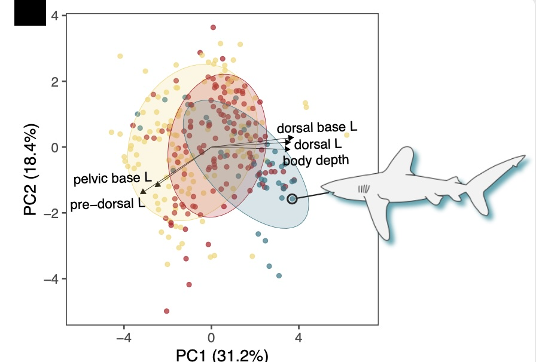

class: inverse, top
# Hello! 

```{r,echo=FALSE,message=FALSE,warning=FALSE}
library(tidyverse)
library(kableExtra)
```

<!-- Add icon library -->
<link rel="stylesheet" href="https://cdnjs.cloudflare.com/ajax/libs/font-awesome/5.14.0/css/all.min.css">


.pull-left[
Today we'll ....

- Learn what the course is about

- See how the course  is organized

]

.pull-right[

]
---
class: inverse, top
<!-- slide 1 -->
# Class details

.pull-left[


https://bcorgbio.github.io/class

Monday, Wednesday, Friday 10:00-10:50 for **some** lecturing and lots of in-person **problem solving**


]

.pull-right[


kenaley@bc.edu

<!-- Add font awesome icons -->
<p style="text-align: left;">
    <a href="https://twitter.com/kenaley" class="fab fa-twitter">@kenaley</a>
</p>

kenaleylab.org

office hours by appointment in Higgins 425B 
]


---
class: 

# Meet and potatoes


```{r,echo=FALSE}
   
g <- rbind(c("","","Points"),
  c("Discussion Q&A","",50),
  c("Wednesday Code Reviews ","","12x10"),
c("Phase I Projects ","","4x25"), 
c("Phase II Projects ","","3x50"),
c("Phasee III/Final Project","", "1x150"),
c("","total","500")
)

kbl(g)%>%row_spec(row = 1:nrow(g),background = "white")%>%kable_styling()
```

---

# Course requirements

.pull-left[

Hard stuff:

- Personal computer 


Soft stuff: 
- [GitHub account](https://github.com/join) 
- [R](https://www.r-project.org/) installed 
- [R Studio IDE](https://www.rstudio.com/) installed 


]
.pull-right[


]

---
class:  top
# Class structure

.pull-left[

- Semi-flipped (some lecturing but talk/discuss here, learn/conquer out there)
- Lectures are discussion based and project focused 
- In class code reviews (graded) on Most Wednesdays
- You lead!
- Team-based projects
- Teams assigned randomly

]

.pull-right[

]


---
class:  top
# Teams and team responsibilities

- Teams of 3 students assigned at the beginning of each modules. 

This team must establish two things:

  1. Pick a team nickname. Puns are welcome and encouraged (e.g., "R-tful Coders") 
  2. Have all clone github repository appropriately named, e.g., "Module1_Team1" (directions [here](https://docs.github.com/en/repositories/creating-and-managing-repositories/creating-a-new-repository)). 
  4. Professor Kenaley (@ckenaley) will add all team members as collaborator to their  repository (directions [here](https://docs.github.com/en/account-and-profile/setting-up-and-managing-your-personal-account-on-github/managing-access-to-your-personal-repositories/inviting-collaborators-to-a-personal-repository))
  5. A team representative must submit a question to our [discussion board](https://github.com/orgs/bcorgbio/discussions) and include the team name in the question title.
  6. A team representative must answer a question on the discussion board and include the team name in the response.
  


---
class:  top
# Course Outline
.center[

]

.pull-left[

## Phase I

- Learning the basics
- Small projects
- [Peer evaluations](peer_contributions.htmls)
- Commit to team repo on GitHub

]

.pull-right[

## Phase II projects

- Project descriptions on [course site](https://bcorgbio.github.io/class/index.html)
- 2-3 weeks to finish
- Reports due on Sundays
- Report written as scripts and eventually as R Markdown
- Commit to team repo on GitHub
- Peer evaluations
]


---
class:  top
# Phase III/Final project

.pull-left[

## Overview

- Team-based
- Topic of your choice (build off of Phase II)
- Same report guidelines as Phase II (.Rmd, format, etc.,peer evaluations)

]

.pull-right[

## Timeline
- ~2 weeks to develop, execute
- Start end of November
- Commit to team repo on GitHub
]


---
class:  top
# Phase II topics

.pull-left[
- **Evolution of body shape in sharks.**

- Spatial analysis of species occurences.

- Migration phenology of neotropical migrants in New England
]

.pull-right[

]


---
class:  top
# Phase II topics

.pull-left[
- Evolution of body shape in sharks.

- **Spatial analysis of species occurrences.**

- Migration phenology of neotropical migrants in New England
]

.pull-right[

]


---
class:  top
# Phase II topics

.pull-left[
- Evolution of body shape in sharks.

- Spatial analysis of species occurrences.

- **Migration phenology of neotropical migrants in New England**
]

.pull-right[

]


---
class:  top
# Phase III topics

.pull-left[

- New Englang shark occurences and SST.

- *Phylogenetic signal* in migration phenology of neotropical migrants in New England
]

.pull-right[


]


---
class:  top
# Wednesday Code Reviews (WCRs)

.pull-left[

- In class

- Posted on [class calendar](https://bcorgbio.github.io/class/at_a_glance.html)

- Submit over google forms

- 12x10 pts (2 lowest dropped)

]

.pull-right[


]

---
class:  top
# Academic Inegrity and AI


  + Generative AI is incredibly useful for writing a little code
  + Can render usesful and in some cases complete results.
  + IMO, relying on AI makes the learning goals of the course hard to reach. 
  + Summary: it can be helpful, but stifle learning, and can be used irresponsibly. 
  
  So that we're all on the same page with regard to how AI fits into the course, students should read, understand, and follow following AI policy.

---
class:  top
# Academic Inegrity and AI

### Requirements


  + **All students must attribute AI as the source of any work** (i.e., you must cite your AI sources and specifically how they were used). Therefore, there must be a statement in every piece of submitted work that outlines how AI was used in the execution of the project. 
  + **Students may *NOT* submit AI-generated work as wholesale substitutes for the work expected of them.** In other words, any work a student submits must be, by and large, produced by that student and not the direct output of AI. 
 
---
class:  top
# Academic Inegrity and AI

### Guidelines for Acceptable Use

  AI may be used for:
  
  + Brainstorming and  code-review preparation.
  + Debugging code and error interpretations.
  + Finding guidance concerning how to implement code in an analysis (e.g, appropriate functions, syntax, and logic).
  + Background research on a topic or quantitative method.
  + Generating a lists of potentially relevant sources to read.
  + Editing text for clarity, spelling and grammar.
  + Many other things.*
 
*If you come to a point where you're using AI and unsure if this particular use falls in the "acceptable" category, please talk with Prof. K. He'll provide some guidance.

---
class:  top
# Academic Inegrity and AI

### AI-use Statement

Each submission, whether a script or markdown document, must include a bried AI-use statement that outlines how AI was used in the execution of the project. This must include specific details concerning what type of AI was used and how the completion of tasks or report requirements were assisted with AI. Based on this, Prof. Kenaley will assess whether the use was appropriate.

---

class: center, middle

# Thanks!

Slides created via the R package [**xaringan**](https://github.com/yihui/xaringan).

