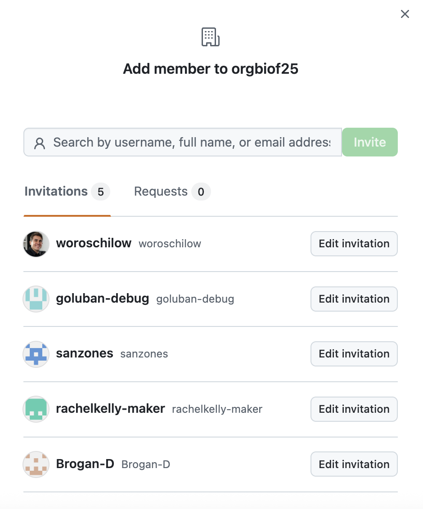
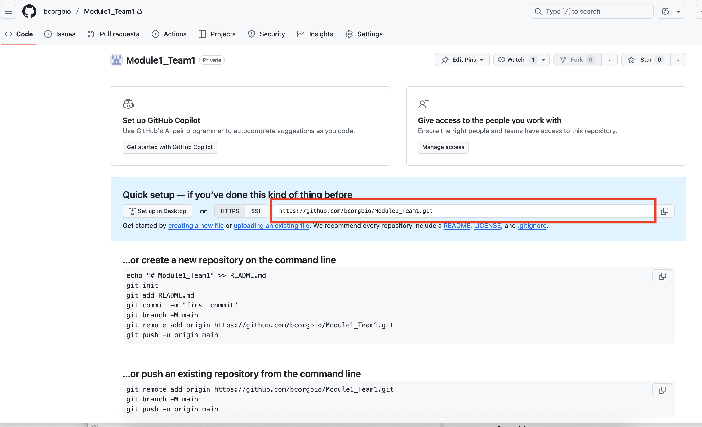
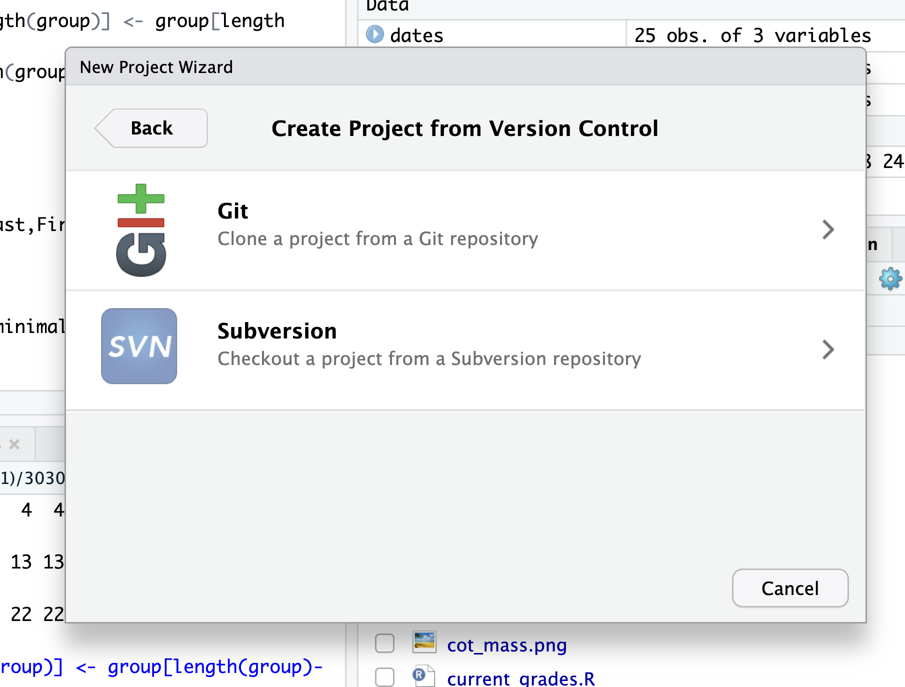
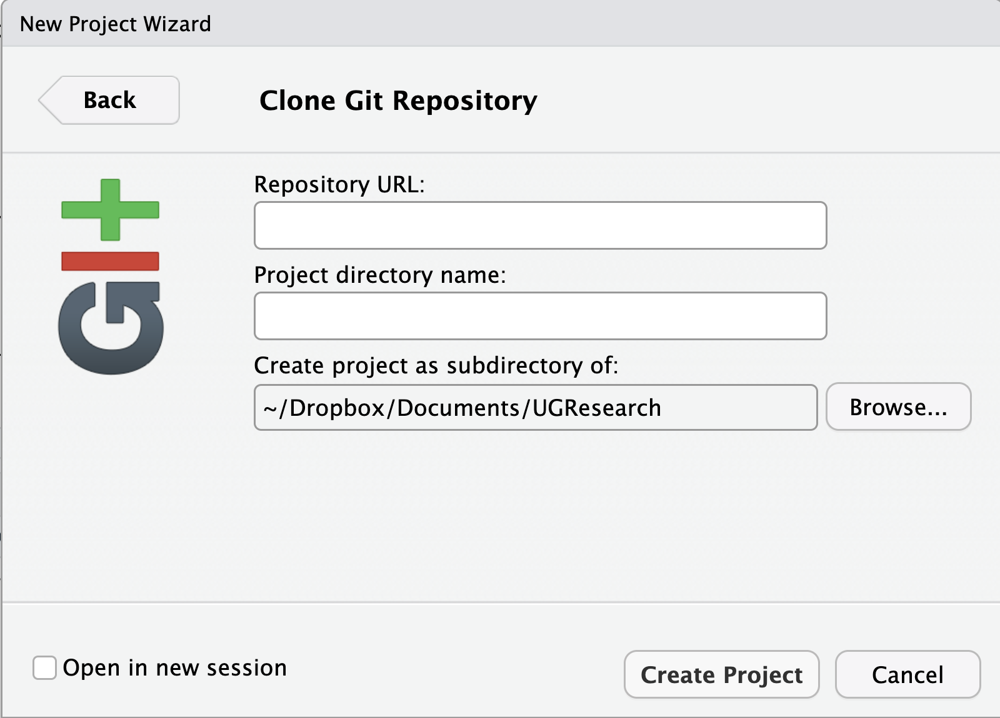
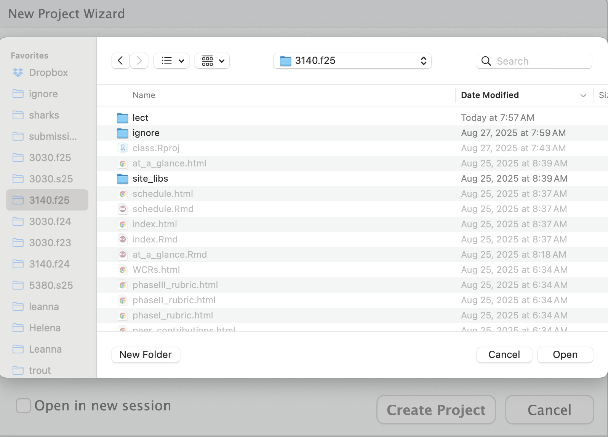
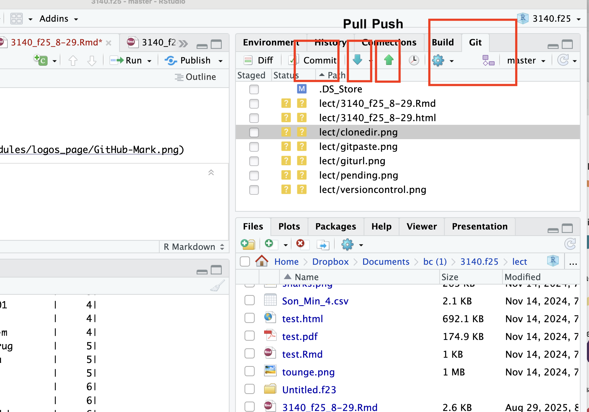

class: inverse, top
# Today we'll .....
```{r,echo=FALSE,message=FALSE,warning=F}
library(tidyverse)
library(kableExtra)
```

.pull-left[

- Review Gitting, clone a repo

- Subsetting data

- `for` loops

- Peak under the hood of Module Project 1

]

---
class: inverse, top
# Pleas for help

.pull-left[

Please accept team and repo invites!


]

.pull-right[




]

---
class: inverse, top
# Git and RStudio
## Important steps


.pull-left[

1a: [If repo exists] Go to repo on github, copy URL

1b: [If repo doesn't exists] Make a repot on github, copy


]

.pull-right[


]

---
class: inverse, top
# Git and RStudio
## Important steps

.pull-left[

2: Create an R project
  + Go to File -> New Project....
  + Choose Version Control:
  + In the "New Project" dialog, select "Version Control".
]

.pull-right[


]

---
class: inverse, top

# Git and RStudio
## Important steps

 


.pull-left[
3: Select "Git" as the system
- Click **Git**.
]


.pull-right[

]


---
class: inverse, top

# Git and RStudio
## Important steps


.pull-left[
4: Paste the Repository URL
- In **Clone Git Repository**, paste the repo **URL** (copied from GitHub).
- Example: `https://github.com/YOUR-ORG/YOUR-REPO.git`
]


.pull-right[


]


---
class: inverse, top

# Git and RStudio
## Important steps

.pull-left[
  5: Name the repo locally
  - Give your local project a short, clear **Name**.
  - This becomes the folder name.
 6: Choose a destination folder
  - Click **Browse…** and pick where to put the project.
  - Tip: keep a top-level folder/directory like `~/bc-3140/` or `~/courses/`.
]


.pull-right[

]


---
class: inverse, top

# Git and RStudio
## Important steps

.pull-left[
7: Click "Create Project"
- RStudio will clone the repo and open the project.
- Look for the **Git** pane (upper right: "Commit", "Pull", "Push").
]


.pull-right[

]


---
class: inverse, top

# Git and RStudio
# You're ready to code 🎉


.pull-left[
- Use the **Git** tab to manage workflow.
- *Always* Use **Pull** first to sync download
- **Commit** with message to stage make changes.
- **Push** to publish.
]


.pull-right[


]

---
class: inverse, top

# Subsetting

```{r setup, include=FALSE}
options(width = 90)
knitr::opts_chunk$set(message = FALSE, warning = FALSE)
library(tidyverse)
```


## Goals 

- Compare **row** and **column** subsetting in **base R** 
- Show common patterns: conditions, positions, name patterns, etc. 
- Use the built-in **`iris`** dataset for reproducible examples


---
class: inverse, top

# Data & Setup


```{r}
library(tidyverse) #Always!
class(iris)
iris <- as_tibble(iris) #converts data frame to tibble
class(iris)
head(iris)
```

---
class: inverse, top

# data frames and tibbles

- data frame (`?data.frame`): 2D table, rows x column

- tibble (`?tibble`): super-charges 2D table, rows x column

## Isolating rows, columns in 2D classes

```{r}
# rows
iris[1,]

```
---
class: inverse, top


## Isolating rows, columns in 2D classes

```{r}
# multiple rows
iris[c(1,3,5),]
```

---
class: inverse, top

## Isolating rows, columns in 2D classes

```{r}
#columns
head(iris[,1])
#columns with $
head(iris$Sepal.Length)

```

---
class: inverse, top


## Isolating rows, columns in 2D classes

```{r}
#columns with names
head(iris[c("Sepal.Length","Sepal.Width")])

```


---
class: inverse, top

# Row Filtering by Condition

### With `[]` and conditions
```{r}
# Versicolor flowers with Sepal.Length > 6
subset_rows <- iris[iris$Sepal.Length > 6 & 
                      iris$Species == "versicolor", ]
head(subset_rows)
```


---
class: inverse, top

# Row Filtering by Condition

### With `subset()` and conditions

```{r}
# Using subset() (convenience wrapper)
subset_rows2 <- subset(iris, Sepal.Length > 6 
                       & Species == "versicolor")
head(subset_rows2)
```

---
class: inverse, top

# Row Filtering by Condition

### Allows operations on data of interest

```{r}
# means
vers_sepalL <- iris[iris$Species == "versicolor",]$Sepal.Length
set_sepalL <- iris[iris$Species == "setosa",]$Sepal.Length

mean(vers_sepalL) 
mean(set_sepalL)

#same using sapply
sapply(list(vers_sepalL,set_sepalL),mean)
```
