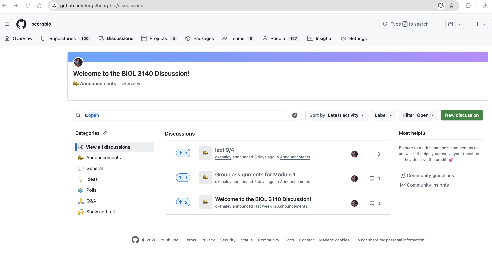

class: inverse, top
# Today we'll .....
```{r,echo=FALSE,message=FALSE,warning=F}
library(tidyverse)
library(kableExtra)
```

.pull-left[

- Review WCR

- Subsetting data
  
- loop alternatives: `sapply`, `lapply`


]


---
class: inverse, top
# Reminder

.pull-left[

- Post question to discussion board (today)

- Post answer to discussion board (friday)
  


]

.pull-right[


  


]


