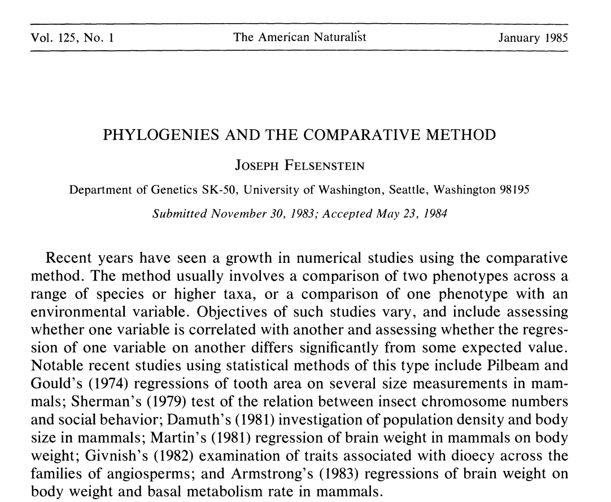
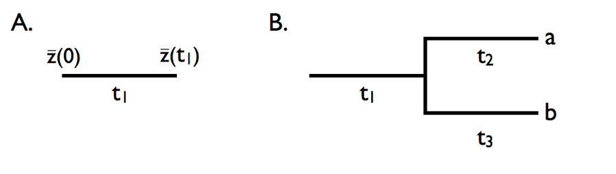
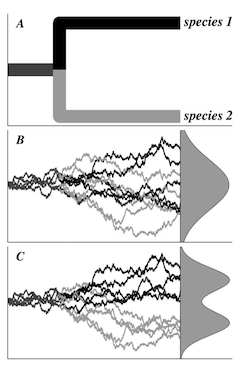

# In class today 

```{r,echo=FALSE,message=FALSE,warning=F}
library(tidyverse)
library(kableExtra)
library(ape)
library(phytools)
library(broom)
library(formatR)
knitr::opts_chunk$set(message = FALSE, warning = FALSE)
```

<!-- qAdd icon library -->
<link rel="stylesheet" href="https://cdnjs.cloudflare.com/ajax/libs/font-awesome/5.14.0/css/all.min.css">


.pull-left[
Today we'll ....

- Consider a little history

- Consider the effect of phylogeny

- More on the AIC: $AIC_c$ and $AIC_w$

]

.pull-right[

]

---

# First, some history


.pull-left[
The comparative method:

- Documenting diversity of traits 

- Quantifying their covariation and intercorrelations 

- Speculating on their evolution

Before Felsenstein (1985), no theoretical method to account for phylogeny and this effect was largely ignored or explained away.
]

.pull-right[
Cited >10000 times!!!

]


---

## Before Felsenstein (1985)

.pull-left[
- Sample a breadth of species

- Document the phenotype (e.g., Met. rate vs. size)

- Quantifying the contrast or trend between them (ANOVA, T-test, etc.)


```{r, echo=FALSE,fig.height=4,message=F,warning=F}
library(phytools)
library(tidyverse)
spec <- letters[1:20]
set.seed(123) 
phy <- rcoal(n=20)
phy$tip.label <- spec
plot(phy)

met <- c(runif(1,))
theta <- rep(1, Nedge(phy))
theta[c(1:8)] <- 2
## sensitive to 'alpha' and 'sigma':
met <- rTraitCont(phy, "OU", theta = theta, alpha=.02, sigma=.01)*1000
mass <- c(rnorm(7,n=8,sd=1),rnorm(5,n = 12,sd=1))
```
]

.pull-right[
```{r,fig.height=3,echo=FALSE,results='hide',warning=F}
d <- tibble(spec,mass,met)
d%>%
  ggplot(aes(x=mass,y=met))+
  geom_point()+
  geom_smooth(method="lm")+
  theme_classic(20)
```


```{r,echo=FALSE,message=F,warning=F}
library(broom)
d_lm <- lm(log(met)~log(mass),d)
tidy(anova(d_lm))[1,c(1,5,6)]
```
]


---

# After Felsenstein (1985)

Phylogenetic Independent Contrast (PIC)

.pull-left[
```{r,fig.height=3,message=F,warning=F}
mass.pic <- pic(log(mass),phy)
met.pic <- pic(log(met),phy)

qplot(mass.pic,met.pic)+
  geom_smooth(method = "lm")+
  theme_classic(20)
```
]

.pull-right[
```{r}
d.lm.pic <- lm(met.pic~mass.pic)
tidy(
  anova(d.lm.pic)
  )[1,c(1,5,6)]
```
]


---

# After Felsenstein (1985)


.pull-left[

Metabolic Rate

```{r,fig.height=3,echo=FALSE,message=F}
plotBranchbyTrait(phy,met)
```
]


.pull-right[

Mass

```{r,fig.height=3,echo=FALSE,message=F}
plotBranchbyTrait(phy,mass)
```
]


---

<!-- slide 1 -->

# Humble beginnings

> This paper addresses a complex and important issue, and provides a solution to part of the problem—a very unsatisfactory solution, as the author is well aware, given the degree to which our data will usually fall short of the quality required by the method he proposes. … Nevertheless, as far as I can tell the method does what is claimed, and it is probably worth publishing.
              
              -Anonymous reviewer of Felsenstein (1985)

---

<!-- slide 1 -->

# More complex models

## Brownian motion
<center>

</center>
<br>

  $\sigma^2$

the rate parameter

---

<!-- slide 1 -->

# More complex models

## Different values of $\sigma^2$, the rate parameter

```{r,echo=F,message=F,fig.height=4}
sig2 <- 0.1
nsim <- 100
t <- 1:100

sim.l <- list()
for(i in c(1,5,10,20)){
sim.i <- tibble(
  sig2=i,
  x=rnorm(n = nsim * (length(t) - 1), sd = sqrt(i)),
  t=rep(t,nsim-1),
  n.sim=unlist(lapply(1:99,function(x) rep(x,100)))
)%>%
  group_by(n.sim)%>%
  mutate(sim.sum=cumsum(x))
sim.l[[paste0(i)]] <- sim.i
}

sim <- do.call(rbind,sim.l)


sim%>%
  ggplot(aes(t,sim.sum,group=n.sim),alpha=0.01)+geom_line()+facet_wrap(sig2~.,ncol=2)+ylab("trait value")

```

---

<!-- slide 1 -->

# More complex models

## OU process

.pull-left[
<center>

</center>
<br>
]

.pull-right[
$\sigma^2$
the rate parameter

$\theta$
trait optimum

$\alpha$
strength of selection
]


---

<!-- slide 1 -->

# More complex models

## Phylogenetic Least Squares

- Models that include process (mode) and relationships

- using `nlme::gls()`

- correlation functions from `ape` package (e.g.`corBrownian()` for BM, `corMartins()` for OU)


```{r, tidy=TRUE,message=F,warning=F}
library(nlme)
#PGLS under BM,
fit_bm <- gls(log(met) ~log(mass), correlation = corBrownian(1,phy = phy,form=~spec),data = d, method = "ML")

#PGLS under OU
fit_ou <- gls(log(met) ~log(mass), correlation = corMartins(1,phy = phy,form=~spec),data = d, method = "ML")

d$pred_bm <- predict(fit_bm)
d$pred_ou <- predict(fit_ou)

```

---

<!-- slide 1 -->

# Phylogenetic Least Squares

```{r,message=F,fig.height=3,message=F,warning=F}
d %>% 
  pivot_longer(pred_ou:pred_bm,names_to = "evol_model") %>% 
  ggplot(aes(log(mass),log(met)))+
  geom_point() +
  geom_smooth(method="lm")+
  geom_smooth(method="lm",aes(y=value,col=evol_model))
```

---

<!-- slide 1 -->

# Phylogenetic Least Squares: model choice

Which model should we interpret?

Using AIC: 

```{r, tidy=TRUE,message=F}
AIC(fit_bm,fit_ou)
anova(fit_bm)
```

---

<!-- slide 1 -->

# Phylogenetic Least Squares: model choice

.pull-left[
Which model should we interpret?

Using *corrected* AIC ($AIC_{c}$):


```{r, tidy=TRUE,message=F}
library(MuMIn)
AICc(fit_bm,fit_ou)
anova(fit_bm)
```
]


.pull-right[

### AIC
$\mathrm{AIC} = 2k - 2\ln(\hat{L})$

### $AIC_c$

$\mathrm{AIC}_c = \mathrm{AIC} + \frac{2k(k + 1)}{n - k - 1}$
]

---
# Phylogenetic Least Squares: model choice

Which model should we interpret?

Using *corrected* AIC weights ($AIC_{cw}$):

.pull-left[
```{r, tidy=TRUE,message=F}
library(MuMIn)
AICc(fit_bm,fit_ou) %>% Weights()
anova(fit_bm)
```
]

.pull-right[


### $AIC_w$
$w_{i}=\frac{\exp \left(-\frac{1}{2}\Delta _{i}\right)}{\sum _{R=1}^{R}\exp \left(-\frac{1}{2}\Delta _{R}\right)}$
]


