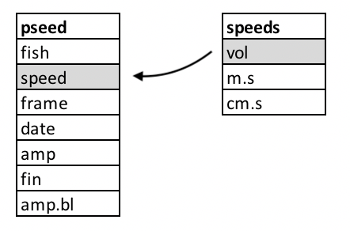

<style>
div.green { background-color:#c7d1c0; border-radius: 5px; padding: 20px;}
</style>
<!-- Add icon library -->
<link rel="stylesheet" href="https://cdnjs.cloudflare.com/ajax/libs/font-awesome/5.14.0/css/all.min.css">

# Introduction

Now that we have read and explored the basics of how to tidy, transform, and summarize data in R, let's put some of these new skills into practice. In this exercise, we'll work toward the goal of plotting kinematic data from a swimming fish. To do this, we'll have to load data from text files, join related data tables, add new columns to the data based on other columns and a custom function, and summarize our data based on grouping variables. 

# Set up

There are several data sets that need to be loaded:

  + A file of pectoral fin amplitude from two [pumpkinseed sunfish](https://www.newyorkupstate.com/life-and-culture/g66l-2019/08/b2a354a76c7e4/sunfish-101-how-to-id-a-bluegill-pumpkinseed-or-redbreast.html) at [this link](pseed.fin.amps.csv).
  + A file containing the body length of pumpkinseed sunfish included in the study at [this link](pseed.lengths.csv).
  + A file of the speeds at which specimens swam in the study at [this link](pseed.calibration.csv).

  Let's do so and then comment on the origin and importance of the data.
  
```{r,results='hide',warning=F}
library(tidyverse) # Remember to load your libraries!

#Remember to set your working directory, too!

#load data
pseed <- read_csv("pseed.fin.amps.csv")
pseed.bl <- read_csv("pseed.lengths.csv")
speeds <- read_csv("pseed.calibration.csv")
```

First, notice that we used `read_csv()` to load our .csv data files rather than `read.csv()`. `read_csv()` from the `tidyverse` package `readr` is identical to `read.csv()`.  However, it loads data as a tibble, an object like a data.frame but one that works seamlessly with the other functions contained in `tidyverse`. 

<center>
<iframe width="460" height="315" src="https://www.youtube.com/embed/xYEJThBVoXM" frameborder="0" allowfullscreen></iframe>
</center>
<br>

The data loaded to `pseed` are amplitudes of pectoral fin oscillations (i.e., fin beats) from two pumpkinseeds swimming across a range of speeds in a swim tunnel. Points on the pectoral fin (red dots in the video above) were tracked frame by frame automatically from video files in R with the package `trackter`. The video above represents 100 frames or so from one experiment. The data set includes the following columns:
  
  + `fish`: The fish number in the experiment.
  + `speed`: The voltage sent to the motor driving the prop that is moving the water. Higher voltages result in a faster motor speed.
  + `frame`: The frame in the experiment video from which the data are taken.
  + `date`: A date in the format "year-month-day-hourminutesecond" that identifies when the experiment started. This is unique for each experiment.
  + `amp`: Fin amplitude in pixels.
  + `fin`: From which fin, left or right, the amplitude was recorded.
  + `amp.bl`: The specific fin amplitude as a proportion of body length (BL$^{-1}$).
  
This data set doesn't include important information about the data, including the size of each specimen and what water speeds the motor speeds resulted in. These are critical data. For instance, data for locomotor speed are often reported as *specific speeds*, i.e., body lengths per second (BL$\cdot$s$^{-1}$) by physiologists to control for the difference in size between organisms. Using motor voltage wouldn't be so helpful in this regard. To do something like compute the specific swimming speed, we need both the length of the specimen (in cm, say) and the speed of the water (in cm$\cdot$s$^{-1}$). Fortunately, we measured the BL of each fish and conducted calibration experiments to assess water speed for each motor voltage. 

The size of each fish is contained in the "peed.lengths.csv" file that we passed to the `pseed.bl` variable. It contains the columns `fish`, the specimen number, and `bl`, the body length in cm. The calibrated speed in cm$\cdot$s$^{-1}$ of the flow tank according to motor RPM is contained in the "pseed.calibration.csv" file that we passed to the `speeds` variable. The columns in `speeds` include `vol`, the motor voltage, `m.s` and `cm.s` the water speed inside the flow tank resulting from that voltage in in m$\cdot$s$^{-1}$ and in cm$\cdot$s$^{-1}$, respectively.

Our goal in this project is to qualitatively assess if pectoral-fin amplitude changes over the range of speeds swam by our two pumpkin seeds. To do this, we'll plot these data (in convention dimension units of BL$^{-1}$ for amplitude and BL$\cdot$s$^{-1}$ for speed). This will require that we combine our data sets and perform some transformations on the data, adding new columns of data for plotting along the way.


# More Complicated Operations: Joining Relational Data

As we learned in [R4DS](https://r4ds.had.co.nz/relational-data.html), separate but related data can exist in different places (i.e., different data frames or tibbles), yet have similar properties, specifically common attributes such as columns that contain the same data. By using these common attributes, known as keys, we can combine data to ask and answer a more expansive array of questions. In the context of analysis of data from scientific experiments, we often have many data files, including one that contains the results of the experiments and others that contain important data not recorded in the course of the experiments but that are essential to analysis. 

Consider the pectoral-fin data we loaded and the goals we have. Our main results table in `pseed` contains the the amplitude of left and right pectoral fins recorded over many experiments for two fish over many speeds. Our goal is to assess how amplitude varies with speed. The speed in the main data table isn't reported as a conventional unit, like cm$\cdot$s$^{-1}$, but rather as the motor voltage that spun the prop. Higher voltages resulted in higher water speeds, but we don't know the exact relationship based on this alone and, thus, if we worked with this table for analysis, we are left in the awkward position of reporting our results for various speeds in voltage. Not good. 

<div class = "green">
<div class="row">
  <div class="col-sm-2"><a class="far fa-sticky-note fa-5x" style="color:#939681"></a> <!-- regular style --></div>
  <div class="col-sm-9">You may be wondering *How does water speed in the tunnel relate to swimming speed of a fish in it?* Answer: think of the swim tunnel as a treadmill for aquatic locomotors (i.e., swimmers). If you were on a treadmill and set the speed to an 8-minute mile, the tread would be moving at 7.5 miles$\cdot$h$^{-1}$. If you keep up with the tread, running stationary with reference the the space surrounding the treadmill, you're running at 7.5 miles$\cdot$h$^{-1}$. Therefore a fish swimming in place in a swim tunnel that is moving water at 5 cm$\cdot$s$^{-1}$ is swimming at 5 cm$\cdot$s$^{-1}$
</div>
</div>
</div>
<br>

To easily plot data and undertake our qualitative analysis, we need amplitude and swim/water speed in the same table. Fortunately, we have loaded the tunnel's water speed as it varies with motor voltage. To combine the data, we must perform a merge or join operation. In this case, we need to perform an [outer join](https://r4ds.had.co.nz/relational-data.html#mutating-joins) whereby we add observations that appear in at least one of the tables. By this I mean that we have many observations (over 74,000!) of amplitude, each with an associated speed value in voltage in the main data table and fewer observations of voltages and associated water speeds in another (i.e., one voltage and water speed in each row). We want to add these water speeds to the many observations in our main `pseed` table.

Joining data tables in this way requires that we identify a key, a common attribute to both tables whose values will be used to add the new data to the table. What is this key? It's voltage, represented in the `pseed` table as `speed` and the `speeds` table as `vol`. 

<center>

</center>
<br>

In the figure above, we see the two tables and their columns represented. The key columns are outlined in gray. The arrow indicates the direction and manner of the join: the smaller `speeds` table that, based on the key values will add the remaining `m.s` and `cm.s` columns to the `pseed` table on its left. 

Fortunately, the powerful data analysis package `dplyr` in the `tidyverse` has a join function for just such an operation: `join_left()`, joining new data to left data. Here's how this works:

```{r}
pseed2 <- pseed%>%
  left_join(speeds,by=c("speed"="vol"))%>%
  print()
```

Here we create a new tibble by passing `pseed` with the pipe `%>%` to a `left_join()` function. The `left_join()` operation takes the `speeds` table and joins it leftward to the `pseed` table. The `by` parameter specifies by what columns to join the tables, i.e., the key values for each. Notice that the names of the key values are different because the key columns have different names in `pseed` and `speeds`. With `print()`, we printed the new table, complete with `m.s` and `cm.s` columns. Notice that there's no `vol` column added from the `speeds` table. Voila, almost there.

# Mutation: Adding Data to Data from its Own Data

Great, we have speed in cm and m$\cdot$s$^{-1}$ added to our results table, however, it is common practice in physiology to report locomotor speeds as specific speeds, that is, as a proportion of body lengths per second (BL$\cdot$s$^{-1}$). This means we need to add BL to our results table `pseed` and compute the specific speed, that is divide BL (in cm) by cm$\cdot$s$^{-1}$ to get BL$\cdot$s$^{-1}$. Fortunately, we have BL information contained in our `pseed.bl` tibble.

```{r}
pseed.bl%>%
  print()
```

Notice that this tibble contains three values for `fish` and we only have two fish in our new results table, "Pseed5" and "Pseed6":
```{r}
pseed2%>%
  select(fish)%>%
  unique()
```

To join `pseed.bl` to `pseed2`, the logical key value would be the column `fish`, a column common to both tibbles. You might at first think that a join operation would be complicated because the key values of each table aren't identical (i.e., "Pseed5" and "Pseed6" in `pseed` but "Pseed1", "Pseed5", and "Pseed6" in `pseed.bl`. Because the table we're joining to `pseed` has one additional value ("Pseed1"), all the values in the `pseed2` `fish` column are present in the `pseed.bl` `fish` column. So, we won't have a problem. By default, an outer join operation in `dplyr` like `left_join()` will only add values to the leftward table if the key value is present in both tables. However, if the opposite was the case and the key column in the leftward table contained more values than the right table to join, we'd have a problem. Say, there was a value of "Pseed2" in the key column `fish` of the `pseed2` table. There'd be no matching value in the key column `fish` in `pseed.bl` and a value of "NA" would be added to the new joined table. 

Let's go ahead and join the body length table `pseed.bl` with the results tibble `pseed2` using `left_join()` again. Notice we'll redefine `pseed2` as this new merged tibble:

```{r}
pseed2 <- pseed2%>%
  left_join(pseed.bl,by="fish")%>%
  print()
```

We now have BL in cm stored in a `bl` column. Now we need to compute specific speed in  BL$\cdot$s$^{-1}$. Because `pseed2` now contains `cm.s` (cm$\cdot$s$^{-1}$) and `bl` (in cm), all that's left to do is compute a new  `bl.s` column based on dividing `cm.s` by `bl.s`. For this, we'll mutate the tibble, that is, add a new column with this calculation.

```{r}
pseed2 <- pseed2%>%
  mutate(bl.s=cm.s/bl)%>%
  print()
```
Here we passed `pseed2` to a `mutate()` operation to add the new column, `bl.s`, based on the division of `cm.s` by `bl.s`. Note that we redefined `pseed2` as this new mutated tibble containing the specific swimming speed in the `bl.s` column.

Let's now use `ggplot`, our fantastic plotting package included in `tidyverse` to plot specific fin amplitude (`amp.bl`) against specific swimming speed (`bl.s`).

```{r}
pseed2%>%
  ggplot(aes(x=bl.s,y=amp.bl))+geom_point()
```
First of all, this is some sort of a mess: just a bunch of points for each speed. But, let's briefly breakdown what we did with `ggplot` (in our next module, we'll go into more specifics). We passed `pseed2` to a new plot with `ggplot()` and specified what it should look like with the `aes()` parameter. This is the aesthetic of the plot. Specifically, we want the x axis to reflect `bl.s` values in `pseed2` and the y axis to reflect `amp.bl`. To this we added a geometry layer, a specific type of plot, in this case, a scatter or point plot with `geom_point()`.

<div class = "green">
<div class="row">
  <div class="col-sm-2"><a class="far fa-sticky-note fa-5x" style="color:#939681"></a> <!-- regular style --></div>
  <div class="col-sm-9">We haven't spent much time discussing the ins and out of `ggplot`. That will come in the next module. So for now, don't worry too much about it's grammar and seemingly odd mechanics.
</div>
</div>
</div>
<br>

This plot is indeed a mess. We have so many plotted y values (over 74,000!) that we can't say much about the pattern in question `amp.bl` vs. `bl.s`. In this case it, it may be that we have a lot of overlapping points, obscuring any patterns. To confirm this suspicion, we can simply adjust the transparency of the points with the `alpha` parameter in `ggplot`. The lower the value for `alpha` (from 0-1), the more transparent the geometry being plotted. Let's try a really low `alpha` of 0.01, something like:

```{r}
pseed2%>%
  ggplot(aes(x=bl.s,y=amp.bl))+geom_point(alpha=0.01)
```

One thing should be apparent here: there are a lot of low values for each speed and many fewer high values. Duh! This is a flapping fin! That is, it moves through a range of motion from a low amplitude to high and back again. Let's look at the left pelvic fin for only one experiment identified by the first value of the `date` column by using the `filter()` function. Let's look at the amplitude over each frame by plotting these values.

```{r}
pseed2%>%
  filter(date=="2019-06-17-151149", fin=="L")%>%
  ggplot(aes(x=frame,y=amp.bl))+geom_point()
```

Yep, the fin amplitude is oscillating for sure, just like you would predict a flapping fin would. Maybe it's not simply amplitude we should be looking at. 

# Using Customized Functions

Maybe it's not simply amplitude we care about. In the the plot above, we see that the pectoral fin is oscillating like a sine wave. Perhaps we should look at the *max* amplitude across speeds. The max amplitude corresponds to the peak of each wave. But how do we find this value? One part of the power of scripting in R is that someone has probably written a package to do just what you want to do. Another powerful aspect of R is that you can write customized functions from these packages to suit your needs.

The R package `features` is super handy here. It's main function `features()`, so cleverly named, can find local minima and maxima (i.e., peaks and troughs) of curvy data. Install and then load the `features` library:

```{r}
#make sure features is installed first
library(features)
```

Let's first see what the `features()` function can do for us by running the first experiment through this function:
```{r}
exp1 <- pseed2%>%
  filter(date=="2019-06-17-151149", fin=="L")

 f1 <-  features(x = exp1$frame,y=exp1$amp.bl)->f1
```

`features()` will only accept a vector for the x and y data of a curvy relationship. So we have to break up our filtered `pseed2` table so that it can be used by the function. Here we made an `epx1` `data.frame` and passed the `frame` column to the x parameter and `amp.bl` to the y parameter. We saved the results of the `features()` operation to `f1`. Let's see what `features()` gave us with the `fget()` function in `features` (it simply extracts the important stuff from the results):

```{r}
fget(f1)
```

`fget()` tells us that there are 24 critical points (where the curvature (i.e., second derivative) of the curve is 0) in the "crit.pts` output. Let's plot  vertical lines that correspond to the critical points over our original plot of the first experimnet's `amp.bl` vs. `frame`:


```{r}
pseed2%>%
  filter(date=="2019-06-17-151149", fin=="L")%>%
  ggplot(aes(x=frame,y=amp.bl))+geom_point()+geom_vline(xintercept = fget(f1)$crit.pts)
```

This is pretty good. We get all the peaks (the maxima of amplitude we're after). We're missing some troughs and have a few lines close to one another, likely due to noise. But, this isn't a problem because we're after the peaks only. How to isolate the peaks? That's a matter of looking at the curvature form the `fget()` output: by convention, negative curvature indicates a convex line, positive curvature a concave line. Peaks, in other words, will have a negative curvature. There's a problem here. We see that from the `fget()` output above that the curvature for each critical point comes back as 0 in all cases. We're getting 0 for the curvature values because the second derivative of our low specific amplitudes is really small and `features()` defaults to outputs of two decimal points, i.e., it rounds. If we merely multiply our amplitude values by 100, we'll see that some curvatures are negative (the peaks), while some are positive (the troughs). Let's rerun `features()`with this change and see what we get.

```{r}

 f2 <-  features(x = exp1$frame,y=exp1$amp.bl*100)
 fget(f2)
 
```

Very good, we now get postie and negative curvatures for the critical points. Now let's pull out the peaks, choosing those critical points that are negative. Let's make a tibble so we can use our `tidyverse` skillzzzz.


```{r}

f.tib <- fget(f2)[2:3]%>%
  as_tibble()%>%
  filter(curvature<0)%>%
  mutate(peaks=round(crit.pts,0))%>%
  print()
  
```

Here we took the second and third elements---the critical points and curvatures, respectively---of the `f2` output from `features()` and passed it to a new tibble. Then `filter()` is applied so  that we output only the peaks to `f.tib`. Finally, the estimated critical points in terms of frame that were calculated by `freatures()` is not an integer value like frame should be. So we create a new column, `peaks` that has this discrete value based on a rounding operation of `crit.pts`.

```{r}
pseed2%>%
  filter(date=="2019-06-17-151149", fin=="L")%>%
  mutate(peak=frame %in% f.tib$peaks)%>%
  ggplot(aes(x=frame,y=amp.bl,col=peak))+geom_point()
```

Looks like we have a rather sophisticated and reliable way to find peaks in the amplitude data that we can then use to calculate the max amplitude across a set of frames while the fin is oscillating. However, we've just done this for one experiment and there are how many experiments? 

```{r}
pseed2%>%
  summarize(n=length(unique(date)))
```

That's right, 50. And remember, there are two fins to consider! To find the max amplitude for each fin during each oscillation, we could write a `for` loop and use the code above to find the peaks over the frames of each experiment for each fin. However, this would be a lot of code and, as it turns out, rather slow. Let's consider another way: passing a custom function to the defined groups in our data set (`date` for experiment and `fin`).

To accomplish this, we can construct this custom function from the code we wrote to find the max amplitudes for the left fin in the first experiment. Let's define this function `find.peaks()` thusly and break down its components with some comments:


```{r}
find.peaks <- function(x,y,mult=100){ #define the functions parameter/inputs:x,y, and how much we won't to multiple y by (remember the rounding issue)
f <- fget(features(x = x,y=y*mult))[2:3]%>% #store results in `f` and compute the features for the x-y relationship, wrap in in fget to retrieve the important features, subset the results to take the 2nd and 3rd and  items, the critical points and curvature, then pass it to a tibble
  as_tibble()%>% # pass in through a filter that returns curvatures <0
  filter(curvature<0)%>% #add a column that rounds the critical point to an integer that represents the frame
  mutate(peaks=round(crit.pts,0))
 return(f$peaks) # return the peaks from tibble
}

```

Here we define the function's parameters, and then between `{}`, ask r to perform some operations on these inputs. Lastly, before the `}`, we ask R to return some value (the peaks).

Let's now see how this function works on our data set `pseed2`. Remember, we have 50 experiments and two fins and even though passing a function to groups using `dplyr` is easier and faster than running a loop, it will still take a while. So let's use a filter to limit the operation at first, using only the first 3 unique values of the date column, i.e., the first 3 experiments. Let's run the following and break it down.

```{r,cache=TRUE}
pseed2%>%
  filter(date%in%unique(date)[1:3])%>%
  group_by(date,fin)%>%
  mutate(peak=frame %in% find.peaks(frame,amp.bl))%>%
  ggplot(aes(x=frame,y=amp.bl,alpha=peak,col=peak))+geom_point()+facet_grid(date~fin)

```

After the filter, we:

  1. Grouped the data by `date` (experiment) and `fin`
  2. We then added a column `peak` to the data set. This new column returned the results of a logical operation: *is the frame in a set of peaks found by `find.peaks`). 
  3. Lastly, we plotted the amplitude over frame, controlling the transparency and color of the point according to whether it's a peak or not. 
  
Notice the we added something new, a grid with `facet_grid()`. This breaks the plot up into a grid according  values in the data. This function takes a formula as input which corresponds to "row facets ~ column facets", that is, what should the rows and columns in the grid represent. Here make a grid of dates/experiments in the plot's rows and fin in the columns. As a result, we get a 3x2 plot.

It looks like this new function of ours did a really nice job of finding the peaks in each of the experiments and fins. Let's do this for ALL the data. Remember, we have 100 individual groups to apply this function to and determine if the frame in each corresponds to a peak. So, run this code without the plotting operations and a final filter to only return the frames that correspond to a peak. Check the weather and then come back after 90s or so.


```{r,cache=TRUE}
pseed.max <- pseed2%>%
  group_by(date,fin)%>%
  mutate(peak=frame %in% find.peaks(frame,amp.bl))%>%
  filter(peak==T) #new filter
```

This produces a tibble of 3300 amplitudes representing those at the peak of each oscillation. Let's come back to our original question: *How does amplitude change with speed?* by plotting specific amplitude against specific swimming speed and adding a smooth line that represents a linear regression model (`method="lm"`).

```{r}
pseed.max%>%
  ggplot(aes(x=bl.s,y=amp.bl))+geom_point()+geom_smooth(method="lm")
```

There we have it. It's a little noisy, but it looks like amplitude does indeed *decrease* with with speed! To confirm, maybe we want to run a simple statistical test on this model, an ANOVA, say:

```{r}
 amp.aov <-  aov(amp.bl~bl.s,pseed.max)
summary(amp.aov)
```

We see in `Pr(>F)` that the p value is much lower than 0.05, indicating a significant relationship.

<div class = "green">
<div class="row">
  <div class="col-sm-2"><a class="far fa-sticky-note fa-5x" style="color:#939681"></a> <!-- regular style --></div>
  <div class="col-sm-9">For what it's worth, this was an unexpected result for us, one we found consistent after adding more specimens to the data set. In your spare time (hahahaha!), can you hypothesize why amplitude would decrease with speed?
</div>
</div>
</div>
<br>

# Next Steps

As newly minted data scientists, you may not like that there are hundreds of observations for each speed. This may bias the results if we have clustered high and low points. In addition, you may wonder if the max amplitude may vary with speed differently between the two fish in our experiment.  Let's compute  means for each speed and for each fish. For this we can trot out the `summarize()` function in `dplyr`. Let's also plot our means vs. speed and a linear regression line for each fish. Something like:

```{r}
pseed.max %>%
  group_by(fish, bl.s) %>%
  summarize(mean.max=mean(amp.bl)) %>%
  ggplot(aes(x=bl.s,y=mean.max,col=fish))+geom_point()+geom_smooth(method="lm")

```


# Pivoting to Different Questions

In our readings of R4DS, [we learned about tidy data](https://r4ds.had.co.nz/tidy-data.html). Specifically, tidy data are a data set that meets the following requirements:
  1. Each variable must have its own column.
  2. Each observation must have its own row.
  3. Each value must have its own cell.

Fortunately the data sets we've been working with in this project are tidy. We have observations for a fin, on fish, during an experiment, at certain speed. Each of these variables have their own column. This allows us to compute operations across rows and by groups according to column variables (experiment, fin, fish, etc.). If our data weren't we could use pivoting operations we learned about to make it tidy. However, sometimes you want to make additional observations, asking a different question even, and we need to do the pivoting operations just the same. 

In asking how each fin's amplitude varies with each speed across fish, we can do operations on these variables and plot them easily enough as we just have. But, what if the question changes to  *what is the sum of amplitude of **both fins** over our range of speeds?* Because our data are tidy and the amplitude of each fin is in a different row for each frame, this is made difficult. Have a look at `pseed2` again:

```{r}
pseed2
```
Note each frame has two rows, one for each fin. How would we compute the sum of the amplitude for each frame? You might at first think we should add column (say `amp.sum`) to the tibble that represents the sum of the amplitudes, left and right, for each frame across experiments:

```{r}
pseed2 <- pseed2 %>%
  group_by(date,frame) %>%
  mutate(amp.sum=sum(amp.bl))
```
When we do this, our data now violates a tidy principle, namely that each data value must have it's own cell (especially data that are responses to other variables we care about!). Look at our `amp.sum` column and you see that each value spans two cells, one for each fin. This makes the data appear as if there is an `amp.sum` for each fin. To fix this, and keep the data tidy, we could delete one of the rows for each frame in each experiment:

```{r}
pseed2 %>%
  filter(fin=="R")
```

But, I'm sure you see the problem---we've lost half our data and `amp.sum` appears to apply only to the right fin. We can avoid this problem by pivoting our data, making it wider. That is, we can give left and right fins their own amplitude column and sum the values of these to get our sum of amplitude. Here's how with `pivot_wider()`:

```{r}
pseed.wide <- pseed2 %>%
  select(-amp)%>%
  pivot_wider(names_from = fin,values_from = amp.bl) %>%
  mutate(amp.sum=L+R)%>%
  print() 
```


What we did is create a wider tibble (i.e., one with more columns) by:

  1. Passing `pseed2` through a `select()` operation to remove the unneeded `amp` column (we'll concentrate as we have on the specific amplitude, `amp.bl`).
  2. Passing the new tibble to a `pivot_wider()`operation the pulls the names from the `fin` column and the data from the `amp.bl` column. Notice how there's now new columns with amplitude data, `L` and `R`.
  3. Lastly, we add our new column `amp.sum` using `mutate()`.
  
  
You're now ready to take the rains and repeat our previous analyses using the `amp.sum` data to answer the question, **How does the sum of amplitude of both fins vary over our range of speeds?**

# Project Report

In this project report, you'll use the principles and tools outlined above to analyze the `amp.sum` data in our `pseed.wide` tibble in the same manner we analyzed amplitude data for each fin. You'll also create your own custom function to add another piece of information to our analysis. 

For this project report, perform the following tasks. 
  
  1. In a script named "groupname_module2.R", combine the code above so that you can establish the `pseed.wide` data tibble. 
  2. Compute the mean **maximum*** of all the `amp.sum`s for each specific swimming speed for each fish just like we did for mean maximum amplitude of each fin (i.e., the mean of all the max amplitudes across each experiment for each fish). Make sure this is contained in a new tibble named `pseed.sum.max`. Call this column `amp.sum.mean`.
  3. Create a custom function that computes the standard error of the mean (SE). [see below] and add a column in your summary table `pseed.sum.max` for SE and call it `amp.sum.se`.
  4. Using `ggplot`, plot the mean `amp.sum` vs. specific swimming speed and [add error bars](http://www.cookbook-r.com/Graphs/Plotting_means_and_error_bars_(ggplot2)/) that correspond to the SE of `amp.sum`. Be sure to color your points and error bars by specimen (fish). 
  5. Download [this file](pseed.met.rate.csv), read it as a tibble and merge it with the your new `pseed.sum.max` tibble. [see below].
  6. Use `ggplot` to plot the metabolic power output of each fish vs. mean maximum of `amp.sum`.
  <!-- should be the mean metabolic power vs. mean maximum of amp.sum. This confused folks the first two-->
  7. Include the code for all the tasks listed above in the "groupname_module2.R" script and upload it to [this link](https://forms.gle/ZRvFUySA5bP19tmQ9).
  
  

<div class = "green">
<div class="row">
  <div class="col-sm-2"><a class="far fa-sticky-note fa-5x" style="color:#939681"></a> <!-- regular style --></div>
  <div class="col-sm-9">**Why compute the standard error of the mean?** Often, scientists like to report standard deviation, the degree to which individuals within the sample differ from the sample mean. But, when reporting sample means, it's nice to report how well that mean is likely to reflect the population mean. This is where SE comes in. It represents an estimate of how far the sample mean is likely to be from the population mean. 
</div>
</div>
</div>
<br>

**What's in the "pseed.met.rate.csv" file?** This file represents the active metabolic rate while swimming (the swim tunnel is both a treadmill for fishes and a closed metabolic chamber). You'll notice many of the same columns as our kinematic data and one new one: `met.rate`, the metabolic power output in W$\cdot$kg$^{-1}$.

```{r,include=FALSE}
pseed.met <- read_csv("pseed.met.rate.csv")

pseed.sum.max <- pseed.wide%>%
  group_by(date,fish)%>%
  mutate(peak=frame %in% find.peaks(frame,amp.sum))%>%
  filter(peak==T) #new filter
  
pseed.met.kin <- pseed.sum.max%>%
   group_by(fish,bl.s)%>%
   summarize(
     amp.sum.mean=mean(amp.sum),
     amp.sum.se=sd(amp.sum)/sqrt(length(amp.sum))
     ) %>%
   left_join(pseed.met%>%select(fish,bl.s,met.rate),by=c("fish","bl.s"))

pseed.met.kin%>%
 ggplot(aes(x=bl.s,y=amp.sum.mean,col=fish))+geom_point()+geom_smooth(method="lm")+geom_errorbar(aes(ymin=amp.sum.mean-amp.sum.se,ymax=amp.sum.mean+amp.sum.se))

pseed.met.kin%>%
   ggplot(aes(x=amp.sum.mean,y=met.rate,col=fish))+geom_point()+geom_smooth(method="lm")

  
```

Submissions are due by 11:59 PM on Sunday, September 19th.
