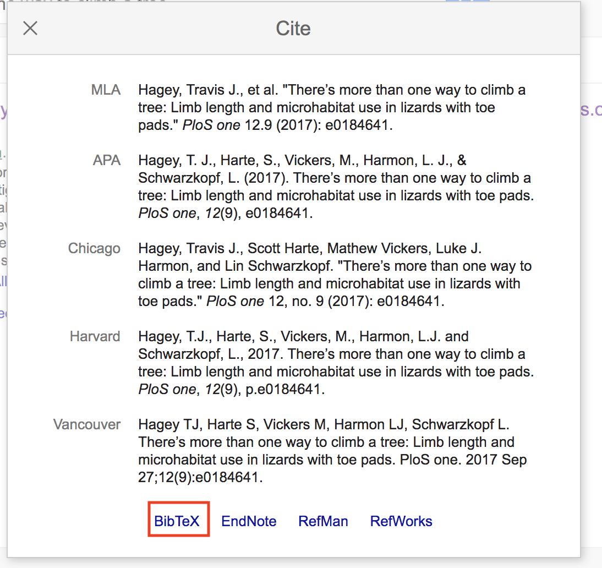

<style>
div.green { background-color:#c7d1c0; border-radius: 5px; padding: 20px;}
</style>

<!-- Add icon library -->
<link rel="stylesheet" href="https://cdnjs.cloudflare.com/ajax/libs/font-awesome/5.14.0/css/all.min.css">


# Introduction

Now that we've learned (at breakneck speed!) some ins and outs of data analysis, visualization, and modeling, we'll turn to how a scientist can easily organize, share, and communicate results and ideas. Communication of the results of any research in science is, at its final stage, usually done through publishing scientific papers. However, before this final product, scientists must catalog the maturation of their work and often seek to repeatedly share it with collaborators. Cataloging the progress and sharing preliminary results can take many forms: exchanging scripts that analyze data, giving presentations to colleagues, and passing manuscripts back and forth between team members, just to name a few activities. 

From a mechanistic standpoint, the workflow for sharing progress is often decentralized. Want to share scripts? Send the over email or store them in cloud (or GitHub!). Want to give a presentation? Import figures from your scripts into a slide deck. Want to create and share a manuscript? Write it up in a word-processing software and distributed over email or the cloud. Fortunately, there exists a unifying alternative: markdowns, an easy-to-read and easy-to-write plain text format that's then converted to any one of a variety of formats (slides, PDF, HTML, etc.). For we scientists working in R, we can use R Markdown, giving us the added benefit of adding code and the results of our code to text and commentary about our work. It's one stop shopping.

In this project, we'll learn the basics of R Markdown. Specifically, we'll learn how to author documents that include code, the graphics that are produced from it, and stylistically pleasing text that place the results of our analysis in context.

Our tasks will be to:

  1. Familiarize ourselves with the R Markdown framework.
  2. Author a simple R Markdown.
  3. Run code within an R Markdown document.
  4. Add graphics (i.e., figures), images, tables and references to and R Markdown document. 
  5. Render (i.e., knit) this R Markdown into HTML and PDF documents.

# Set up

First of all, let's precisely define what we mean by a markdown, the syntax for R Markdown. Markdown is a very simple ``markup" language which creates documents with headers, images, references, pieces of code and so much more from plain text files. Because it's text based, the document can be rendered into many other file formats like HTML or PDF that will contain the organized content.

To get R Markdown up and running, you don't need to do much at all if you're using R Studio. You just need to open a new markdown document: "File->New File->R Markdown". This will open a dialog where you are asked to include important pieces that will specify the document type, and author and title of the document. 


<br>

Enter in a title ("Project 4", is just fine) and the author (your team name is great, e.g., "aRtful coders"). Select "OK". Now, this doesn't save the new .Rmd, but rather establishes the author and title in the YAML header (more below). You should see that the document is now open in a tab with the name "Untitled1.Rmd". Go ahead and save this with the name "TEAMNAME_Module4" in an appropriate directory. The ".Rmd" extension informs R Studio that this is a source file for markdown and thus it will treat it as such. 

<div class = "green">
<div class="row">
  <div class="col-sm-2"><a class="far fa-sticky-note fa-5x" style="color:#939681"></a> <!-- regular style --></div>
  <div class="col-sm-9">

In R4DS, you may have noticed a discussion about the difference between R Markdown and R Notebooks. Notebooks are merely more compact version of R Markdowns. R Notebooks permit direct interaction with R while producing a reproducible document. However, any R Markdown document can be used as a notebook, so we'll bypass R Notebooks for now, and focus on R Markdowns.

</div>
</div>
</div>
<br>

Keep this document open and ready to edit. But, before was start, let's establish the context for authoring an R Markdown. Say, thinking back to the [Module 3 Project](mod3_proj.html), we wanted to report on some of our results, how we came to them, and what they mean. In that project, we found that ecomorph was an important predictor of the hindlimb-SVL relationship in anoles. Specifically, we used phylogenetic least squares analysis to assess this relationship under Brownian motion and OU models of trait evolution.

To assemble such a report, we should include sections that reflect the the progression of the analysis, each containing text, figures, captions, and references. Our sections should include an introduction, methods, results, discussion, author contributions, and a bibliography. Our tasks for this project will be taken on in this context: producing a succinct and reproducible report on the analysis of anole hindlimb evolution. Let's get started.

# Resources

As you learn more about R Markdown, you may want to reference the following online resources:

  * A rather [complete guide to R Markdown by Yikui Xie](https://github.com/rstudio/bookdown)
  * R Markdown [Cheatsheets](https://rmarkdown.rstudio.com/lesson-15.html)
  * R Studio's [markdown tutorial](https://rmarkdown.rstudio.com/)
  
# The YAML Header

You'll see at the top of your new ".Rmd" file a header contained between two lines (`---`). This is the YAML header that specifies the the attributes of the markdown, all of which are inherited from the dialog your answered when opening the new .Rmd. By default it includes a title, author, date, and type of file for your output. These are but a few of the formatting options and settings that could apply to the whole document. For now, let's leave it as is. So it should look like this:


```
---
title: "Project 4"
author: aRtful coders
date: 22/Sep/2020
output: html_document
---
```

Below the YAML header is the space where you'll include text, code, etc. 

# knitting Cozy Report

In the .Rmd before us, we have a template with some marked up text. This is the file that will be interpreted by the markdown language to produce a document. To do so, you must "knit" the .Rmd. You can do this by selecting the "knit" icon at the top of the file panel or keying in "cmd+shift+k". Go ahead and do either and see what happens. You'll get an HTML rendering of your document. You may end up doing this often as you add new pieces and markup to the text. Notice that there's now an .html file saved to the same directory containing the .Rmd file.

# Set the Working Directory No More

You may have noticed that we haven't yet set a working directory. In R markdown, this is unneeded and, frankly, discouraged. It's assumed that **all the things you need to knit your document are in the same directory as the .Rmd file**. We'll be running the same code from Project 3 in this .Rmd, so make sure all the data files from Project 3 reside where you have your .Rmd saved.


# Headers

When you start putting together the content of an .Rmd, you should consider adding sections almost immediately. This can serve as an outline for the document. Headers provide a way of hierarchically organizing the document into sections that reflect an outline. These are identified in the markdown by using one or several `#`. The more you use, the smaller the text and, presumably the less inclusive the header. That is, `#` is the biggest header and `##` is typically nested within a `#` header, and `###` is nested within a `##` header. For instance, this 

```
# Header 1

Text under Header 1

## Header 2

Text under Header 2

### Header 3

Text under Header 3

```
will produce this:


In your future project reports for Phase II and III of the class, you'll always want to include sections for an introduction, methods, results, discussion, author contributions, and references. We'll organize the .Rmd accordingly, so please add those sections to your .Rmd. with a high-level header `#`.  We'll add nested subsections and text later.  


```{r "load the data",include=FALSE,echo=FALSE}
library(tidyverse)
library(ape)
library(nlme)
library(MuMIn)
library(geiger)
library(knitr)
library(kableExtra)
library(rmarkdown)

anole <- read_csv("anole.dat.csv")
anole.eco <- read_csv("anole.eco.csv")
anole.tree <- read.tree("anole.tre")

anole2 <- anole%>%
left_join(anole.eco)%>%
  filter(!Ecomorph%in%c("U","CH"))%>%
  na.omit()

anole.log <- anole2%>%
  mutate_at(c("SVL", "HTotal","PH","ArbPD"),log)


### phylogenetic GLS models

#PGLS under BM, no ecomorph
pgls.BM1 <- gls(HTotal ~SVL, correlation = corBrownian(1,phy = anole.tree,form=~Species),data = anole.log, method = "ML")

#PGLS under BM, w ecomorph
pgls.BM2 <- gls(HTotal ~SVL * Ecomorph2, correlation = corBrownian(1,phy = anole.tree,form=~Species),data = anole.log, method = "ML")


#PGLS under OU, no ecomorph
pgls.OU1 <- gls(HTotal ~SVL * Ecomorph2, correlation = corMartins(0,phy = anole.tree,form=~Species),data = anole.log, method = "ML")

#PGLS under OU, w, ecomorph
pgls.OU2 <- gls(HTotal ~SVL * Ecomorph2, correlation = corMartins(0,phy = anole.tree,form=~Species),data = anole.log, method = "ML")

#AIC operations
anole.phylo.aic <- AICc(pgls.BM1,pgls.BM2,pgls.OU1,pgls.OU2)
anole.phylo.aicw <- aicw(anole.phylo.aic$AICc)

anole.phylo.aicw%>%
  kable(caption = "AICw of PGLS")

#add phylo-corrected residuals
anole.log <- anole.log%>%
  mutate(phylo.res=residuals(pgls.BM2))

#5
#plot residuals
p.eco.phylo <- anole.log%>%
ggplot(aes(x=SVL,y=HTotal,col=Ecomorph2))+geom_point()

print(p.eco.phylo)

#plot residuals
p.eco.phylo <- anole.log%>%
ggplot(aes(x=Ecomorph2,y=phylo.res)) +geom_boxplot() +stat_summary(fun=mean, geom="point", size=3)

print(p.eco.phylo)

```

# Adding Code with Chunks

Code you include in your .Rmd should be written in sections enclosed by three backwards apostrophes (```). These sections are known as code chunks and look like this:


<pre><code>```{r}
x<-1:100
mean(50)
```</code></pre>


You can insert code chunks with by selecting the "insert" icon at the top of the the tab or my keying in "command+option+i". 

<center>


</center>

To run the chunk, your can  click on "run" tap and selection "Run Current Chunk" or insert your cursor in the chunk and key in "command+shift+return". 

<center>


</center>

The content inside the curly brackets (`{}`) controls the behavior of code chunk. In this case, we're telling R markdown that the code inside the chunk is to be interpreted with R. This is a handy place to control the output of the code chunk. Let's jump right into how you would include code in chunks from our relavent anole project. 

At first, you'll want to include a chunk that loads the libraries you intend to use in the .Rmd. This can be added to the very top of the document. Something that looks like this:

<pre><code>```{r,include=FALSE}
library(tidyverse) #always
library(ape) #for evo analysis
library(nlme) #ditto
library(MuMIn) #for AIC
library(geiger) #for eco analysis
library(knitr) #for knitting options
```</code></pre>

Notice here that we included a behavior to the chunk, specifically  `include=FALSE`. This prevents the code, and the results from appearing in the finished file. Have a look at [this page](https://rmarkdown.rstudio.com/lesson-3.html) to familiarize yourself with handy and often used chunk options.

With a few exceptions, the logical place to include the code that produces analyses or figures is in the results sections. This is where the first output of the code will likely be relevant. So, under the results section, insert the following code chunks that establish the data we need and performs the initial analysis for PGLS.


<pre><code>```{r, "load the data"}
anole <- read_csv("anole.dat.csv")
anole.eco <- read_csv("anole.eco.csv")
anole.tree <- read.tree("anole.tre")
```</code></pre>

<pre><code>```{r, "join, filter, mutate to log"}
anole2 <- anole%>%
left_join(anole.eco)%>%
  filter(!Ecomorph%in%c("U","CH"))%>%
  na.omit()

anole.log <- anole2%>%
  mutate_at(c("SVL", "HTotal","PH","ArbPD"),log)
```</code></pre>

<pre><code>```{r, "PGLS models"}
### phylogenetic GLS models

#PGLS under BM, no ecomorph
pgls.BM1 <- gls(HTotal ~SVL, correlation = corBrownian(1,phy = anole.tree,form=~Species),data = anole.log, method = "ML")

#PGLS under BM, w ecomorph
pgls.BM2 <- gls(HTotal ~SVL * Ecomorph2, correlation = corBrownian(1,phy = anole.tree,form=~Species),data = anole.log, method = "ML")

#PGLS under OU, no ecomorph
pgls.OU1 <- gls(HTotal ~SVL, correlation = corMartins(0,phy = anole.tree,form=~Species),data = anole.log, method = "ML")

#PGLS under OU, w, ecomorph
pgls.OU2 <- gls(HTotal ~SVL * Ecomorph2, correlation = corMartins(0,phy = anole.tree,form=~Species),data = anole.log, method = "ML")
```</code></pre>

<pre><code>```{r, "AIC"}
#AIC operations
anole.phylo.aic <- AICc(pgls.BM1,pgls.BM2,pgls.OU1,pgls.OU2)
anole.phylow.aicw <- aicw(anole.phylo.aic$AICc)
```</code></pre>

<pre><code>```{r, "add residuals"}
#add phylo-corrected residuals
anole.log <- anole.log%>%
  mutate(phylo.res=residuals(pgls.BM2))
```</code></pre>

  
<pre><code>``{r,"plot residuals", fig.cap="Boxplot of phylogenetically corrected hindlimb residuals versus anole ecomorph"}
#plot residuals
p.eco.phylo <- anole.log%>%
ggplot(aes(x=Ecomorph2,y=phylo.res)) +geom_boxplot() +stat_summary(fun=mean, geom="point", size=3)

print(p.eco.phylo)

```</code></pre>

Notice that for each chunk, we included some text in quotes. This identifies the chunk with a name or label, as R Markdown calls it. Each name must be unique. These names are useful especially when we render the document and any errors or warnings emerge. More on that later. 

Also notice that this last chunk named "plot residuals" has another parameter, `fig.cap`. This specifies a caption to produce under a figure produced from the chunk. In communicating result through visualizations, figures or otherwise, it's **essential that you include a description** caption. The caption should include what's going in the figure (e.g., type of plot, the axes, where the data come from). 

# Modifying Text

The basic syntax of a markdown language, so oddly named, is formulated around mark up. This is similar to other mark up languages like HTML or XML in that it uses tags to define elements within a document. There are many often used tags that you should be familiar with and most can be found in this [R Markdown cheatsheet](https://rstudio.com/wp-content/uploads/2015/03/rmarkdown-reference.pdf). Let's consider the text in first paragraph of the introduction to the [Module 3 Project](mod3_proj.html#Introduction) description in block quotes below.


>The central theme of this project will be to assess the morphological and allometric differences between ecomorphs within the genus *Anolis*. First coined by the famous evolutionary biologist and herpetologist Ernest Williams, the term ecomorph describes a group of species, perhaps not sharing a most recent common  ancestor, with a similar ecological niche and behavior within the context of this niche. His model for this concept was the genus *Anolis*, although the ecomorph construct has been widely applied to many other species (think reef fish and Darwin's Finches). 

<center>

>

</center>

>Our tasks will be to:

 > 1. Visualize how hind limb length varies with size (i.e., allometry!).
>  2. Visualize and asses how hind limb length vs. size relationship covary with ecological niche.
>  3. Learn more complex operations in `ggplot` than we've undertaken so far. 
 >  4. Evaluate this hindlimb-size relationship using standard frequentist models within and without a phylogenetic context.
 >  5. Using an information theory approach, assess the fit of phylogenetically corrected models of hind-limb variation under different modes of character evolution.

## Basic Formatting

Notice that there are several pieces of text that have unique formats.  For instance the genus *Anolis* is italicized. This is accomplished by wrapping the text with `*` or `*Anolis*`. You could, just as easily, bold text with `**`, `**Anolis**` to produce **Anolis**. 

As you've probably noticed in reading markdowns so far, where any code and names of code are written inline  (i.e., not in a chunk), the convention is to outline it with a distinctive background (usually gray). To do this, code-bearing text is wrapped in <code>&grave;&grave;</code>. So <code>&grave;ggplot&grave;</code> becomes `ggplot`.

## Ordered Lists

We can easily include lists in an .Rmd with simple mark ups. A numbered list is as simple as . . . 

```
  1. Visualize how hind limb length varies with size (i.e., allometry!).
  2. Visualize and asses how hind limb length vs. size relationship covary with ecological niche.
  3. Learn more complex operations in `ggplot` than we've undertaken so far. 
  4. Evaluate this hindlimb-size relationship using standard frequentist models within and without a phylogenetic context.
  5. Using an information theory approach, assess the fit of phylogenetically corrected models of hind-limb variation under different modes of character evolution.
 ```
 
 And this will produce what you see above. If you'd prefer a bulleted list, take this approach:

```
  * Visualize how hind limb length varies with size (i.e., allometry!).
  * Visualize and asses how hind limb length vs. size relationship covary with ecological niche.
  * Learn more complex operations in `ggplot` than we've undertaken so far. 
  * Evaluate this hindlimb-size relationship using standard frequentist models within and without a phylogenetic context.
  * Using an information theory approach, assess the fit of phylogenetically corrected models of hind-limb variation under different modes of character evolution.
 ```

This will produce the following:

  * Visualize how hind limb length varies with size (i.e., allometry!).
  * Visualize and asses how hind limb length vs. size relationship covary with ecological niche.
  * Learn more complex operations in `ggplot` than we've undertaken so far. 
  * Evaluate this hindlimb-size relationship using standard frequentist models within and without a phylogenetic context.
  * Using an information theory approach, assess the fit of phylogenetically corrected models of hind-limb variation under different modes of character evolution.

 
Notice the list elements are indented and the text separated by `*` with and empty space.


## Links
While no links are included in the example above, they abound in this and many other .Rmd documents. Inserting them couldn't be easier. One just has to wrap the text in brackets followed by the link path in parentheses. For example,  `[class site](https://bcorgbio.github.io/class/)` gives us [class site](https://bcorgbio.github.io/class/), text linking us to our class site.


## Images
We also have an image inserted above. Inserting images can be useful for all sorts of reasons, especially when you'd like to include a graphic that is not produced by R and resides elsewhere, like say online. The image above is inserted with:

```

```

Notice this is much like inserting a link, but we have to tell R markdown to stop interpreting text by including `!` before a set of brackets, then we include the file path (in this case, a URL). This is the simplest way to insert an image. But, say you want to include an image that is a live link as well. All you have to to is include the link tags around the image tags, like this: 

```
[](https://upload.wikimedia.org/wikipedia/commons/thumb/4/4b/Green_anole.jpg/320px-Green_anole.jpg)
```
<br> 

And this is what you'll get:

[](https://upload.wikimedia.org/wikipedia/commons/thumb/4/4b/Green_anole.jpg/320px-Green_anole.jpg)
<br>

This image isn't centered on the page. The easy way to modify the position of an image (or any element, really) is to use standard HTML tags. So wrapping `<center>` and `</center>` around our image code like so . . . 

```
<center>
[](https://upload.wikimedia.org/wikipedia/commons/thumb/4/4b/Green_anole.jpg/320px-Green_anole.jpg)
</center>
```

. . . gives us: 

<center>
[](https://upload.wikimedia.org/wikipedia/commons/thumb/4/4b/Green_anole.jpg/320px-Green_anole.jpg)
</center>

<br>

Keep in mind that R markdown prefers .jpg or .png images.

Of course, one can also add local images, i.e., those stored on your computer. For instance, say we wanted to include a small version of the radiograph image from the [Module 3 project Description](mod3_proj#Introduction), a .png stored in the same directory as this .Rmd file, we simply write

```
<center>

</center>
```

<center>

</center>
<br>

## Equations

As scientists, we often need to express our ideas in equation form (e.g., linear model of hindlimb vs. snout-vent length in case of our last project). Fortunately, this is made easy by R Markdown's inclusion of another markup language, $\LaTeX$. This is a favorite of those writing really technical documents and the equation markup capabilities are rather extensive but eminently approachable. For instance, if we need to write out an equation that expresses a linear model (e.g. `lm(y~x)`) we can write `$$y=\alpha+\beta x$$` to produce:

$$y=\alpha+\beta x$$

Notice the equation is wrapped by two `$$`. A single `$` indicates the use of $\LaTeX$ markup and two indicates the equation should stand alone on a separate section. If we just wanted to include the aforementioned equation inline with the rest of the text, we'd use just one `$`, or ``$y=\alpha+\beta x$` to get $y=\alpha+\beta x$.


<div class = "green">
<div class="row">
  <div class="col-sm-2"><a class="far fa-sticky-note fa-5x" style="color:#939681"></a> <!-- regular style --></div>
  <div class="col-sm-9">
Although it may appear as a coding free-for-all, the ability to include HTML and $\LaTeX$ markup in addition to R markdown language injects enormous flexibility. One can use all the standard methods of HTML and $LaTeX$ wizardry to expand R Markdown's capabilities and charm. These note boxes, for example are a container class written in HTML.
</div>
</div>
</div>
<br>


# Tables

Tables are often important devices in communicating something about your project. Sometimes your want tables populated with your data and code, others we need to create them by hand. 


## Tables From Code

For smallish tables generated from your code, I suggest the `kable()` function from the `knitr` package which is included with R Studio. It's simple and rather intuitive to use. For instance, let's say we wanted to know how many species were include in each ecomorph for our anole study. We'd first write the code to do so and then with the pipe, finally pass it to the `kable` function:

```{r,message=FALSE}
n.spec <- anole.log%>%
  group_by(Ecomorph2)%>%
  summarise(n.species=n())

n.spec%>%
  kable()
```
<br>

One nice attribute about `kable()` is that we can easily specify a table caption. Something like:

```{r}
n.spec%>%
  kable(caption = "Number of species within each anole ecormorph included in this study")
```
<br>

For large tables, say data sets with a large number rows, you may want to consider using the `paged_table()` function from `rmarkdown` to create a table that has pagination of rows and columns. For example:

```{r}
paged_table(anole.log, options = list(rows.print = 15))
```

Here we also added a parameter to `options` to print 15 row at a time.


## Tables "By Hand"

You can also define tables explicitly using markdown. For this, we merely mark up the text with `-` to specify the header and `|` to specify rows. So this . . . 


```
|    Ecomorph        | Description                             |
|------------------|-------------------------------------------|
| crown-giant     | Large bodied, lives in crown               |
| grass-bush      | Lives in grass or bushes                   |
| trunk           | Lives on the trunk                         |
| trunk-crown     | Lives in the trunk-crown interface         |
| trunk-ground    | Lives in the trunk-ground interface        |
| twig            | Lives out on the twigs of trees             |
```
becomes this:

|    Ecomorph        | Description                             |
|------------------|-------------------------------------------|
| crown-giant     | Large bodied, lives in crown               |
| grass-bush      | Lives in grass or bushes                   |
| trunk           | Lives on the trunk                         |
| trunk-crown     | Lives in the trunk-crown interface         |
| trunk-ground    | Lives in the trunk-ground interface        |
| twig            | Lives out on the twigs of trees           |


# Inserting References

As we prosecute out projects in Phase I and II, we'll be reading scientific papers, some assigned, some asked to find so that we can place our results in context. In addition, as scientists, we always want to support our statements of fact with references. For this,  we'll need to cite and include these papers in a bibliography. 

[Adding reference to an .Rmd](https://rmarkdown.rstudio.com/authoring_bibliographies_and_citations.html) is pretty straight forward. First we'll need to establish a .bib file that will reside in the same directory as your .Rmd file. To do this, select "File->New File->Text File." A new tab will appear with the name "Untitled1.txt". Save this file as "BIOL2140.bib" (note the ".bib" extension) in the same directory as your .Rmd file. This .bib file will be referenced by your .Rmd when inserting citations. 

The framework for citations and references in .Rmd can be formulated around [BibTex](https://en.wikipedia.org/wiki/BibTeX). BibTex is handy because you can find BibTex formatted citations in all your typical outlets (see note below). This system of citation uses a .bib file that contains text describing published works. Each work or potential reference in the .bib file is identified with a unique tag at the top of its entry and this entry contains the important bibliographic information. For instance, a .bib file containing a reference to the following paper

Hagey, T.J., Harte, S., Vickers, M., Harmon, L.J. and Schwarzkopf, L., 2017. There’s more than one way to climb a tree: Limb length and microhabitat use in lizards with toe pads. [PloS one, 12(9), p.e0184641](https://journals.plos.org/plosone/article?id=10.1371/journal.pone.0184641).

would have the following text:

```
@article{hagey2017there,
  title={There’s more than one way to climb a tree: Limb length and microhabitat use in lizards with toe pads},
  author={Hagey, Travis J and Harte, Scott and Vickers, Mathew and Harmon, Luke J and Schwarzkopf, Lin},
  journal={PloS one},
  volume={12},
  number={9},
  pages={e0184641},
  year={2017}
}

```

Notice we have a tag `&#64;article{hagey2017there,". This identifies the entry as a journal article (as apposed to a book or manual, etc.) and contains a key that is unique among all the other references in the .bib file. After this, the entry then goes on to identify the important bibliographic pieces: title, author, journal, etc.). Go ahead and add this BibTex reference to your BIOL3140.bib file and save it. 

For .Rmd to reference this .bib file, we need to specify a bibliography file in the YAML header. So now alter your YAML header at the top of the .Rmd so that it contains `bibliography: BIOL3140.bib". The YAML header should now look like this:


```
---
title: "Project 4"
author: aRtful coders
date: 22/Sep/2020
output: html_document
bibliography: BIOL3140.bib
---
```

With a .bib file now in place, we can use the reference keys to cite works listed in the .bib file. For this, we simply add the key label to the text with '@'. For instance, `@hagey2017there` with produce @hagey2017there. 

When citing published works in text, we often follow certain formatting conventions. To be honest, your professor couldn't care less about which format gets used in your .Rmds. Fortunately, R Markdown uses a familiar [Harvard-like](https://www.citethisforme.com/harvard-referencing) format by default and he recommends plowing ahead with it. In a Harvard-like format, a reference in a sentence used in an explicit manner, includes the reference year in parentheses. For instance, if we were to express that these authors studied the hindlimb-ecomorph relationship in anoles, we would write, "@hagey2017there studied the hindlimb-ecomorph relationship in anoles." The reference `@hagey2017there` is just inserted at the beginning of the sentence as in the following:

```
@hagey2017there studied the hindlimb-ecomorph relationship in anoles.
```

However, Harvard-like convention follows that if we aren't explicit about the study, we include the entire reference in parentheses. For instance, if we wanted to write, "A recent study considered the hindlimb-ecomorph relationship in anoles [@hagey2017there]." we would include the following:

```
A recent study considered the hindlimb-ecomorph relationship in anoles [@hagey2017there].
```
Note that `@hagey2017there` is wrapped in `[]`.

In R Markdown, bibliographies will be placed at the end of the document. Normally, this means you want to end your document with the header "References". This will anchor the bibliography in this section.


Note that this .bib file can be used in all your .Rmd documents, not just this one. As long as all the BibTex entries have unique keys, this .bib file can serve as a reference database for all your .Rmd citations.


<div class = "green">
<div class="row">
  <div class="col-sm-2"><a class="far fa-sticky-note fa-5x" style="color:#939681"></a> <!-- regular style --></div>
  <div class="col-sm-9">

You may be wondering where you can find BibTex citations. Like so much of our lives, the answer points to Google, specifically Google Scholar. As an example, go to [Google Scholar](http://scholar.google.com/) and search for the @hagey2017there paper. The entry under scholar will look like the following:


<br>

Click on the big `"` at the bottom of the entry. This will bring you to a pop-up window that contains different citation formats for the entry. 



<br>

Now click on the "BibTex" link at the bottom of the window. This will lead you to a text file of the BibTex format. Simply copy and paste this to your .bib file. Voila.

</div>
</div>
</div>
<br>


# Project Report

The goal of this project report is to produce an R Markdown in HTML that includes all the important components of the project reports you'll produce in Phases I and II of the course. You can think of this as a template that can be used when writing writing up your reports in all the subsequent modules. 


For this project report, write an .Rmd document named "TEAMNAME_Module4.R" that includes the following:
  
  1. A YAML header that specifies the author, title, date, output, and bibliography file. 
  2. The following section headers that organize your text and includes 2-3 short relevant sentences:
      + Introduction: Include a brief background to the anole project (why are we studying this anyway?), what the main questions is, and how this question will be answered.
      + Methods: Briefly outline the specifics of how the question will be answered.
      + Results: Briefly summarize the results.
      + Discussion: Briefly discuss the importance of the results (i.e., how they relate to the main question).
      + Author Contributions: Briefly state what the contributions of each team member to the project.
      + References: Populate a bibliography section that includes the works cited in the text.
  3. A centered image from an online source of an *Anolis* lizard at the end of the introduction. Please make sure this is in the [creative commons](reativecommons.org).]
  4. All the code chunks included in the [Adding Code with Chunks][Adding Code with Chunks] section.
  5. An altered  "AIC" chunk that produces a table of AIC values with `kable`. Be sure to include a descriptive caption 
  6. Another chunk of code, inserted before the "plot residuals" chunk, that produces a figure of a regression plot of log-transformed `HTotal` vs `SVL` with points colored by `Ecomorph2`. Be sure to include a descriptive caption here, too. 
  7. A citation to the @hagey2017there paper in the introduction (include in the References section, too) 
  8. A citation in the methods sections that identifies the source of the phylogenetic tree used in PGLS analysis (include in the References section as well).


Submissions are due by 11:59 PM on Sunday, October 3th. Submission should be pushed to your team repo.

```{r,include=FALSE}
anole.phylo.aic <- AICc(pgls.BM1,pgls.BM2,pgls.OU1,pgls.OU2)
anole.phylo.aicw <- aicw(anole.phylo.aic$AICc)
rownames(anole.phylo.aicw) <- c("pgls.BM1","pgls.BM2","pgls.OU1","pgls.OU2")

anole.phylo.aicw%>%
  kable()
```

# References
