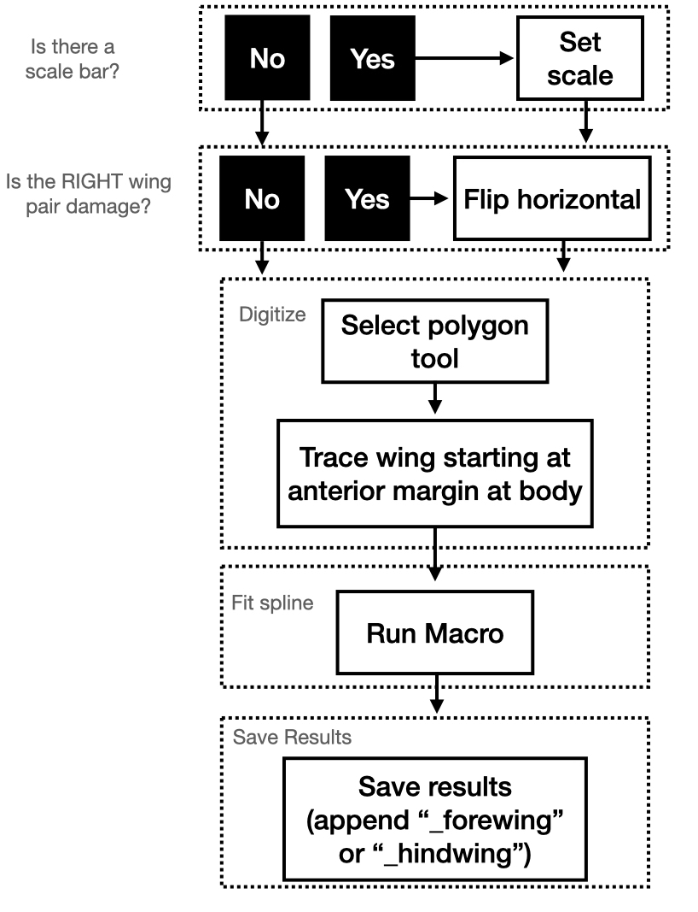
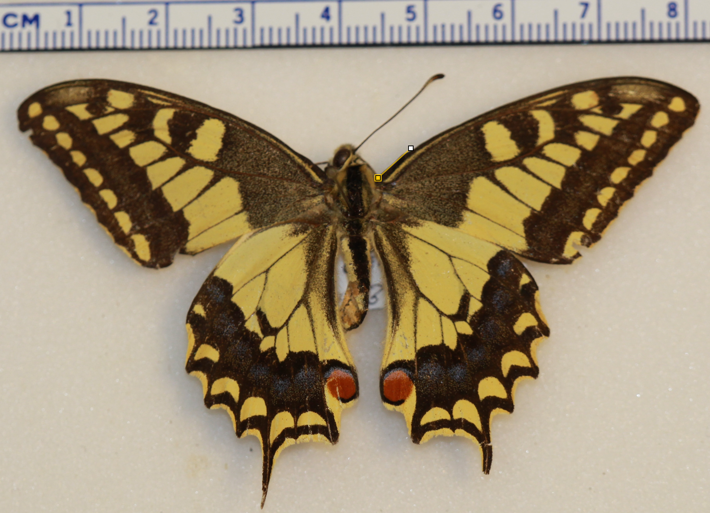
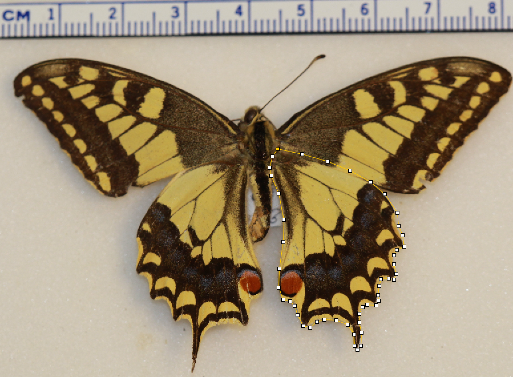

<style>
div.green { background-color:#c7d1c0; border-radius: 5px; padding: 20px;}
</style>
<!-- Add icon library -->
<link rel="stylesheet" href="https://cdnjs.cloudflare.com/ajax/libs/font-awesome/5.14.0/css/all.min.css">


# Introduction
Butterflies and moths (the Lepidoptera) are an exceptional [radiation](https://en.wikipedia.org/wiki/Evolutionary_radiation) of insects, comprising nearly 160,000 described extant
species. (For context, the vertebrates comprise just 70,000 species or so.) The Lepidoptera play a fundamental role in almost every terrestrial ecosystem. These ecologically important species use paired wings to power flight in search of places to lay eggs, feed on nectar and other resources, and find mates. The airy  environment in which moths and butterflies fly undoubtedly exerts natural selective pressure on wing size and shape.  However, it appears as if the hind- and forewings have different roles to play in powered flight and the ecology of the Lepidoptera. If hindwings are removed from butterflies, they are able to fly, but at the cost of speed and maneuverability (Jantzen and Eisner 2008). Therefore, it has been proposed that  forewing shape and size may be the result of stabilizing selection imposed by the physical and fluid requirements of flight and hindwing shape and size may be determined more by neutral selection, sexual selection, or selection due to predator avoidance (Sourakov 2013, Barber et al. 2015, Willmott et al. 2017, Rubin et al. 2018, Chazot et al. 2016).

<center>
{width=50%}

<br>
*The anotomy of a butterfly or moth.* 
</center>
<br>
<br>


Studies based on experimental manipulations like those of Jantzen and Eisner (2008), important as they are, are limited in their ability to characterize shape variables and the ecological roles of fore- and hind wings over evolutionary time scales and across lepidoptera lineages. Comparative analysis of shape data from natural history collections has helped bridge the gap between experimental studies and macroevolutionary patterns. If there is in fact different constraints on the evolution of fore- and hindwing morphology, we would expect to find a consistent patterns of diffent fore- and hindwing shape across the lepidopter. Indeed, a number of studies have investigated whether for- and hindwing shape and size differs in several isolated groups of butterflies. Strauss (1990) found the shape of hindwings were much more variable than forewings in heliconiine and ithomiine butterflies. In contrast, Chazot et al. (2016) found a strong correlation between forewing and hindwing shapes in the famous morpho group of butterflies. Therefore, the limited research on this topic does not resolve whether fore- and hindwing shape differ consistently across the Lepidoptera. Each of these studies was limited in their phylogenetic scope, encompassing very few species spanning few families of butterflies. Addressing whether fore- and hindwing shape varies independently, a much broader phylogenetic sample should be analyzed, one that includes not just representatives of the butterfly lineage, but also moths.


<center>
{width=50%}

<br>
*Several species of Heliconiinae butterflies, demonstrating the variability in wingshape. From @penz2003phylogenetic.* 
</center>
<br>
<br>

The goal of this project is to study wing-shape evolution across the lepidoptera, including hundreds of species from both the moths (a paraphyletic group) and butterflies. To do this, we'll take a morphometric approach, characterizing the shape outline of fore- and hindwings from about 200 species of Lepidoptera.

```{r images, include=FALSE,eval=FALSE}
library(tidyverse)
library(ape)
library(treeio)
library(rgbif)
library(data.table)
library(EBImage)


#read in lepidoptera tree from Akito et al.

lep.tree <- read.mcmctree("lepidoptera_tree.tre")

write.tree(lep.tree@phylo,"lep_tree.tre")

lep.tree <- read.tree("lep_tree.tre")

#plot(lep.tree)


#retrieve tips
tips <- sapply(lep.tree$tip.label,function(x) strsplit(x,"_"))


#adjust tips to Genus species
tips2 <- lapply(tips,function(x){
  r <- x[grep("inae$",x)+1:2]
if(length(r)==0){
  r <- x[grep("idae$",x)+1:2]
}
  return(paste(r,collapse=" "))
}

) %>% unlist

hi.taxa <- tibble(higher_taxon=lapply(tips,function(x) x[1]) %>% unlist,species=tips2) 
  

common.names <- tibble(higher_taxon=hi.taxa$higher_taxon %>% unique(),
       common_name=c(
         "Caddisflies caddisflies",
         "Mandibulate archaic moths",
         "Kauri moths",
         "Valdivian archaic moths",
         "Sparkling archaic sun moths",
         "Archaic bell moths",
         "Australian archaic moths",
         "Ghost moths",
         "Pygmy leafminer moths",
         "Andean endemic moths",
         "Primitive monotrysian moths",
         "Gondwanaland moths",
         "Trumpet leaf miner moths",
         "Clothes moths",
         "Cocoon-maker/leaf blotch miner moths",
         "Ermine moths",
         "False burnet moths",
         "Metalmark moths",
         "Pantropical moths",
         "Tortrix moths",
         "Clearwing moths",
         "Burnet moths",
         "Carpenter moths",
         "Papilionoid butterflies",
         "Curved-horn moths",
         "Many-plumed moths",
         "Plume moths",
         "Old World butterfly moths",
         "Picture-winged leaf moths",
         "Snout moths",
         "Sack-bearer moths",
         "Hook-tip moths",
         "Owlet moths",
         "Geometrid moths",
         "Eggars/Tent moths",
         "Sphynx/Silk moths"
       )) %>% 
  mutate(highest_common_name=gsub(".+ (\\w+)$","\\1",common_name)) %>% 
  left_join(hi.taxa)


lep.tree$tip.label <- sp <- tips2

write.tree(lep.tree,"lep_tree2.tre")

#species from tree
tree.sp <- tibble(species=sp,sp=gsub("\\w+ (\\w+)","\\1",sp)) %>% arrange(tree.sp) %>% left_join(common.names)

#save
tree.sp %>% write_csv("lep_tree_species.csv")

 
if(FALSE){
#query gbif for images for spp in tree
 dat.l <-list()
 media.l <- list()

 #last.sp=1
 
 sp <- tree.sp$species[which(tree.sp$species==last.sp):length(tree.sp$species)]
for(s in sp){
  

dat.l[[paste0(s)]] <- m <- occ_search(scientificName = s,basisOfRecord="PRESERVED_SPECIMEN",
mediaType="StillImage")

if(length(m$media)==0) media.l[[paste0(s)]] <- tibble(species=s,key=NA,identifier= NA)

if(length(m$media)>0) media.l[[paste0(s)]] <- lapply(1:length(m$media),function(x) tibble(species=s,key=m$media[[x]][[1]]$key,identifier= m$media[[x]][[1]][[1]]$identifier)) %>% rbindlist()

last.sp <- s
}

 dat <- lapply(dat.l,function(x) x$data)
 
 dat <- rbindlist(dat,fill=T)
 
 dat <- dat %>% 
   dplyr::select(genus,species,family,rightsHolder,collectionCode,catalogNumber,institutionCode,references,key) %>% left_join(tree.sp)
 
 
 
 media <- do.call(rbind,media.l)
 
 all.dat <- dat%>%
   left_join(media)


saveRDS(all.dat,"lep_gbif.RDS")
}

all.dat <- readRDS("lep_gbif.RDS")
#write.csv(all.dat,"lep_gbif.csv")
 
#nulls from gbif
all.dat%>%
   filter(is.na(identifier)&is.na(references)) %>% 
  count(species)

dat %>% 
  count(species)

if(FALSE){

gbif.nulls <- rbind(media%>%
   filter(is.na(identifier)) %>% count(species),
   all.dat%>%
   filter(is.na(identifier)&is.na(references)) %>% 
  count(species)
) %>% arrange(species)

all.dat %>% 
  filter(is.na(species))


   setdiff(media %>% filter(is.na(identifier)) %>% count(species) %>% pull(species),
   all.dat%>%
   filter(is.na(identifier)&is.na(references)) %>% pull(species)
   )
   
   setdiff(
   all.dat%>%
   filter(is.na(references)) %>% pull(species),
   media %>% filter(is.na(identifier)) %>% count(species) %>% pull(species)
   )

gbif.nulls%>%
    write_csv("lep_gbif_null.csv")

found.gbif <- read_csv("lep_gbif_null_found.csv")
}

img.download <- function(urls,dir="lep_photos/",res=200000,ask=FALSE){
  
  
  res.l <- list()
  for(i in urls){
   
    z <- tempdir()
    f <- paste0(z,"/",basename(i))
    if(!grepl(".jpg|.jpeg|.tiff|.TIFF|.JPG|.JPEF|.png|.PNG",basename(f)))f <- paste0(f,".jpg")
    z.i <- try({ 
      download.file(i,f,quiet = T)
      pic <- readImage(f)
    })
    
    res.i <- dim(pic)[1]*dim(pic)[2]
    
    if(!inherits(z.i,"try-error") & res.i>res){
      display(pic,method = "raster")
       n1 <- "y"
      if(ask) n1<-readline(prompt="keep?")
     
      if(n1=="y"|n1=="Y") {res.l[[i]] <- tibble(identifier=i,keep= "keep")
      save.f <- basename(f)
      if(save.f=="default.jpg") save.f <- paste0(gsub(".+(ypm\\:.+)\\/full.+","\\1",i),".jpg")
      file.copy(f,paste0(dir,"/",save.f))}
    }else{
      
      if(inherits(z.i,"try-error")) res.l[[i]] <- tibble(identifier=i,keep= "error")
      
      if(res.i<res) res.l[[i]] <- tibble(identifier=i,keep= "too small")
    }
    print(paste0("image ", which(urls==i), " of ",length(urls)))
    file.remove(f)
  }
  r <- do.call(rbind,res.l)
  return(r)
  
}

img.res <- list()

sp <-  all.dat%>%
   filter(!is.na(identifier)) %>% pull(species) %>% unique()

all.dat %>% 
  filter(species==sp[51]) %>% 
  select(species,identifier)

run.img <- function(n=NULL,...){
sp.n <- n
  print(sp[sp.n])
urls <- all.dat %>% filter(!is.na(identifier)& species==sp[sp.n]) %>% pull(identifier)

sp.dir <- paste0("lep_photos/",sp[sp.n])
dir.create(sp.dir)
img.r <- img.download(urls = urls[sample(1:length(urls))],dir=sp.dir,...)

return(img.r)
}

sp <- found.gbif$species %>% unique()
run.img.nulls <- function(n=NULL,...){
sp.n <- n
  print(sp[sp.n])
urls <- found.gbif %>% filter(!is.na(new_identifier)& species==sp[sp.n]) %>% pull(new_identifier)

sp.dir <- paste0("lep_photos/",sp[sp.n])
dir.create(sp.dir)
img.r <- img.download(urls = urls[sample(1:length(urls))],dir=sp.dir,...)

return(img.r)
}

run.img.nulls(n=1)


### download all YPM images, show V and D views (write script to do so)


 
found.gbif2 <- found.gbif %>% 
  select(-careful,-new_comments) %>% 
  left_join(common.names) %>% 
  mutate(genus=gsub("(\\w+) .+$","\\1",species),
         family=NA,key=NA,
         references=NA,
         sp=gsub("(\\w+) (.+$)","\\2",species)
         ) %>% 
  dplyr::rename(identifier=new_identifier,catalogNumber=catalog,collectionCode=new_collection_code)
 
all.dat2 <- rbind(all.dat %>% mutate(source="gbif"),
      found.gbif2 %>% mutate(source="search/BOLDS"),fill=T) %>% mutate(filename=basename(identifier))


```


# Methods

## Image acquisition

A few decades ago, a morphometric project like this would require visiting museums collections from around the world to take images of the specimens and species of interest. In fact, this was a major part of Prof. Kenaley's PhD thesis, which included trips to natural history collections in France, Denmark, Great Britain, Taiwan, Japan, Monaco, New Zealand, and Australia. Ahhhhhh, the gool ol' days. Fortunately (or unfortunately), travel to such wonderful places may be avoided as collections have made major efforts to photograph their specimens. Now that most museums around the world have their holdings cataloged in databases, researchers can search their collections for records that have images. 

Until very recently, amassing a data set of images for morphometric work  would require querying individual databases, one at a time. However, most natural history museums share their data with the Global Biodiversity Information Facility (GBIF), a clearing house of collections and species information. In the context of our project, one could search the GBIF database online for moth and butterfly records that have images. Fortunately for use, the folks at GBIF have created and R package, [`rgif`](https://www.gbif.org/tool/81747/rgbif), that permits access to GBIF's application programming interface (API), rendering their records searchable from the command line.

Thus, the images we'll be studying were found by querying GBIFs holdings and downloading the images from URLs that are provided with the records. Prof. Kenaley has screened these images to make sure they are suitable for digitizing and morphometric analysis.

The species list

BMNH image collection: https://data.nhm.ac.uk/dataset/56e711e6-c847-4f99-915a-6894bb5c5dea/resource/05ff2255-c38a-40c9-b657-4ccb55ab2feb?q=lepidoptera&_gl=1*z3b8cj*_ga*NDMwNjI0MzMyLjE2NjQ4MjMzMzg.*_ga_PYMKGK73C4*MTY2NDgyMzMzOC4xLjAuMTY2NDgyMzMzOC4wLjAuMA..&filters=_has_image%3Atrue

Phylogeny:
https://www.pnas.org/doi/pdf/10.1073/pnas.1907847116

Tree from ^ https://www.pnas.org/cms/10.1073/pnas.1907847116/asset/075c8ff7-6363-462d-a528-f2b13710804d/assets/graphic/pnas.1907847116fig01.jpeg

I think this is tree file for figure S12 (based on [READme](https://datadryad.org/stash/dataset/doi:10.5061/dryad.j477b40) file and [Appendix](https://www.pnas.org/doi/suppl/10.1073/pnas.1907847116/suppl_file/pnas.1907847116.sapp.pdf))

papilio paper: https://academic.oup.com/sysbio/article/69/5/813/5817324
To capture shape data, we'll produce outlines for fore- and hindwing shapes from photographs of moths and butterflies 

evolution paper: https://onlinelibrary.wiley.com/doi/full/10.1111/evo.12114


## Species list and phylogeny

Because we'll be comparing wing shape across species of the Lepidoptera, this project is by definition a comparative one and we'll need a phylogeny for the group. Fortunately a recent phylogenomic analysis for 200 species of Lepidotera by @kawahara2019phylogenomics resolved the relationships of the majore groups of this order. We've used the taxa studied in this paper to find images in GBIF and we'll use [a tree file](lep_tree2.tre) representing phylogeny for our comparative analsyis. 

<center>
<br>
{width=50%}
<br>

The phylogenetic relationships of the Lepidoptera according the @kawahara2019phylogenomics.
</center>
<br>

## Digitization

Our shape analysis will be based on the outline of the hind- and fore-wings of ~200 species of Lepidoptera. To outline the wings, we'll follow this generalize workflow below in the image analysis program FIJI (FIJI is just imageJ). 

<br>
<center>
{width=50%}
<br>
</center>
<br>

By now, you and your team should have been assigned about 20 of the ~200 species to outline and have accessed [the directories containing their photos](https://drive.google.com/drive/folders/1NEdQ0h5KXum3DzbhCzl857R_5YxZEQq3?usp=sharing). First choose one of your species to work on. For each species, start with what you think is the best image, that is, it has a scale bar, the wings are not damaged, and the hindwing is most exposed. Open that best image in Fiji.

After opening the photo, follow the steps above.

1. If there's a scale bar, [set the scale](https://imagejdocu.list.lu/gui/analyze/set_scale).

2. If the right wing pair is damaged, flip the image horizontally. Select "Image" $\rightarrow$ "Transform" $\rightarrow$ "Flip horizontally". **Note:** you may have to do this only for the fore- or hindwing.

3. Select the [polygon selection tool](https://imagej.nih.gov/ij/docs/guide/146-19.html).

4. Trace the wing by placing the first point on the polygon on the anterior margin of the wing where it meets the thorax. Like so . . 

<center>

{width=40%}
<br>
</center>
<br>

Continue to trace the outline of the wing being sure to include enough points to capture more complex areas. For instance, in this swallowtail hindwing, it may require 30 or more points to outline the interesting projections along the posterior margin.

<br>
<center>
{width=40%}
<br>
</center>
<br>

You may also find it easier to get an acurate outline if you zoom in (`crtl+` or `command+`).

5. Run the following macro in imageJ.

```{}
run("Fit Spline");
run("Properties... ", "list");
```


This script [fits a spline](https://en.wikipedia.org/wiki/Spline_interpolation) through the selected points and produces a list of the x,y coordinates.

**Note:** For the first image you outline, you will have to open the macro editor ("Plugins" $\rightarrow$ "New" $\Macro$). Paste the script command from above into the editor and save this new macro to an appropriate directory, perhaps you cloned repo. You'll want to access this later ("Plugins" $\rightarrow$ "Edit") so that you automate this process.

6. Save the results table that pops up and be sure to append either "_hindwing" or "_forewing" to the file name and make sure this is before the ".txt" file extension. `command+s` or `ctrl+s` works. 

For some species there may be only one image. For others there may be 10 or more. If you can, aim to outline the wing of three specimens per species.


After you team has completed outlining the assigned species, upload your text files to [this directory](https://drive.google.com/drive/folders/1M7kb_6EooVdXZlMvkpOPSbwaRu2TfCDJ?usp=sharing). Once all the data appear here, your team can download all the outline data.

## Shape analysis

As we learned in class and you've been reading, researchers interested in comparing shape change between species can use one of two methods: landmark- or outline-base shape analysis. We'll use the latter. 

Outline analysis involves breaking the shapes down into a mathematical description of the points that constitute the shapes. The most popular approach for fitting functions is elliptical Fourier analysis (EFA) in which the shapes in a data set are described as a series of ellipses. EFA attempts to align a number of ellipses to the outline of shapes and the scale of the major and minor axes of the ellipses are then used as the descriptor of the shapes. Of course, one could fit a lot of ellipses and describe the shape perfectly, i.e., with 100% power; however practitioners usually stop short of this and choose some lower lever of lower, say 99%. The number of ellipses is referred to as the number of harmonics. In the figure below, you see the a higher number of harmonics describe the shape in question more perfectly.

<br>
<center>
{width=60%}
<br>
Elliptical Fourier analysis of the pygostyle, the fused plate of caudal vertebrae that support tail feathers in birds.
</center>
<br>

Once EFA is used to describe the shapes in a data set, one is left with many variables to consider including all the descriptors of all the ellipses that form the outlines. This could be many hundreds of variables in a data set like ours. This is a serious [multivariate problem](https://en.wikipedia.org/wiki/Multivariate_statistics).

For such a problem, researchers usually turn to Principal Components analysis (PCA) whereby the very complicated suite of variables is distilled into a set of fewer variables that describe the important variance among the original variables. In a sense, PCA produces a series of regressions, or vectors, that pass through the values of the original variables. This operation is performed iteratively, with the first vector (the first principal component, PC1), drawn through the variable space that accounts for the most variance in the data set. After the combination of variables forming PC1 is removed, a subsequent vector (PC2) is drawn through another unique variable space that describes the second most amount of variance. This continues until most of the varaince is captured, resulting in scores of PCs. The first two or three, however, are usually enough to describe a health amount of variance, say 90% or more.

To perform EFA and then PCA, we need only to turn to one R package, `Momocs`. Let's load this package and begin with an example analysis that we can scale up on our full data set. 


Let's begin by reading in one of the outline text files, Prof. Kenaley has already produced for 10 species of butterflies and moths. Please [download these](lep_examples.zip) to follow along. You can unzip this directory and place it your project directory.

```{r momocexp1}
library(tidyverse)
library(Momocs)
f <- list.files("lep_examples",pattern=".txt",full.names = TRUE)

out <- read_delim(f[1],delim="\t") %>% 
  as.matrix()

out %>% 
  list() %>% 
  Out() %>% 
  coo_flipx() %>% 
  stack()

```

Notice that we've found all the files in the "lep_examples" directory with `list.files()`, searching for the patter ".txt" and using the full filepath to make a loading the data in the directory possible. Next, we use `read_delim()` with `delim=\t` rather than `read_csc()` because FIJI outputs tab-delimited data. We save this outline as `out` after tranforming it to a matrix, the prefer format for `Momocs`.

In the next operation, we transform this matrix into an `Momocs` outline using `Out()`; however, `Out()` must take a list of matrices and therefore we pipe in the `list()` function first. Next, `coo_flipx()` is invoked to flip the outline about the x axis--remember that the origin of the image field is the upper left, not the lower left in the usual graphical representation. Lastly, `stack()` is invoked to visualize the outline. And here we have a forewing visualized.

Now, we will of course have hundreds of files to load and analyze with PCA. For this challenge we will rely on the `for` loop convention we've learned in projects past. We have the file pathes store in `f`, so let's develop this loop and store our outline data in a list.

```{r datalist, message=FALSE}

outs.l <- list()

for(i in f){
  outs.l[[i]] <- out <- read_delim(i,delim="\t") %>% 
  as.matrix()
}


```

As was mentioned above, the `Out()` function prefers a list, so we can work on the list established here to visualize our outlines.

```{r out}
outs.l %>% 
  Out() %>% 
  coo_flipx() %>% 
  stack()
```

Wonderful! Fore- and hindwings loaded for the 10 examples species. However, notice we have a problem. 


```{r include=FALSE, eval=FALSE}


#find the id that matches the data
image.f <- list.files("lep_photos",recursive = TRUE,include.dirs = FALSE,full.names = TRUE)

images <- tibble(
  path=image.f,
  identifier2=basename(image.f),
  species=gsub("lep_photos\\/(.+)\\/.+$","\\1",image.f)
) %>% 
  mutate(dup=duplicated(identifier2)) %>% 
  mutate(filename=ifelse(dup==TRUE,paste0(species,"_",basename(identifier2)),basename(identifier2)),filename2=gsub("\\..+$","",filename))


#are file names duplicate? and fix
all.dat2 <- all.dat2 %>% 
  arrange(species) %>% 
    mutate(dup=duplicated(filename)) %>% 
    mutate(filename=ifelse(dup==TRUE,paste0(species,"_",basename(identifier)),basename(identifier))) %>% 
  select(-dup)


images2 <- images %>%
  
  left_join(all.dat2) 


# rename <- images2 %>%
#   filter(dup==TRUE) %>%
#   mutate(file.rename(path,to =gsub("(lep_photos\\/)(.+)\\/(.+)$","\\1\\2\\/\\2_\\3",path)))

### will have to come back to this to make a table of museum numbers ^^^^

images2 <- images%>% left_join(common.names)

images2 %>% write_csv("lep_image_data.csv")
 
```


```{r eval=FALSE, include=FALSE}
#the images

images <- tibble(filename=list.files("lep_photos",full.names = TRUE,recursive = TRUE))

sp.dirs <- list.dirs("lep_photos")


# diff.n=100
# while(diff.n>4){
# spec.sample <-  tibble(species=gsub("lep_photos\\/","",list.dirs("lep_photos")[-1])) %>% 
#   mutate(group=rep(sample(1:10,replace = T,length(species))))
# 
# diff.n <- diff(range(spec.sample %>% 
#   group_by(group) %>% 
#   count %>%
#     pull(n)))
#   }
# 
# spec.sample %>% 
#   group_by(group) %>% 
#   count

spec.sample %>% select(group,species) %>% arrange(group,species) %>%  kableExtra::kable(format = "html")


dir.create("group_photos")
grp.dirs <- paste0("group_photos/Group",spec.sample$group)
lep.dirs <- paste0("lep_photos/",spec.sample$species)
sapply(unique(grp.dirs),dir.create)


spec.sample <- spec.sample %>% 
  mutate(from=lep.dirs,to=paste0(grp.dirs,"/",species)) 


%>% 
  mutate(dir.create(path=to,recursive = T))
  

sapply(spec.sample$to,dir.create)

images %>% 
  mutate(species=gsub("lep_photos\\/","",dirname(filename))) %>% 
  left_join(spec.sample %>% 
  mutate(from=lep.dirs,to=paste0(grp.dirs,"/",species)) %>% 
  mutate(to=paste0(to,"/",basename(filename))) %>% 
  mutate(file.copy(filename,to))

```
                       
```{r outline, include=FALSE, eval=FALSE}
f <- list.files("lep_examples",pattern = ".txt",full.names = TRUE)

d.l <- list()
outs.l <- list()
id.l <- list()
wing.l <- list()
hi.tax <- list()

for(i in f){
  
  wing.i <- gsub(".+_(.+)\\.txt$","\\1",basename(i))
  id.i <- basename(gsub("XY_|_forewing|_hindwing|.txt","",i))
    wing.l[[basename(i)]] <- gsub(".+_(.+)\\.txt$","\\1",basename(i))
  id.l[[basename(i)]] <- basename(gsub("XY_|_forewing|_hindwing|.txt","",i))
   
  
  xy <- read_delim(i,delim = "\t") %>% 
    mutate(identifier2=id.l[[basename(i)]],wing=wing.l[[basename(i)]])
  colnames(xy[,1:2]) <- c("x","y")
  
   outs.l[[basename(i)]] <- coo_sample(as.matrix(xy[,1:2]),100)
  
   d.l[[basename(i)]] <- xy
   
 
}

xy.dat <- do.call(rbind,d.l)

images2
library(Momocs)

xy.data <- tibble(
  indentier2=id.l %>% unlist
)

wings <- Out(outs.l,fac=list(indentier2=id.l %>% unlist,wing=wing.l %>% unlist)) 


all.dat[sapply(id.l %>% unlist,function(x) grep(x,all.dat$identifier)),]
all.dat %>% 
  mutate(grepl())

hwings.pca <- wings %>%  
Momocs::filter(wing=="hindwing")%T>%  
  stack() %>%
  fgProcrustes()%>%
  coo_aligncalliper() %T>%
  stack() %>%
  efourier(norm=T) %>%  # Elliptical Fourier Transforms
  PCA() 

fwings.pca <- wings %>%  
Momocs::filter(wing=="forewing")%T>%  
  stack() %>%
  fgProcrustes()%>%
  coo_aligncalliper() %T>%
  stack() %>%
  efourier(norm=T) %>%  # Elliptical Fourier Transforms
  PCA()

plot(hwings.pca)
plot(fwings.pca)

hwings.pcs <- hwings.pca$x[,1:2]%>%
  as.data.frame()%>%
  mutate(filename=rownames(hwings.pca$x),
         indentifier2=hwings.pca$fac$indentier2 %>% unlist)

plot(wings.pca)

vert2.pcs.long <- verts2.pcs%>%
  pivot_longer(cols=c("PC1","PC2")

```


# Project Report

Please submit your report to your team GitHub repository as an .Rmd document with HTML output that addresses the following:

  * lorem ipsum 
  * lorem ispum
  
  
In answering your question, your .Rmd should include the following components:

   * A YAML header that specifies HTML output, the authors, and a bibliograph named "BIOL3140.bib". **Submit this bibliography as well!**
   * Sections including an introduction, methods, results, discussion, author contributions, and references. Make sure that each, aside from the references, includes one to two short paragraphs. Specifially:
      + Introduction: Frame the questions, indicating why they are important, what background work has been done in this realm, and how you will answer them. **Please include at least one reference to support the summary of previous work.** Note: this can be done easily by refiguring the introduction to this project report.
      + Methods: Explicitly state how you answered the questions, including a narrative of all the anlyses both qualitative and quantitative.
      + Results: Include any appropriate figures or tables and a narrative of the main results that are important to answering the questions.
      + Discussion: Succinctly declare how the results relate to the question and how they compare to previous work devoted to the topic. In addition, be sure to comment on the importance of your findings to the broader topic at hand. **Please include at least one reference to another relevant study.** Note: circling back to the introductions, both to this project description and yours, will be helpful here.
      + Author contributions: Breifly outline what each team member contributed to the project.

Project reports should be uploaded by 11:59 PM on Sunday, October 24th.

```{r eval=FALSE}

f <- list.files("./proj6data",full.names = T)

gsub("BIOL3140(.+)","BIOL314020\\1","BIOL3140_subject21")
for(i in f ){
 i2 <- gsub("(.+)BIOL3140(.+)","\\1BIOL314020\\2",i)
  file.copy(i,i2)
}
```
# References
