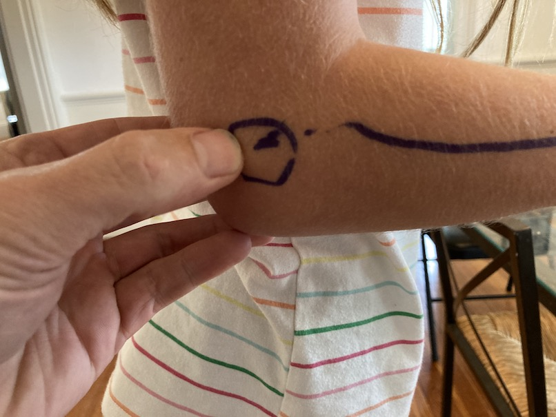
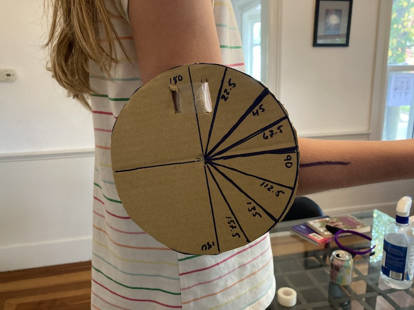

<style>
div.green { background-color:#c7d1c0; border-radius: 5px; padding: 20px;} 
</style>
<!-- Add icon library -->
<link rel="stylesheet" href="https://cdnjs.cloudflare.com/ajax/libs/font-awesome/5.14.0/css/all.min.css">
 
# Introduction


https://onlinelibrary.wiley.com/doi/full/10.1111/mec.12570

https://www.ncbi.nlm.nih.gov/pmc/articles/PMC3899836/

```{r}
library(tidyverse)
library(rinat)
library(sf)
library(rgbif)
library(parallel)
library(foreach)
library(doParallel)
library(smartsnp)
library(SNPassoc)

data.table
cowplot
rnaturalearth
dplyr
ggspatial
gganimate
png
leaflet
rnaturalearthdata with devtools::install_github("ropensci/rnaturalearthdata")

states <- c("Maine","New Hampshire","Vermont","Massachusetts")
basis <- c("OBSERVATION","PRESERVED_SPECIMEN","HUMAN_OBSERVATION")
species <- c("Canis latrans","Sciurus carolinensis")

args <- expand_grid(species,states,basis)
gbif_args <- list()

for(i in 1:nrow(args)){
  name_i <- paste0(args[i,1],args[i,2],args[i,3])
  gbif_args[[name_i]] <- list()
  gbif_args[[name_i]]$scientificName <- args[i,]$species
  gbif_args[[name_i]]$stateProvince <- args[i,]$states
  gbif_args[[name_i]]$basisOfRecord <- args[i,]$basis
   gbif_args[[name_i]]$limit <- 10000
   gbif_args[[name_i]]$hasCoordinate <- TRUE
}

get_gbif <- function(i) do.call(rgbif::occ_data,args = gbif_args[[i]])
 

file.copy(pathToGenoFile,paste0("data/",basename(pathToGenoFile)))

cl <- makePSOCKcluster(detectCores()-2) # leave two cores for background processes
# cl <- makePSOCKcluster(1) # if old PC use only 1 core
registerDoParallel(cl) # register parallel backend

t <- system.time(
  gbif_res <- foreach(i=sample(1:length(cyp),20),.verbose=T, .packages = c( "rgbif")) %dopar% {
      get_gbif(i)
  }
)


lapply(gbif_res, function(x) x[][[1]]$count)
cols_ <- c("species","decimalLongitude","decimalLatitude","basisOfRecord","stateProvince","year","month")
 nulls <- lapply(gbif_res,function(x) is.null(x$data)) %>% unlist
gbif_rec <- lapply(gbif_res[!nulls], function(x) x$data[,cols_]) %>% do.call(rbind,.) 

gbif_rec %>% 
  group_by(species,year,stateProvince) %>%
  summarize(n=n()) %>% 
  ggplot(aes(year,log(n),col=species))+geom_point()


data("SNPs")
d <- SNPs[,-c(1:5)]
myDat<-setupSNP(d,1:ncol(d),sep="")
mydatnum <- apply(myDat,2,additive)

cl_snps <- read_csv("data/coyote_snps.csv")
cl_local <- read_csv("data/coyote_local.csv")


wolf <- read_csv("data/wolf_snps.csv") 

wolf2 <- rbind(
wolf[,1:3] %>% 
  pivot_longer(starts_with("Canis")) %>% 
  rename(snp=snp_1),
wolf[,5:7] %>% 
  pivot_longer(starts_with("Canis")) %>% 
  rename(snp=snp_2),
wolf[,9:11] %>% 
  pivot_longer(starts_with("Canis")) %>% 
  rename(snp=snp_3)
) %>% 
  rename(species=name) %>%
  mutate(value=paste0(value,value)) %>% 
  mutate(species=gsub("(\\w*)_(\\w*)_.*","\\1 \\2",species),
         Region=ifelse(grepl("lycaon",species),"Eastern","Western")) %>% 
  group_by(species) %>% 
  mutate(id=paste0(gsub("(\\w).* (\\w.).*","\\1\\2",species),1:n()))
  

common_snps <- base::intersect(colnames(cl_snps),wolf2$snp)
cl_snps <- cl_snps %>% 
  pivot_longer(-id,names_to = "snp") %>% 
    mutate(species="Canis latrans",Region="Eastern") %>%
    select(species,Region,id,snp,value)

rbind(
  cl_snps,
wolf2 %>% 
  select(species,Region,id,snp,value)  %>%
  filter(snp%in%common_snps,!is.na(value))
) %>% write_csv("data/wolf_coyote_snps.csv")

wolf_coy  <- read_csv("data/wolf_coyote_snps.csv") 

all(wolf_coy$value %>% str_count(".")==2)
any(wolf_coy$value %>% str_count("ang"))


bad_snps <- wolf_coy %>% group_by(snp) %>% 
  summarize(n=length(unique(value))) %>%
  filter(n>3) %>% pull(snp)


snps <-  wolf_coy %>%
  filter(!snp%in%bad_snps) %>% 
  select(-c(Region,species)) %>% 
   pivot_wider(names_from = snp,values_from = value)

snps_ <-wolf_coy %>% select(id,species) %>% 
  left_join(snps)

snps <- setupSNP(snps_,3:ncol(snps),sep="")
snps <- apply(snps[,-c(1:2)],2,additive) %>% data.frame()

mds <- snps %>%
  dist() %>%          
  cmdscale() %>%
  as_tibble()


colnames(mds) <- c("Dim.1", "Dim.2")
# Plot MDS
ggscatter(mds, x = "Dim.1", y = "Dim.2", 
          label = rownames(swiss),
          size = 1,
          repel = TRUE)


 data(SNPs)
 SNPs[,4]
 myDat<-setupSNP(w,5,sep="")
 
 
```


  select(starts_with("Canis")|starts_with("snp")) %>% 
  pivot_longer(cols = contains("Canis"))
mds <- snps %>%
  dist() %>%          
  cmdscale() %>%
  as_tibble()

colnames(mds) <- c("Dim1", "Dim2")

wolf <- cl_mds %>% 
  filter(species=="Canis lupus")%>%
  select()
  summarize(Dim1=mean(Dim1),Dim2=mean(Dim2))

cl_mds <- mds %>% mutate(id=rownames(snps)) %>% left_join(cl_local)
cl_mds %>% 
  group_by(state,species,id) %>%
  mutate(dist=sum(c(abs(Dim1-wolf$Dim1),abs(Dim2-wolf$Dim2)))) %>% 
  ggplot(aes(state,dist))+geom_boxplot()
  
  ggplot(aes(Dim1,Dim2,col=species,shape=Region))+geom_point()


```

#
https://royalsocietypublishing.org/doi/abs/10.1098/rsbl.2009.0575

# Methods

## Experimental Design

To assess the affect of eccentric fatigue of elbow flexor muscles, we'll be measuring the isometric force over the range of motion of the forearm produced by MVC. To capture MVC data, you must design and construct a portable Arduino-based force-data acquisition system (DAQ). Your device should record force data over the course of 30s. 


## DAQ Design Components

1. 100-kg S-type Load Cell with HX711 amplifier
2. Arduino Uno microcontroller

## DAQ Assembly and Programming

Assembly for this force logger is almost entirely captured in [this tutorial](https://www.instructables.com/Arduino-Tension-Scale-With-40-Kg-Luggage-Load-Cell/). And, Prof. K has wired the load cell to the amplifier, so y'all just need to wire up the ampflifier to the Arduino

~~You'll see that the sketch in the tutorial requires a calibration step to output appropriate force or mass units.~~ **Don't worry about calibration.** We'll be looking at normalized force, so units don't matter. 

<!-- As for your SD storage integration, make sure your sketch writes one column data to the SD card with the header "force". -->

For each experiment, you'll be recording 12 bouts of MVC force, each corresponding to a different elbow angle, for 30 s.  For each arm angle, one only needs to unplug the Arduino and hit the red restart button on the Arduino to begin taking force data. So as not to confuse from where your data came, it's a good idea to change the name of the text file being saved to for each experiment, e.g., "Team_subject1_control.csv" and "Team_subject1_fatigue.csv".

## Data Collection

### Elbow Angle

You'll first need to construct a ganiometer, a simple device that measures the angle between the upper and lower arm (i.e., the elbow angle). One approach is to use the outline of a small plate to cut a disc out of cardboard and then bisect the diameter and then continue to bisect this semicircle into equal segments (Fig. 4.)

<center>
{width=50%}
<br>
**Fig. 4** A simple ganiometer made of cardboard.
</center>
<br>

To use the ganiometer, find the center of the elbow joint in lateral view and mark this position with a marker. From this point, mark a line along the lateral margin of the radius. (Fig. 5). Then, poke a hole through the center of the ganiometer and affix it to the upper arm so its center aligns with your mark at the elbow joint and the 0-180$^o$ axis aligns with the long axis of the humerus (Fig. 6).You can affix the ganiometer to the upper arm by passing a strip of surgical tape through two tabs cut out on either side of the 0-180$^o$ axis (Fig. 6).

<center>
{width=50%}
<br>
**Fig. 4** The elbow joint on a tiny human and the lateral margin of the radius marked with a dark line. Thanks, Zo!
</center>
<br>


<center>
{width=50%}
<br>
**Fig. 5** The ganiometer affixed to the upper arm with surgical tape with its center placed over the elbow joint. Note how the marked line on the radius indicates an elbow angle of about 90$^o$.
</center>
<br>

As the elbow flexes or extends, you should be able to peak at the ganiometer to assess elbow angle.


### Isometric MVCs

We will collect isometric force data from MVCs over 12 arm angles, 45-157.5$^o$ at 11.25$^o$ (call it 11$^o$) intervals. Your load-cell is affixed to a wooden or plastic dowel with a zip tie at one end and has a looped zip tie attached to the other. Pass the looped zip tie around the provided C-clamp and fasten the clamp to something that won't move under the torque of your forearm. This could be  table, desk, ect. Hold the dowel in your hand as shown in Fig. 6. Make sure your elbow is supported by something rigid (i.e. the top of a chair back, etc.). 

<center>
{width=50%}
<br>
**Fig. 6** How to grip the the load-cell.
</center>
<br>


First collect your control (i.e., non-fatigued) data by starting at the largest arm angle, 157.5$^o$. You can move through the 12 arm angles by rotating your body about your hips. That is, at the high elbow angles, you'll be more upright, at lower angles, more bent over. At each angle, flex your elbow as hard as you can to produce a MVC, resetting your DAQ system each time. Make sure the load-cell forms a right angle with reference to your hand (Fig. 6). You might want to practice a few times to get a sense of how this will proceed.

### MVCs after Eccentric Fatigue

To eccentrically fatigue your forearm flexors, you'll perform isokinetic controlled drops of a heavy object weighing 1/3 your maximum isometric force recorded in the control experiments. A book bag or back pack full of heavy items (ahhh. . .  books) should do just fine. 

To perform your isokinetic eccentric drops, grab the book bag with the hand not involved in the experiment and pass it to the other as its forearm is fully flexed. With the bag now in your study hand, lower the bag slowly and at a constant speed. When the arm is fully extended, grab the book bag with the free hand and then flex the study forearm. Repeat by passing the bag to your study hand. Continue repeating this exercise for 3 min. Keep the cycles uniformly frequent by monitoring the duration (probably 3-4 s each cycle). At the end of the 3 mins, your forearm flexors should feel tired.

After you fatigue your flexors, wait 2 min. Then repeat the experiment exactly as you did for the control data.

Once you complete your experiments, upload your 24 data files to [this Google directory](https://drive.google.com/drive/folders/1ncojVtzbQaZWKNdFgWtkK5CeJ_PmAbq0?usp=sharing). Be sure to name your files according to the following convention: "team_subject_angle_control/fatigue.csv". **Please stick to all lower case.**

## Software and Coding the Arduino

The sketch needed for this experiment could be quite simple. It does, however, require you to download the HX711 library. 

As a primer, this would work:

```{c eval=F}

#include "HX711.h" // include the appropriate library for `scale` functions


HX711 scale; //invoke scale functions
    
void setup() {

 Serial.begin(115200); //set baud rate
   scale.begin(6, 7); //set digital pins 6 and 7 as the data and clock pins
  scale.tare(); //zero the measurements

}


void loop() {

  float newReading= scale.get_units(10); //establish new variable from load cel

   Serial.println(newReading); //print load cell value

}

```


  **NOTE:*** You may find it handy to work with a [previous release of Arduino IDE](https://www.arduino.cc/en/software/OldSoftwareReleases) because the current version does not allow copying data from the serial monitory


## Summary of Experimental Protocol
  
  + Fabricate and program a load-cell data acquisition system.
  + Make a ganiometer.
  + Record isometric MVCs at 12 distinct elbow angles.
  + Eccentrically fatigue your flexors.
  + Wait 2 minutes.
  + Repeat recording isometric MVCs at the same 12 distinct elbow angles.
  + Upload data to [this directory](https://drive.google.com/drive/folders/1ncojVtzbQaZWKNdFgWtkK5CeJ_PmAbq0?usp=sharing).
  
  
  Pleas upload your data by Monday, November 13th.

 
## Data Analysis

For each experiment, we'll stick to a convention within the muscle physiology world by considering maximum normalized force. That is:

  1. Find maximum force for each recording (don't worry about the specific values or units because you'll. . .).
  2. Find maximum force ($F_{max}$) across all angles for each experiment (control or fatigued) for each individual and then divide all maximum values for that experiment by $F_{max}$. Your values will now be normalize, i.e., scaled 0-1 with a value of 1 representing the highest force recorded during an experiment.
  
Using the normalized force data from the control and fatigued experiments, we'll consider shifts at which angle $F_{max}$ occurred, the difference in $\theta_{max}$. To assess any shift in $\theta_{max}$ with our limited elbow angle samples, we could simply look at the angle at which the flexors produce the most force. For instance, for the these data:


```{r,message=FALSE}
library(ggplot2)
ang <- seq(45,168.75,length.out = 12) #elbow angle

normF <- c(0.71, 0.77, 0.83, 0.91, 0.97, 1.00, 0.96, 0.94, 0.89, 0.84, 0.77, 0.74) #you'll get this by reading in data and calculating normalized values


qplot(ang,normF)+geom_point(aes(x=ang[which.max(normF)],y=normF[which.max(normF)]),col="red",size=4)

ang[which.max(normF)] #Find angle for Fmax, theta_max

```

So, of the 12 angles that we sampled (45--157.5$^o$), the maximum isometric force occurred at angle ($\theta_{max}$=) 101.25$^o$. Simply doing this overlooks the fact that the maximum force could have occurred between any two of the sampled angles. Given the trend in the figure above, $\theta_{max}$ could have been an angle either greater and less than 101.25$^o$. To estimate the trend and find a perhaps more refined estimation of $F_{max}$ we'll resort to (wait for it) . . . modeling. In this case, a series of [polynomial models](https://en.wikipedia.org/wiki/Polynomial_regression) should work. Polynomial models are great for fitting parabolic data like those we have here, but are tricky in that one can keep adding monomial terms very quickly to achieve a better fit. This requires the practitioner to make sure that they are not overfitting the model. Fortunately, we have the tools to prevent such a thing using AIC, as we have learned. 

Therefore, let's fit some polynomial models to our example data with a different number of monomial terms (i.e., orders) and tease apart the fit and penalty for including more terms using AICc. Fortunately, we can use the `lm()` and `poly()` functions from the base package to fit the models and use `AICc()` from the `MuMIn` package for AICc fitting. 


```{r,message=FALSE}
library(MuMIn)

poly.m2 <- lm(normF~poly(ang,2)) #second order
poly.m3 <- lm(normF~poly(ang,3)) #third order
poly.m4 <- lm(normF~poly(ang,4)) #fourth order

AICc(poly.m2,poly.m3,poly.m4) #the second order model fits best

x.pred <- seq(45,157.5,length.out = 1000) #define 1000 angles from our range

normF.pred <- predict(poly.m4,newdata = data.frame(ang=x.pred)) #predict the force using 1000 angles

qplot(ang,normF)+geom_point(aes(x=x.pred,y=normF.pred),col="red")+geom_point(aes(x=x.pred[which.max(normF.pred)],y=normF.pred[which.max(normF.pred)]),size=5,col="blue")

x.pred[which.max(normF.pred)] #theta_max

```


In this example we constructed 3 polynomial models of the 2nd, 3rd, 4th variety and then used AICc to find the lowest AICc score. The 4th order model fits best, so we then produced 1000 discrete values within our range with `seq()` to pass to`predict()` to predict force over this range using our best fitting model (producing `normF.pred`). We then found the max of `normF.pred` (the $F_{max}$) and plotted that, along with our predictions. Lastly, we found $\theta_{max}$, a value of 104.9.


A goal of this project is to detect shifts in $F_{max}$ with respect to angle. If we had two data sets, one control and one produced after fatigue, we merely need to compare the two $\theta_{max}$, that is, the shift in angle for $F_{max}$ predicted by two polynomial models. This would look something like this:

```{r,message=FALSE}

normF.fat <- c(0.65, 0.71, 0.81, 0.89,0.92, 0.96, 0.99, 1, 0.96, 0.92, 0.84, 0.77) #fatigue data, you'll get this by reading in data and calculating normalized values


qplot(ang,normF.fat)+geom_point(aes(x=ang[which.max(normF.fat)],y=normF.fat[which.max(normF.fat)]),col="red",size=4)

ang[which.max(normF.fat)] #Find angle for Fmax for fatigue data

poly.m2.fat <- lm(normF.fat~poly(ang,2)) #second order
poly.m3.fat <- lm(normF.fat~poly(ang,3)) #third order
poly.m4.fat <- lm(normF.fat~poly(ang,4)) #fourth order

AICc(poly.m2.fat,poly.m3.fat,poly.m4.fat) #the second order model fits best

normF.pred.fat <- predict(poly.m2.fat,newdata = data.frame(ang=x.pred)) #predict the force using 1000 angles

qplot(ang,normF)+geom_point(aes(x=x.pred,y=normF.pred.fat),col="red")+geom_point(aes(x=x.pred[which.max(normF.pred.fat)],y=normF.pred.fat[which.max(normF.pred.fat)]),size=5,col="blue")


x.pred[which.max(normF.pred.fat)]-x.pred[which.max(normF.pred)] #shift in angle for Fmax, theta_max

```

Looks as if there's a 10.3$^o$ shift in $\theta_{max}$. 

Say we had a bunch of data (from only 10 subjects) and you wanted to compare the control against fatigued data graphically, you could do the following. First we'll simulate some control and fatigue data, adding random noise drawn form a normal distribution and plot the data with a color according to experiment to quickly assess the pattern.

```{r}
library(tidyverse)

set.seed(1234) #to keep random noise the same

sub <- 1:10 #ten subjects
dat.l <- list() #empty list

#loop to run through subjects and simulate data based on noise added to data above
for(i in sub){
  noise <- rnorm(length(ang),mean = 0.02,sd = 0.01)
  noise2 <- rnorm(length(ang),mean = 0.02,sd = 0.01)
  dat.l[[i]] <- tibble(
    rbind(
      data.frame(ang,force=normF+noise,subject=i,exp="control"),
      data.frame(ang,force=normF.fat+noise2,subject=i,exp="fatigue")
  )  
  )%>%
    group_by(subject,exp)%>%
    mutate(force=force/max(force))
  
}

dat <- do.call(rbind,dat.l) #get data into one tibble

dat%>%
  ggplot(aes(ang,force,col=exp))+geom_point()
```

Now let's take our data and get AICc scores for our three polynomial models. We'll group the data by subject and experiment and retrieve AICc from each model (`m2`, `m3`, and `m4`). Then, we'll pivot the tibble to a longer format so that we have a single column for AICc values.

```{r, message=FALSE}
AICs <- dat%>%
  group_by(subject,exp)%>%
  summarize(
    m2=AICc(lm(force~poly(ang,2))), #second order
    m3=AICc(lm(force~poly(ang,3))), #third order
    m4=AICc(lm(force~poly(ang,4))) #fourth order
  )%>%
  pivot_longer(m2:m4,names_to="model",values_to="AICc")%>%
  print()

```

Now we'll do something very similar, predicting values for 1000 discrete angles across our range of elbow positions. Notice that we've summarized the data by subject, experiment and model to find the angle (`x.pred`) which matches the max force value.
```{r, message=FALSE}

fits <- dat%>%
  group_by(subject,exp)%>%
  summarize(
    m2=predict(lm(force~poly(ang,2)),newdata=data.frame(ang=x.pred)), #second order
    m3=predict(lm(force~poly(ang,3)),newdata=data.frame(ang=x.pred)), #third order
    m4=predict(lm(force~poly(ang,4)),newdata=data.frame(ang=x.pred)) #fourth order
  )%>%
   pivot_longer(m2:m4,names_to="model")%>%
   group_by(subject,exp,model)%>%
   summarize(theta_max=x.pred[which.max(value)])%>%
   print()
```

Now let's join these the `AICs` and `fits` tables so that we can filter the model predictions by which model fits best. Note `filter(best==TRUE)` after constructing a `best` column according to the minimum AICc score using `mutate()`.

```{r, message=TRUE}
best.models <- fits%>%
  left_join(AICs)%>%
  group_by(subject,exp)%>%
  mutate(best=AICc==min(AICc))%>%
  filter(best==TRUE)%>%
  dplyr::select(-best)%>%
  print()
```

To investigate whether a shift if $\theta_{max}$ is different between the control and fatigue experiments, we can run the following ANOVA.
```{r, message=TRUE}
anova(lm(theta_max~exp,best.models))
```

Lastly, we should calculate the mean shift with SEM. To find the shift, we can pivot the `best.models` tibble to a wider format so we can have $\theta_{max}$ for each experiment in separate columns and find the difference with `mutate()`. Then, `summarise()` can be used to find the mean and SEM.

```{r, message=TRUE}
best.models%>%
  pivot_wider(id_cols=subject,names_from = exp,values_from=theta_max)%>%
  mutate(shift=fatigue-control)%>%
  ungroup()%>%
  summarise(mean.shift=mean(shift),se.shift=sd(shift)/sqrt(length(shift)))

```


# Project Report

Please submit your report to your team GitHub repository as an .Rmd document with HTML output that addresses the following questions:

  * Do class-wide force-angle data for isometric MVC accord to a typical FL relationship both under control and fatigued conditions?
  * Is there a significant shift between $\theta_{max}$ between the control and fatigue FL relationships?
  
In answering these questions, be sure to use the visualization, modeling, and model-assessments tools we've used in the course so far.
  
The answers and narrative in your .Rmd should include the following components:

   * A YAML header that specifies HTML output, the authors, and a bibliography named "BIOL3140.bib". **Submit this bibliography as well!**
   * Sections including an introduction, methods, results, discussion, author contributions, and references. Make sure that each, aside from the references, includes one to two short paragraphs. Specifically:
      + Introduction: Frame the questions, indicating why they are important, what background work has been done in this realm, and how you will answer them. **Please include at least one reference to support the summary of previous work.** Note: this can be done easily by refiguring the introduction to this project report.
      + Methods: Explicitly state how you answered the questions, including a narrative of all the analyses both qualitative and quantitative.
      + Results: Include any appropriate figures or tables and a narrative of the main results that are important to answering the questions.
      + Discussion: Succinctly declare how the results relate to the question and how they compare to previous work devoted to the topic. In addition, be sure to comment on the importance of your findings to the broader topic at hand. **Please include at least one reference to another relevant study.** Note: circling back to the introductions, both to this project description and yours, will be helpful here.
      + Author contributions: Briefly outline what each team member contributed to the project.

Project reports should be uploaded by 11:59 PM on Thursday, November 16th.

<div class = "green">
<div class="row">
  <div class="col-sm-2"><a class="far fa-sticky-note fa-5x" style="color:#939681"></a> <!-- regular style --></div>
  <div class="col-sm-9">
Please have a look at out [Phase II report rubric](phaseII_rubric.html) to get a sense of how this and other Phase II reports will be grade.
</div>
</div>
</div>
<br>

# References


