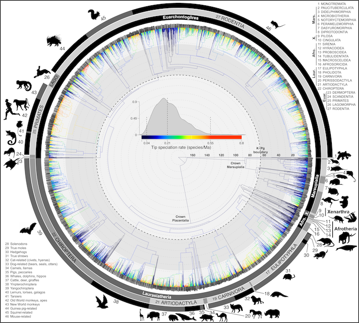

<!-- Add icon library -->
<link rel="stylesheet" href="https://cdnjs.cloudflare.com/ajax/libs/font-awesome/5.14.0/css/all.min.css">

# Introduction

As we took on in [the last module](mod6_proj.html) and read in @mortola2004scaling, body temperature ($T_b$) across mammals demsonstrates predictable scaling patterns. In the analysis for the last project and in the analysis performed by @mortola2004scaling, neither accounted for the phylogenetic relationships of the species considered. After the project for [Module 3](mod3_proj.html), you'd be forgiven if you put a giant asterisk next to results of these analyses. That is, species are not statistically indepedent samples due to their shared evolutionary history [@felsenstein1985phylogenies]. 

Organismal biologists---ecologists, physiologists, and behavioral ecologists, to name a few---have a checkered history of including phylogenetic structure in their analyses [@freckleton2002phylogenetic]. Accounting for phylogeny when asking comparative questions (i.e., how do traits vary between species?) isn't always necessary [@westoby1995further], nor is it always appropriate in the way biologist use comparative methods [@uyeda2018rethinking]. However, generally, when a biologists asks if one trait varies with another, especially when those traits are continuous, it's a good idea to at least explore if those traits demonstrate some phylogenetic signal.

white2009phylogenetically
white2009phylogenetically

@freckleton2002phylogenetic
In this project, let's reconsider these analyses in a phylogenetic context.

In our last project, we focused on ($T_b$) oscillations ($T_{\Delta}$)  using our own data for humans and data from @mortola2004scaling for 52 species of non-human mammals. For our Module 7 project, we'll also consider the scaling relationships of maximum daily $T_b$ ($T_{max}$) and mininum daily $T_b$ ($T_{min}$). 

mammal.temp2.csv

important evolutionary step in birds and mammals, permitting these taxa the ability to achieve higher metabolic output, regardless of ambient temperatures. Despite relatively consistent body temperatures, nearly all mammals engage in some form of heterothermy, etheir of the regional type (varying accross the body) or the temporal type (varying across time) [@aschoff1982circadian]. Temporal heterothermy is often used as a strategy to modulate metabolic demands and reduce evaporative water loss [@ostrowski2003heterothermy]. Over seasonal time scales, metabolic rate, and thus temperature, can be reduced when food availability declines in a form of torpor known as hibernation [@mcnab1983energetics]. Reducing the metabolic rate reduces energy requirements and allows a hibernating endotherm to wait out the food-scarce (and often cold) seasons [@angilletta2009thermal]. 

{width=50%}

 
*A time-calibrated molecular phylogeny of 5,911 extant and recently extinct species of mammals from  @upham2019inferring. Colors at the tips indicate speciation rates.* 

 
 

# Methods

To capture $T_b$ data, you must design and construct a portable Arduino-based temperature data aqusition system (DAQ). Your device should record body axial temperature data over the course of 1 hour for each of your team members. 

Sampling times should correspond to predictably high $T_b$ (i.e., 30 minutes when the subject is active, say in the middle of the day) and [predictably low $T_b$](https://www.nature.com/articles/srep39640/figures/1) (i.e., 30 minutes early in the morning, say 4 AM, before you typically get up---sorry! Set those alarms). This won't capture the full diurnal cycle, but will reduce the DAQ's running time while recording the important points.

## DAQ Design Components

1. DS18B20 temperature sensor
2. Arduion Uno microcontroller
3. SD storage module
4. 9V battery power cable

## DAQ Assembly and Programming

Assembly for this temperature logger is almost entirely captured in [this tutorial](http://arduinolearning.com/projects/temperature-logger.php). To this prototype, we must add battery power. That's easy enough: merely connect the battery power cable in the battery barrel connector on the Arduino (see pic below). 

{width=50%}

 
*The barrel connector for a battery pack on an Arduino Uno.* 

 
 

With the battery pack and SDcard module installed and writing data, one only needs to unplug the Arduino and hit the red restart button on the Arduino to begin taking temperature data. Be sure to modify your sketch to take data for 30 minutues (1.8 million ms).

## Data Collection and Analysis

### Intra-specific Scaling
To evaluate the scaling relationship between $T_{\Delta}$ and mass, construct a various models that describe the relationship between mass ($W$) and the differnce between mean $T_{high}$ and $T_{low}$ for all participants in the study (all the students in the class). Yes, we'll be relying on the rest of your class for these data. After completing data collection, each group should submit their data as .csv text files to [this google directory](https://drive.google.com/drive/folders/11VBPXKHWvlBSZ9z2asQ8EG4NYsGoOk0U?usp=sharing) **by Tuesday, October 20th**. 

Rememember from the [Module 5 project description](mod5_proj.html#Saving_Data_from_the_Serial_Monitor), that saving data files with a predictable format containing metadata is essential to a clean and easy workflow in R. The metadata needed for this project include your team name, subject, and mass. Therefore, please contruct the file names thusly: "TeamName_Subject#_Time_Mass.csv". 

  * TeamName: your team name, the same for each file your team submits.
  * Subject#: a subject number that uniquely identifies the participant anonymously (e.g., "Subject1")
  * Time: Time of day, i.e., "day" or "night".
  * Mass: The subject's mass **in kilograms** (an estimate is fine).
  * Make sure each of the metadata are separated by and underscore, "_".
  
  Once all files of these data can be downloaded and from this directory, analysis can commence. (- 5 pts for not submitting on time).

### Inter-specific scaling

From the class-wide values, compute the mean mass and mean $T_{\Delta}$ for our human subjects and add these values to a dataset that includes the same data from 51 species of non-human mammals from [@mortola2004scaling]. From here you can commence with modeling and analysis. These data can be dowloaded [here](mammal.temp.csv).

### Pagel's lambda

In this article, we use a quantitative measure of phylogenetic dependence introduced by Pagel (1999) to assess in a range of real and simulated data sets the issue of whether there is evidence of a significant phylogenetic component to character variation. In addition to providing an index of phylogenetic association, this index may also be used to adjust the phylogeny to match the degree of phylogenetic correlation in hypothesis tests, and we illustrate how this may be done.

# Project Report

Please submit your report to your team GitHub repository as an .Rmd document with HTML output that addresses the following:

  * What is the relationship between $T_{\Delta}$ and body mass in mammals ? I.e., is there a relationship and if so, is it allometric rather than isometric? Be sure to estimate important model parameters including scaling coefficients and slopes. 
  * What is the relationship between $T_{\Delta}$ and body mass across mammals, including humans? 
  * Does taxonomic group with respect to order effectively predict differences in this relationship across mammals?

In answering these questions, be sure to use the visualization, modeling, and model-assessments tools we've used in the course so far.
  
In answering your question, your .Rmd should include the following components:

   * A YAML header that specifies HTML output, the authors, and a bibliograph named "BIOL3140.bib". **Submit this bibliography as well!**
   * Sections including an introduction, methods, results, discussion, author contributions, and references. Make sure that each, aside from the references, includes one to two short paragraphs. Specifially:
      + Introduction: Frame the questions, indicating why they are important, what background work has been done in this realm, and how you will answer them. **Please include at least one reference to support the summary of previous work.** Note: this can be done easily by refiguring the introduction to this project report.
      + Methods: Explicitly state how you answered the questions, including a narrative of all the anlyses both qualitative and quantitative.
      + Results: Include any appropriate figures or tables and a narrative of the main results that are important to answering the questions.
      + Discussion: Succinctly declare how the results relate to the question and how they compare to previous work devoted to the topic. In addition, be sure to comment on the importance of your findings to the broader topic at hand. **Please include at least one reference to another relevant study.** Note: circling back to the introductions, both to this project description and yours, will be helpful here.
      + Author contributions: Breifly outline what each team member contributed to the project.

Project reports should be uploaded by 11:59 PM on Sunday, October 25th.

# References
