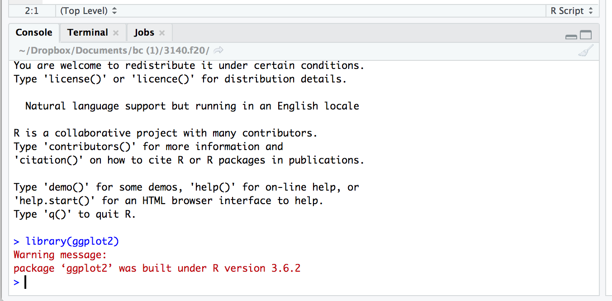

<style>
div.green { background-color:#c7d1c0; border-radius: 5px; padding: 20px;}
</style>


# Phase I: The basics

In this phase, we'll learn the basics of instrumentation and data analysis by working through XX learning modules devoted to instrument design and data analysis. This will most likely be the most challenging part of the course in that many, if not most of you will not have ever designed and built instruments and data acquisition systems, let alone analyzed data from them. Rest assured, your experience will be curated, sticking to the bare bones of instrument design and data science. This introductory phase will set the groundwork for Phase II, the independent development of sensors and data analysis.

## Module 1: Introduction and Cheap Tricks

This module is intended to give students the background and skills to begin designing and programing of simple hardware devices using Arduino.

### Dates: 
Week 1 (Aug 31—Sep 4):

### Key Concepts:
  + Course workflow
  + Course expectations
  + Arduino IDE basics (the sketch)
  + Digital vs. Analog I/O
  
### Learning Objectives:

Upon completion of this week and module, students will be able to:

  + Know what is expected during Phase I of the course
  + Design and program a blinking Arduino unit
  + Design and program a simple Arduino DAQ

### Read/Watch: 

  + [What is Arduino?](https://www.arduino.cc/en/Guide/Introduction)
  + [Getting started with Arduino](https://www.arduino.cc/en/Guide)
  + [What is Arduino IDE?](https://www.arduino.cc/en/Guide/Environment)
  + [Getting Started with the Arduino UNO](https://www.arduino.cc/en/Guide/ArduinoUno)
  + [The Serial Monitor](https://learn.adafruit.com/adafruit-arduino-lesson-5-the-serial-monitor/the-serial-monitor)
  + [How Does a Breadboard Work](https://www.sciencebuddies.org/science-fair-projects/references/how-to-use-a-breadboard)
  + Adafruit's [Using a Temp Sensor](https://learn.adafruit.com/tmp36-temperature-sensor/using-a-temp-sensor)


###Do:

  + Post one and respond to one question in [discussion board](https://github.com/orgs/bcorgbio/teams/biol-3140)
  + [Install Arduino IDE](https://www.arduino.cc/en/Guide)
  + Work through "Blink" sketch in [Getting Started with the Arduino UNO](https://www.arduino.cc/en/Guide/ArduinoUno) (work with the desktop IDE)
  + Complete [Module 1 Project]
  + [Upload video of temp data](https://forms.gle/gRHLVdGKh4bsF3Md7) passing through serial monitor on Arduino IDE [10 points]


### Guiding Questions:

  + Where does one find important course information?
  + What are the major components of an Arduino microcontroller?
  + What are the major components of an Arduino-based DAQ? 
  + How does one program an Arduino microcontroller?
  + How are data acquired from an Arduino unit?

### Module 1 Schedule

 || Monday <br> 8/31 |  Tuesday <br>9/1    | Wednesday<br>  9/2 | Thursday <br> 9/3 | Friday <br> 9/4 |Saturday<br> 9/5 | Sunday<br> 9/6
|--------|-------- |--------|-------- |--------|--------|--------|--------    
**Assignment due** | | | Post question to discussion board | Answer a question on discussion board  | | | Upload temp video
||||||||

### Module 1 Project

Now that we have read and explored the basics of how to program an Arduino unit, we'll now proceed with prototyping a simple sensor, one that can very accurately record temperature. This project assumes you have worked through the the assigned readings and links and therefore understand how an Arduino Uno (or a clone) is programmed and how serial data are sent and received from an Arduino.

#### Materials

  + TMP36 precision linear analog temperature sensor
  + Elegoo Arduino Uno clone
  + variety of jumper or prototyping wires
  
#### Assembly and Programming

Be sure to read Adafruit's [Using a Temp Sensor](https://learn.adafruit.com/tmp36-temperature-sensor/using-a-temp-sensor)---it provides a good overview of this temp sensor and explicit intructions for assembling and programming an Arduino-based temperature recording system.

Let's start with assembly. Simply wire the three pins of the TMP36 according the this diagram (ignore the photoresistor component):


<center>

</center>

Notice that the  AREF pin is receiving 3.3v from the pin of that name. This changes the reference voltage from 5v, reducing noise and increasing precision. The diagram above doesn't require a breadboard, but merely three male-female jumper wires for wiring the sensor, and a bit of prototyping wire or a male-male jumper for the AREF-3v connection.

Now program the Arduino by uploading the second sketch from Adafruit's [Using a Temp Sensor](https://learn.adafruit.com/tmp36-temperature-sensor/using-a-temp-sensor) tutorial. If everything is in order---you've chosen the right port and board in Arduino IDE---you can now click on the serial monitor icon in the upper right of the IDE (or pres "cmd/ctrl+shift+m") to see what data are being printed from the microcontroller to your computer over the serial (USB) port. It should look something like this. If so, CONGRATS! You're recording temperature data!

<center>

</center>
<br>

This is great, but as a scientist, you're probably building this instrument to record temperature over some length of time. Thus, reporting when, relative to the start of the experiment, the temperature was recorded is important. Fortunately, recording and printing time to the serial connection is super easy. We can do this by adding a new variable `currentTime` and passing a time value in millisecords to this variable in the void loop. First, add `int currentTime;` to the top of the sketch where the other variables are established. `int` establishes the variable as an integer, which is just fine because milliseconds is recorded as whole numbers. Second, add this to the `void(loop)`:

```{}  
  //add line to record current time 
  currentTime=millis(); 
 
  //add line to print current time 
  Serial.print("Time = ");
  Serial.println(currentTime);
```

This first line above records the time in milliseconds. The second and third lines print a prefix and the value for the current time. Notice there's `Serial.print()` and `Serial.println()`. The later is identical to the former, however, `Serial.println` prints the value and then a new line. 

An amended code looks something like this:

```{}

/* Sensor test sketch
  for more information see http://www.ladyada.net/make/logshield/lighttemp.html
  */
 
#define aref_voltage 3.3         // we tie 3.3V to ARef 
 
 
 
 
//TMP36 Pin Variables
int tempPin = A1;        //the analog pin the TMP36's Vout (sense) pin is connected to
                        //the resolution is 10 mV / degree centigrade with a
                        //500 mV offset to allow for negative temperatures
int tempReading;        // the analog reading from the sensor

int currentTime; // the current time when the Arduino is recording temp data

void setup(void) {
  // We'll send debugging information via the Serial monitor
  Serial.begin(9600);   
 
  // If you want to set the aref to something other than 5v
  analogReference(EXTERNAL);
  
  
  
}
 
 
void loop(void) {
 //add line to record current time 
 currentTime=millis(); 
 
  //add line to print current time 
  Serial.print("Time = ");
  Serial.println(currentTime);
 
  tempReading = analogRead(tempPin);  
 
  Serial.println("Temp reading = ");
  Serial.print(tempReading);     // the raw analog reading
 
  // converting that reading to voltage, which is based off the reference voltage
  float voltage = tempReading * aref_voltage;
  voltage /= 1024.0; 
 
  // print out the voltage
  Serial.print(" - ");
  Serial.print(voltage); Serial.println(" volts");
 
  // now print out the temperature
  float temperatureC = (voltage - 0.5) * 100 ;  //converting from 10 mv per degree wit 500 mV offset
                                               //to degrees ((volatge - 500mV) times 100)
  Serial.print(temperatureC); Serial.println(" degrees C");
 
  // now convert to Fahrenheight
  float temperatureF = (temperatureC * 9.0 / 5.0) + 32.0;
  Serial.print(temperatureF); Serial.println(" degrees F");
 
  delay(1000);
}


```

Check in on the serial monitor. Notice that there's now a new line (outlined below in red) that reports time in milliseconds:


</center>
<br>

Notice that the data are being printed about ever second (1000 ms) or so. This is because the the last line of the sketch in the `void(loop)` is `delay(1000)`. The `delay()` function delays or stops the loop for a specified number of milliseconds.

OK, this much better, but, as we'll learn in Module 2, data need to be parsed (i.e., arranged) in particular ways for a scientists to read data into a computer and then work with it. One of the standard parsing conventions or formats is comma separated values (.csv). If we can get our data to be printed to the serial monitor separated by commas, then we just have to copy the data from the the serial monitor and paste it into a text file. Later in the course, we'll learn how to save the data to an SD card, but for now, let's set up serial printing so that we can copy it. 

To do this, we need to rearrange and add some `Serial.print()` commands to the `void(loop)` section. So rather than . . . 

```{}
 //add line to record current time 
 currentTime=millis(); 
 
  //add line to print current time 
  Serial.print("Time = ");
  Serial.println(currentTime);
 
  tempReading = analogRead(tempPin);  
 
  Serial.println("Temp reading = ");
  Serial.print(tempReading);     // the raw analog reading
 
  // converting that reading to voltage, which is based off the reference voltage
  float voltage = tempReading * aref_voltage;
  voltage /= 1024.0; 
 
  // print out the voltage
  Serial.print(" - ");
  Serial.print(voltage); Serial.println(" volts");
 
  // now print out the temperature
  float temperatureC = (voltage - 0.5) * 100 ;  //converting from 10 mv per degree wit 500 mV offset
                                               //to degrees ((volatge - 500mV) times 100)
  Serial.print(temperatureC); Serial.println(" degrees C");
 
  // now convert to Fahrenheight
  float temperatureF = (temperatureC * 9.0 / 5.0) + 32.0;
  Serial.print(temperatureF); Serial.println(" degrees F");
  
```

 . . . let's ditch the prefixes and print some commas. Notice the last serial print command is  `Serial.println()` to start a new line before the next data are printed.
 
```{}
 //add line to record current time 
 currentTime=millis(); 
 
  //print current time 
  Serial.print(currentTime);
 
 //print a comma 
  Serial.print(",");
  
  tempReading = analogRead(tempPin);  
 
  Serial.print(tempReading);     // the raw analog reading
 
  // converting that reading to voltage, which is based off the reference voltage
  float voltage = tempReading * aref_voltage;
  voltage /= 1024.0; 
 
  // print out the voltage
  Serial.print(voltage);
  Serial.print(",");
 
  // now print out the temperature
  float temperatureC = (voltage - 0.5) * 100 ;  //converting from 10 mv per degree wit 500 mV offset
                                               //to degrees ((volatge - 500mV) times 100)
  Serial.print(temperatureC);
    Serial.print(",");
 
  // now convert to Fahrenheight
  float temperatureF = (temperatureC * 9.0 / 5.0) + 32.0;
  Serial.println(temperatureF); 
  
```

 
Upload the sketch and have a look at the serial monitor. Notice that we have data for milliseconds, voltage, temp in &deg;C, and &deg;F, all separated by commas. That is, we have comma separated values (.csv)! There's just one problem with this---unless you knew the inner workings of this sketch, you wouldn't know which data were which. Is the first value time or voltage? The second voltage or &deg;F? Etc., etc. Printing a header at the beginning of the progrom is the solution. After this, the header and data can be copied and pasted to a text file and any computing operations that follow will logically parse and have a name for each column or position in the series of data. 

Here's how to proceed. Merely print some header/column names in the `setup(void)`. The `setup(void)` is a part of the sketch where you ask the microcontroller to do something once and *before* `void(loop)` commences, a perfect place to print the header to the serial port.

```{}
Serial.println("ms,v,degC,degF");
```

After adding this and uploading the modified sketch, the serial monitor should now print a header (i.e., column names) and then the data like this:


</center>
<br>

This new modified Arduino sketch follows here:

```{}

/* Sensor test sketch
  for more information see http://www.ladyada.net/make/logshield/lighttemp.html
  */
 
#define aref_voltage 3.3         // we tie 3.3V to ARef 
 
 
 
 
//TMP36 Pin Variables
int tempPin = A1;        //the analog pin the TMP36's Vout (sense) pin is connected to
                        //the resolution is 10 mV / degree centigrade with a
                        //500 mV offset to allow for negative temperatures
int tempReading;        // the analog reading from the sensor

int currentTime; // the current time when the Arduino is recording temp data
void setup(void) {
  // We'll send debugging information via the Serial monitor
  Serial.begin(9600);   
 
  // If you want to set the aref to something other than 5v
  analogReference(EXTERNAL);

  Serial.println("ms,v,degC,degF");
  

  
}
 
 
void loop(void) {
 //add line to record current time 
 currentTime=millis(); 
 
  //print current time 
  Serial.print(currentTime);
 
 //print a comma 
  Serial.print(",");
  
  tempReading = analogRead(tempPin);  
 
  Serial.print(tempReading);     // the raw analog reading
 
  // converting that reading to voltage, which is based off the reference voltage
  float voltage = tempReading * aref_voltage;
  voltage /= 1024.0; 
 
  // print out the voltage
  Serial.print(voltage);
  Serial.print(",");
 
  // now print out the temperature
  float temperatureC = (voltage - 0.5) * 100 ;  //converting from 10 mv per degree wit 500 mV offset
                                               //to degrees ((volatge - 500mV) times 100)
  Serial.print(temperatureC);
    Serial.print(",");
 
  // now convert to Fahrenheight
  float temperatureF = (temperatureC * 9.0 / 5.0) + 32.0;
  Serial.println(temperatureF); 

  delay(1000);
}
```

#### Project Report

No need to write anything up. Please merely run the modified sketch on your temp sensor protype and upload a video of the serial monitor printing comma separated values. You can capture the video by recording the screen on your phone and upload it [here](https://forms.gle/gRHLVdGKh4bsF3Md7). Please upload the video by 11:59 PM on Sunday, September 6th. 

## Module 2: Data Pirates Code with. . . . R, Introduction to the Basics

In this module we'll learn the basics of coding in R. This introduction to R assumes no previous experience with R specifically or programming in general. The focus of this module will be on learning how R works and appreciating some of its potential in performing simple data operations like loading it, evaluating its different types, subsetting data objects, and iterating quickly through repetative tasks. 

### Dates: 
Week 2 (Sep 7—13):

### Key Concepts:
  + R user interface
  + Working directory
  + Objects, functions, arguments, and scripts in R
  + Lists, data frames, and matrices
  + Basic R notation
  + The `for` loop
  
### Learning Objectives:

Upon completion of this week and module, students will be able to:

  + Open R and RStudio
  + Set a working directory and load data in R
  + Recognize the difference between different objects (e.g., vectors, lists, data frames etc.)
  + Perform simple data operations and manipulation of data objects in R
  + Contruct and run a `for` loop in R to automate a interatively redundant task.
 
### Read/Watch: 

All from [Hands on Programming with R](https://rstudio-education.github.io/hopr) (HOPR)

  + [Appendices A—D](https://rstudio-education.github.io/hopr/starting.html) 
  + [Part I](https://rstudio-education.github.io/hopr/project-1-weighted-dice.html)
  + [Part II](https://rstudio-education.github.io/hopr/project-2-playing-cards.html)
  + [Chapter 5: R Objects](https://rstudio-education.github.io/hopr/r-objects.html)
  + [Chapter 6: R Notation](https://rstudio-education.github.io/hopr/r-notation.html)
  + [Chapter 7: Modifying Values](https://rstudio-education.github.io/hopr/modify.html)
  + [Chapter 11.3: For Loops](https://rstudio-education.github.io/hopr/loops.html#for-loops)
 
When reading through HOPR, make sure to have R and R Studio up and running so that you can copy and paste code from HOPR into an R file and run the specified commands and complete the books project tasks. This will help tremendously in getting the hang of things. 

<!-- Add icon library -->
<link rel="stylesheet" href="https://cdnjs.cloudflare.com/ajax/libs/font-awesome/5.14.0/css/all.min.css">


<div class = "green">

This is a lot of reading and fiddling with R. Don't worry too much about understanding every detail! The goal here is to just get the hang of things and, just as importantly, know where to find answers to questions about how R works. 
</div>
<br>


### Do:

  + Post one and respond to one question in [discussion board](https://github.com/orgs/bcorgbio/teams/biol-3140) [10 points]
  + [Install R and RStudio](https://rstudio-education.github.io/hopr/starting.html#starting)
  + Complete and submit a report for Module 2 Project 


### Guiding Questions:

  + How do I perform simple operations in R?
  + What are R's basic object classes?
  + How does external data get loaded into R?
  + How does one subset common data objects in R?
  + How does a `for` loop work and when should it be used?


### Module 2 Schedule
 || Monday <br> 9/7 |  Tuesday <br>9/8    | Wednesday<br>  9/9 | Thursday <br> 9/10 | Friday <br> 9/11 |Saturday<br> 9/11 | Sunday<br> 9/13
|--------|-------- |--------|-------- |--------|--------|--------|--------    
**Assignment due** | | | Post question to discussion board | Answer a question on discussion board  | | | Submit Module II Project Report
||||||||

### Module 2 Project

Now that we've been introduced to R and its important properties, lets now explore how this knowledge can be put to use in the context of data and a worflow more typical in organismal biology. For this porject, we'll be looking at scale puncture data from Prof. Kenaley's lab. Briefly, these data come from experiments in which we used a motorized probe and force transducer to study how much force it takes to puncture fish scales from various locations on several species of fishes. The goal of analyzing these data is to assess if the magnitude of scale puncture reistance varies over the body and according to species. This dataset is rather large (>1800 experiments!), but eminently suited for work in R (i.e., your head would spin trying to any of the following operations in Excel, say).  

Let's first download these data as .csv file from [this link](scales.csv). **Don't open the file in Excel** or some other program. If your OS does so automatically, just close the file without making any changes. The file in most cases will be automatically downloaded to a "downloads" directory (i.e., folder). Copy or move this file to a new directory, perhaps one named "scales" in a folder for this and other BIOL 3140 projects.

Open R Studio and create a new script (File->New->R script, see below). Save it (File->Save) with an appropriate title in your new "scales" directory. 


</center>
<br>

In this new R script, let's add our first lines of code. It's a general convention that we load the libraries of R packages that we want to use in thr R session (after R has been loaded by R Studio). Without doing so, if you call functions that aren't loaded in base R, you'll encounter an error. For this project and script, we only need `ggplots`, a handy plotting package that we'll rely on time and time again in the course. Make sure you've installed it, something you should have done will reading and working with HOPR. This initial line of code would look like this:

```{r,results="hide",warning=FALSE}
library(ggplot2)
```


Go ahead and just copy and paste this line into your script at line 1.  Notice that when you do this nothing happens. Entering code, either by typing or pasting doesn't tell R to run it. **You must do so explicitly** by selecting a section of code you want to run (the first line in this case) and pressing "enter" or compiling the entire script by clicking on the "run" icon at the top of the R Studio screen. Hit "run" and see what happens. In the console tab at the bottom of R Studio, you'll see this:


</center>
<br>

The console is where you see what's happening or has happened in the R session. Go to the console and type in `library(ggplot2)` and hit return. You've just asked R to load the `ggplot2` library, but because it's already loaded, you won't get any red text in response. Working in the console rather than running code line by line in the script or compiling the whole script can be handy, especially when you just want to do simple things that you don't want saved in the script. For instance, type `5000/3` into the console and hit return. Notice you get your answer: 1666.667.

Let's move on to another convention of writing an R script, setting the working directory. This is perhaps the most important step when working with external data in R (and doing so many other important tasks, like saving outputs from analyses, e.g., figures, tables, etc.). The working directory is a way of telling R where to find and save things. Without this input R won't know where to find or place important objects like data or figures, respectively. 

<style>
div.green { background-color:#c7d1c0; border-radius: 5px; padding: 20px;}
</style>
<div class = "green">

`setwd()` is a command essential to working in R. It's hard to overstate just how important this component of a script is. Over the years, in working with students learning how to use R, I come to have them recite the three most important rules for beginners:
  
  1. Always set the working directory!
  2. Never forget to set the working directory!
  3. Set the working directory always and forever!
</div>
<br>

To perform this all important task, we'll include a `setwd()` command. This function merely needs a text string that stipulates the path the the directory you want to work in. The path may look something like, "~/Chris/Documents/bc/3140/scales". **Note: This will be unique to almost everyone**, that is, we all have different naming conventions for our folders on our computers. My name is Chris, I have a documents folder that contains a "bc" directory, which contains a "3140" directory, which, in turn, contains the "scales" directory I want to work in.

At first, typing in the text of a path may be confusing and less than intuiative. If this is the case, there's a hack. In R studio, just click on "Session->Set Working Directory->Choose Directory" and, in the file browser window, select the directory you want to work in (say "scales" in this case) and press the "OPEN" icon. This will set the working directory to "scales". Notice that in the console, a `setwd()` command has been entered and run, complete with the file path. This file path will be the working directory for the script until you change it through the same approach or close R Studio. When you open your script in R Studio again, you'll have to set the directory again as well. To avoid this cumbersome step each time you start up R and R Studio, just copy and paste the `setwd()` command from the console into you script. Now your script should look something like the following but with your own unique file path to the working directory:


```{r,eval=FALSE}
library(ggplot2)
setwd("~/Chris/Documents/bc/3140/scales")
```

Select these lines in your script and run them or click on "run". If all goes well you'll see these lines appear in the console without any warnings. If you made some error in typing in the file path, then you'll get an error. For example, if I forget the trailing "s" in the "scales" part of the directory path as in this code, I would've gotten the following output:

```{r,error=TRUE}
library(ggplot2)
setwd("~/Chris/Documents/bc/3140/scale")
```

### Loading Data

OK, now that we've gotten our working directory set, we can now load the "scalse.csv" file that was placed in the "scales" directory. 

```{r}
dat <- read.csv("scales.csv")
```

Here, the command `read.csv` is used to read in the data and the results are passed to the variable named `dat`, short for data. By default, the results of reading in a .csv file with `read.csv` are stored as a data frame, a two dimensional table with rows and columns. Before we get to working with these rows and columns, let's first inspect what sort of data we have and say something about what the mean. 


One can see how large the data set is with `dim()` and reveal the first few lines of the data with the function `head()` :

```{r}
dim(dat)
head(dat)

```
Using the `dim()` function reveals that there are 1842 rows and 4 columns, while the `head()` command reveals that there are columns named "N", "quadrant", "species", and "specimen". You might simply want to run these lines in the console rather than from the script---if this is in the script, each time you run it, you'll get the the dimmensions and first 5 lines of the data printed to the console. You really only need to do this once. 

The 1842 rows represent the results of puncture experiments on that many scales. The four columns represent the following: 

  + "N" is the force it took the needle to puncture and scale 
  + "quadrant" indicates from where on the body the scale (see below):
    + "UL": Upper left of the body (anterodorsal quadrant)
    + "UR": Upper right of the body (posteroodorsal quadrant)
    + "LL": Lower right of the body (anteroventral quadrant)
    + "LL": Lower right of the body (posteroventral quadrant)
  + "species" indicates from which species the scales came
  + "specimen" indicates from which specimen the scales came (several for each species)
  
  
</center>
<br>

Now let's see how these data are stored in R, what class the columns are. We can do this one of several ways using the function `class()`. The first and most cumbersome would be to use the subsetting techniques we've learning in HOPR to evaluate each column. Rember that the `$` symbol or numbers reflecting column position (i.e., index) can be employed to retrieve specific columns. Somethig like this:

```{r}
#with "$"
class(dat$N)
class(dat$quadrant)
class(dat$species)
class(dat$specimen)
#with index #, produces the same result
class(dat[,1])
class(dat[,2])
class(dat[,3])
class(dat[,4])
```

Here, using either method, we see that the "N" column is numeric (it's a continuous value corresponding to force), while all the other data columns contain factors, text strings to be exact, representing their discrete values for quadrant, species, and specimen. As you learned in HOPR, this means we must treat the numeric values differently than the factors and vice versa. Go ahead and try treating them the same:

```{r,error=TRUE}
mean(dat$N)
mean(dat$quadrant)
```
Notice that R tells you that mean can't be computed on "quadrant" because it is not numeric. 

<div class = "green">
Whenever you get an error in R, the tendency to go right back to the code and try to fix things, paying little attention to the red text in the console. Errors often tell you something very important about your script and, in this example, your data. Be sure to read these errors carefully and makes sense of them before altering your code. 
</div>
<br>

OK, so now we've learned what classes of data we have, but we've done so in no fewer than four lines of code representing operations on each of the columns. The power or R and other programming languages is that there's almost always a faster and simpler way of doing things. In this case, we can inspect the class of out data in just one line using `sapply()`.

```{r}
sapply(dat,class)
```
Easy peasy with `sapply()`. Have a look at `?sapply()`, the help entry, which explains that this function applies another function over a vector. In the case of data frames, `sapply()` applies a functions over a vector of columns be default. This is considerably more tiddy and speedy than subsetting columns and repeating procedures over each. 

#### Simple operations: Summarizing

Now that we know what sort of data and how much of we have, let's do some simple operations that a biologist might perform ahead of any analysis. Consider what additional and important things we want to know about our data. How many species are in our data set? How many specimens per species were included? How many observations (punctures) are there for each species? Yes, Yes, and Yes. These and other questions about the make up of your data can be answered through summarizations.

Let's start with how many species we have. Because we're working with a factor for species, we can inspect the levels, that is, a factor has one or more unique levels to it. To reveal the levels in factor-type data, we simply pass those data through `levels`:

```{r}
species <- levels(dat$species)
species
```
By storing the levels of species and calling "species" on separate line, we see that there are 6 species in our data set. But let's have R tell us how many. We can count things in R with the `length` function:

```{r}
length(species)
```
The names and number of species, revealed in two lines of code. Pretty simple. Now how about how many observations per species. This is often a crucial piece of summary information, i.e., are there 1800 observations for *A. rupestris* and just a handful for all the others? If so, this wouldn't be much of a comprehensive study across these species. Finding how many observations, as with previous operations, can be done in a number of different ways. And like these previous operations, let's consider both cumbersome and more straighforward methods. 

Because we have the levels (all unique values) of species stored, let's use that vector of names and some [logical-test operations we learned about in HOPR](https://rstudio-education.github.io/hopr/modify.html#logical-subsetting) to subset the data frame and the variable "species" and count the observations. Let's take on the first value of the "species" variable first. In the code below, all the values in the species column are compared to the first entry for "species" ("A. rupestris") by using `==`. This asks the question *Does value to the left equal value to the right?*  In this specific case, we use `==` to ask *Do the values in `dat$species` equal the first value in the "species" variable?* 

```{r,results='hide'}
dat$species==species[1]
```

Have a look at the result in the console (I'm not showing the ouput here, because . . .). You should see hundres of logical values, `TRUE` and `FALSE` with many `TRUE`'s at first. This indicates that the first 300 or so values for the "species" column matches "A. rupestris". Now we can nest these logical values within the "species" vector (column) to return only those values that match "A. rupestris", like so:
```{r,results='hide'}
dat$specie[dat$species==species[1]]
```

From here, we can find the length of this subsetted vector, save the results in a new variable name that resembles that particular level of "species", and then iterate through all the levels of "species". After this, let's combine the results in a data frame using our "species" variable and `c()` to combine our new length variables.

```{r}
A.rup<-length(dat$species[dat$species==species[1]])
L.gib<-length(dat$species[dat$species==species[2]])
L.mac<-length(dat$species[dat$species==species[3]])
M.sal<-length(dat$species[dat$species==species[4]])
M.sax<-length(dat$species[dat$species==species[5]])
P.fla<-length(dat$species[dat$species==species[6]])

species.obs <- data.frame(sp=species,n=c(A.rup,L.gib,L.mac,M.sal,M.sax,P.fla))
species.obs
``` 

There we have it, the number of observations/punctures for each species. Pretty evenly distrubuted, so not to worried about widely uneven sample size. This is great, but, this took many lines of code and some "hard coding", that is, explicitly inputting a value. The hard coding issue here is with typing in the numeric postion ("1", "2", "3", etc.) for each entry in our "species" variable. This is a drag and opens the door to mistakes. Why not let R do the interations for you? 

As we're leanring, summarizing data is an important step in any analysis. Forntunately, succinct methods and operations in R for summarizing exist in several popular packages. Perhaps the most widely used are those curated in the "tidyverse", a set of R packages designed for data science. All the packages in tidyverse share an underlying design philosophy, grammar (what the functions looks like), and data structures, making it a one stop shopping experience for data analysis. We'll introduce how to summarize data using functions from tidyverse here and move on to more involved operations using tidyverse in the next module.

Make sure you have the tidyverse packages installed. If not:

```{r,eval=FALSE}
install.packages("tidyverse")
```

Then load the library (rember to put this as the top of your script):

```{r}
library(tidyverse)
```

tidyverse includes the `dplyr` package, a super helpful library of functions for data analysis. Let's use it's `summarise()` and `group_by()` functions and pipe convention (`%>%`) to find the number of punctures per species. The `summarise()` function creates variables that summarize the data according to variables of interest. We set these variables of interest using `group_by()`. The pipe, `%>%`, is used to combine data with these functions. As we'll take on in more detail later, the pipe `%>%` passes results from left to right.  Using the pipe with the data and the functions `group_by()` and  `summarize()`, we summarize our data by species rather succinctly. 

```{r}
dat %>%
  group_by(species) %>%
  summarise(n = n())

```
What this code essentially means is *pass the data through the function `group_by()`, grouping it by the "species" column, and summarize it according to group with a count (`n()`)*. Notice the result is a tibble, a particular type of data object, akin to a data frame. We'll discuss tibbles more in the next module.

Of course, we can save these results to a variable.

```{r}
species.n<- dat %>%
  group_by(species) %>%
  summarise(n = n())
species.n
```

Now we haven't answered one of our questions, *How many specimens for each species?*. This, again is super easy with `dplyr` and the pipe. Here, we pass out data to a `count()` function that counts observations according to groups ("species" and "specimen" in this case), use `print()` so you can see the output, and then we count this output of observations by "species" to find the unique values of "specimen".

```{r}
dat %>% 
  count(species,specimen) %>%
  print() %>%
  count(species,name = "n.specimens")
```

<div class = "green">
By now, you're head may be spinning like a top. This is a lot to take in. Don't worry! We're just running quickly through the basics and won't worry too much about committing any of this to memory. Just keep moving through this project, logging these operations in your R script, and you can always come back to specific parts when challenged by similar tasks in the future.
</div>
<br>

#### Loop When You Can

Phew! You're almost there, the end of the Module 2 Project. Just one last important concept to work through, the loop, specifically, the `for` loop. This is a great device for interating through operations for which there aren't dedicated functions. Important examples of this in the context of organismal biology include loading data from many files into one dataset and producing a bunch of figures all at once from a large data set, amongst other things. Since we have a large dataset loaded, why don't we use a `for()` loop to produce a bunch of figures.

A `for()` loop essentially tells R to do something over a set of things in a vector. For instance, for "i" in 1 to 10, print each  "i":

```{r}
for(i in 1:10) print(i)
```

In the context of doing something much more complicated, this saves a bunch of time. Back to our example of saving many figures from our large dataset. Consider the case of plotting the mean puncture force for each quadrant in each species. This is easily accomplished with a short `for()` loop that works over our "species" variable and contains a filter, pipes, and a `ggplot()` operation.


```{r}
for(i in species){
  p <- dat %>%
  filter(species==i)%>%
 ggplot()+geom_boxplot(aes(x=quadrant,y=N))+ggtitle(i)
 print(p)
}
```

Here, for each value `i` in `species` we passed `dat` through a filter where `species==i`, plotted a boxplot using `ggplot` where x is the quadrant, y is the puncture force. For each species, this  got saved to `p` and then we printed `p`.  Notice that 6 separate plots are sent sequentially to the "plots" tab in the lower right panel. This is where graphical results are shown in R Studio. No need to establish 6 seperate pieces of code for each figure. 

Let's wrap this up by saving a PDF file containing all the figures.

```{r}
pdf("species.quadrant.pdf")
for(i in species){
  p <- dat %>%
  filter(species==i)%>%
 ggplot()+geom_boxplot(aes(x=quadrant,y=N))+ggtitle(i)
 print(p)
}
dev.off()

list.files(pattern=".pdf")
```
The wrapping function `pdf()` prints graphic output to a file, in this case one named "species.quadrant.pdf". Any plot printed with `p()` after `pdf()` and before `dev.off()` saves the plots in the named file. The `list.files()` command with `pattern=".pdf"`  confirms that a PDF file was saved to our working directory.

#### Project Report

The goal of this project report is to submit an R script that runs the code presented above and produces the PDF of mean puncture force across each quadrant for each species. Have one representative of each team submit the code and PDF here. Submissions are due by 11:59 PM on Sunday, September 13th.

#ddply intro
https://seananderson.ca/2014/09/13/dplyr-intro/

### Week 3 (Sep 17—11)

`#https://rstudio-education.github.io/hopr/starting.html`

            Monday            Wednesday          Friday
--------   --------------   ----------------   ----------------
Read:      Course Welcome                   
Watch:    
Deliver:  
--------   --------------   ----------------   ----------------

## Week 3 (Sep 14–Sep 18)

            Monday            Wednesday          Friday
--------   --------------   ----------------   ----------------
Read:      Course Welcome                   
Watch:    
Deliver:  
--------   --------------   ----------------   ----------------

## Week 4 (Sep 21–Sep 25)

            Monday            Wednesday          Friday
--------   --------------   ----------------   ----------------
Read:      Course Welcome                   
Watch:    
Deliver:  
--------   --------------   ----------------   ----------------

## Week 5 (Sep 28–Oct 2)

            Monday            Wednesday          Friday
--------   --------------   ----------------   ----------------
Read:      Course Welcome                   
Watch:    
Deliver:  
--------   --------------   ----------------   ----------------

## Week 6 (Oct 5–9)
### Monday
  + *Read:* 
  + *Watch:*
  + *Deliver:*

### Wednesday
  + *Read:* 
  + *Watch:*
  + *Deliver:*
  
### Friday
  + *Read:* 
  + *Watch:*
  + *Deliver:*
  
## Week 7 (Oct 12–16)
### Monday
  + *Read:* 
  + *Watch:*
  + *Deliver:*

### Wednesday
  + *Read:* 
  + *Watch:*
  + *Deliver:*
  
### Friday
  + *Read:* 
  + *Watch:*
  + *Deliver:*

## Week 8 (Oct 19–23)
### Monday
  + *Read:* 
  + *Watch:*
  + *Deliver:*

### Wednesday
  + *Read:* 
  + *Watch:*
  + *Deliver:*
  
### Friday
  + *Read:* 
  + *Watch:*
  + *Deliver:*
  
## Week 9 (Oct 26–30)
### Monday
  + *Read:* 
  + *Watch:*
  + *Deliver:*

### Wednesday
  + *Read:* 
  + *Watch:*
  + *Deliver:*
  
### Friday
  + *Read:* 
  + *Watch:*
  + *Deliver:*

## Week 10 (Nov 2–6)
### Monday
  + *Read:* 
  + *Watch:*
  + *Deliver:*

### Wednesday
  + *Read:* 
  + *Watch:*
  + *Deliver:*
  
### Friday
  + *Read:* 
  + *Watch:*
  + *Deliver:*

## Week 11 (Nov 9–13)
### Monday
  + *Read:* 
  + *Watch:*
  + *Deliver:*

### Wednesday
  + *Read:* 
  + *Watch:*
  + *Deliver:*
  
### Friday
  + *Read:* 
  + *Watch:*
  + *Deliver:*

## Week 12 (Nov 16–20)
### Monday
  + *Read:* 
  + *Watch:*
  + *Deliver:*

### Wednesday
  + *Read:* 
  + *Watch:*
  + *Deliver:*
  
### Friday
  + *Read:* 
  + *Watch:*
  + *Deliver:*

## Week 12 (Nov 23–27)
### Monday
  + *Read:* 
  + *Watch:*
  + *Deliver:*

### Wednesday
  + *Read:* 
  + *Watch:*
  + *Deliver:*
  
### Friday
  + *Read:* 
  + *Watch:*
  + *Deliver:*

## Week 13 (Nov 30–Dec 4)
### Monday
  + *Read:* 
  + *Watch:*
  + *Deliver:*

### Wednesday
  + *Read:* 
  + *Watch:*
  + *Deliver:*
  
### Friday
  + *Read:* 
  + *Watch:*
  + *Deliver:*

## Week 14 (Dec 7–Dec 10)
### Monday
  + *Read:* 
  + *Watch:*
  + *Deliver:*

### Wednesday
  + *Read:* 
  + *Watch:*
  + *Deliver:*
  
### Friday
  + *Read:* 
  + *Watch:*
  + *Deliver:*

## Week 15 (Sep 28–Oct 2)


```{r}
library(knitr)

sched <- data.frame(
  
  Week=c(1:16),
  Date=c("Aug31—Sep4","Sep7—11","Sep14—Sep18","Sep21-25","Sep20-Oct2","Oct5—9","Oct12—16","Oct19—16","Oct19—3","Oct26—30","Nov2—6","Nov9—13","Nov16—20","Nov23—27","Nov30—Dec4","Dec7—10"),
  Monday=""
  
  
)
write.csv(sched,"3140Sched.csv",row.names = F)
```
